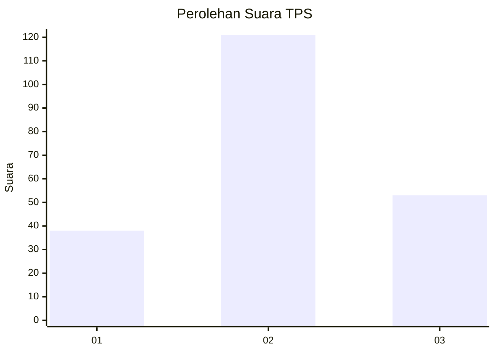
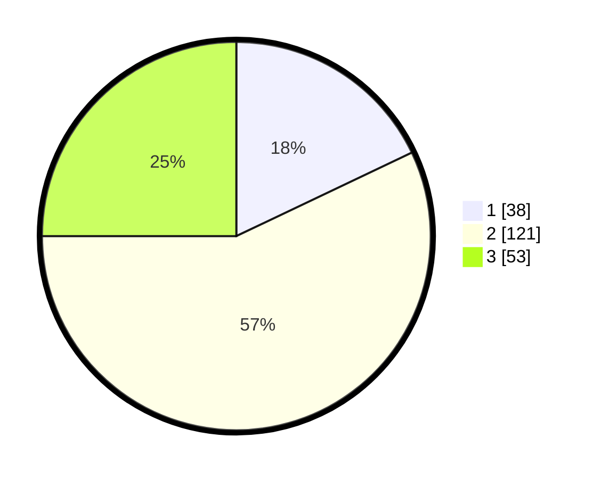

# Hasil

## Grafik

## Tabel

| No. | Nama Paslon    | Suara | Suara (raw) | Persentase |
|:--- |:-------------- | -----:| -----------:| ----------:|
| 1   | ANIES MUHAIMIN | 38    | [38][p-1]   | 17,92      |
| 2   | PRABOWO GIBRAN | 121   | [121][p-2]  | 57,08      |
| 3   | GANJAR MAHFUD  | 53    | [53][p-3]   | 25,00      |

[p-1]: https://github.com/gigit-pemilu/pemilu-2024/blob/main/pilpres/hitung-suara/sub/35-jawa-timur/sub/78-kota-surabaya/sub/13-bubutan/sub/1003-gundih/sub/059-tps/sub/paslon-1.txt
[p-2]: https://github.com/gigit-pemilu/pemilu-2024/blob/main/pilpres/hitung-suara/sub/35-jawa-timur/sub/78-kota-surabaya/sub/13-bubutan/sub/1003-gundih/sub/059-tps/sub/paslon-2.txt
[p-3]: https://github.com/gigit-pemilu/pemilu-2024/blob/main/pilpres/hitung-suara/sub/35-jawa-timur/sub/78-kota-surabaya/sub/13-bubutan/sub/1003-gundih/sub/059-tps/sub/paslon-3.txt

## Foto C Plano

https://sirekap-obj-formc.kpu.go.id/2672/pemilu/ppwp/35/78/13/10/03/3578131003059-20240224-132608--17bf7047-bcde-4b4b-acdf-430af89eb83a.jpg

https://sirekap-obj-formc.kpu.go.id/2672/pemilu/ppwp/35/78/13/10/03/3578131003059-20240224-132757--a95d8c16-8d58-45b1-bd33-2873ffd06edb.jpg

https://sirekap-obj-formc.kpu.go.id/2672/pemilu/ppwp/35/78/13/10/03/3578131003059-20240224-134142--f1cd159f-948f-4edb-9ac8-5f58fdf2315c.jpg

## Metadata

| Key        | Value               |
| ---------- | ------------------- |
| Time Stamp | 2024-02-25 11:00:00 |

## DATA PEMILIH TETAP

Jumlah pemilih dalam DPT: **777**.
 * L: **138**.
 * P: **177**.

## DATA PENGGUNA HAK PILIH

Jumlah pengguna hak pilih dalam DPT: **774**.
 * L: **97**.
 * P: **777**.

Jumlah pengguna hak pilih dalam DPTb: **200**.
 * L: **1**.
 * P: **77**.

Jumlah pengguna hak pilih dalam DPK: **724**.
 * L: **1**.
 * P: **4**.

Jumlah pengguna hak pilih: **4**.
 * L: **33**.
 * P: **100**.

## JUMLAH SUARA SAH DAN TIDAK SAH

JUMLAH SELURUH SUARA SAH: **212**.

JUMLAH SUARA TIDAK SAH: **1**.

JUMLAH SELURUH SUARA SAH DAN SUARA TIDAK SAH: **213**.

