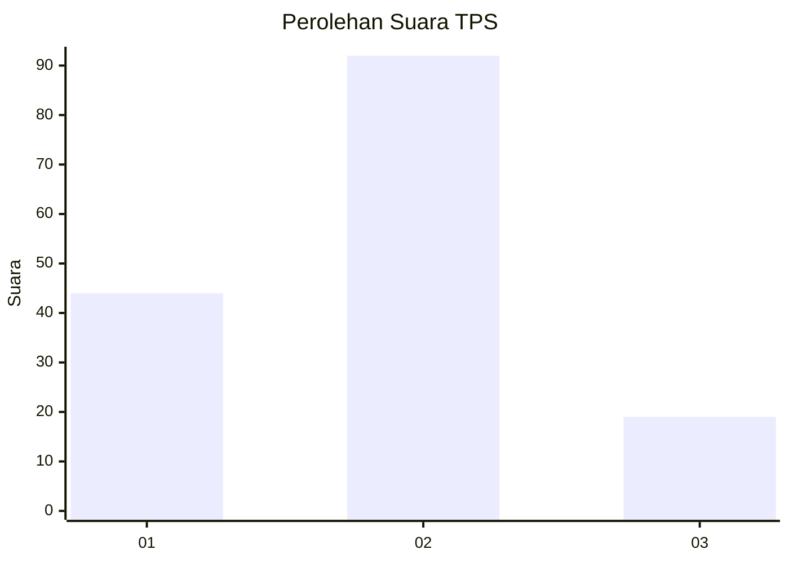
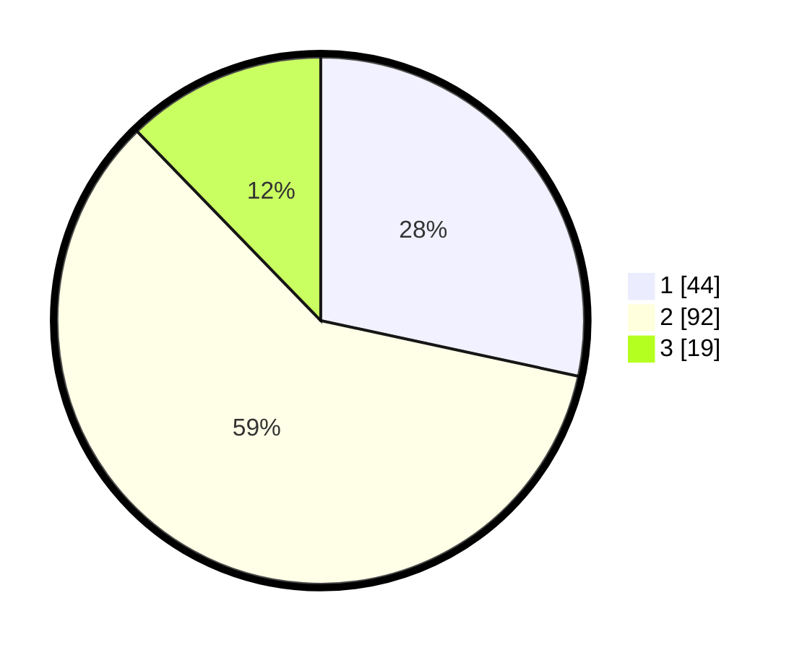

# Hasil

## Grafik

## Tabel

| No. | Nama Paslon    | Suara | Suara (raw) | Persentase |
|:--- |:-------------- | -----:| -----------:| ----------:|
| 1   | ANIES MUHAIMIN | 44    | [44][p-1]   | 28,39      |
| 2   | PRABOWO GIBRAN | 92    | [92][p-2]   | 59,35      |
| 3   | GANJAR MAHFUD  | 19    | [19][p-3]   | 12,26      |

[p-1]: https://github.com/gigit-pemilu/pemilu-2024/blob/main/pilpres/hitung-suara/sub/35-jawa-timur/sub/78-kota-surabaya/sub/13-bubutan/sub/1004-jepara/sub/062-tps/sub/paslon-1.txt
[p-2]: https://github.com/gigit-pemilu/pemilu-2024/blob/main/pilpres/hitung-suara/sub/35-jawa-timur/sub/78-kota-surabaya/sub/13-bubutan/sub/1004-jepara/sub/062-tps/sub/paslon-2.txt
[p-3]: https://github.com/gigit-pemilu/pemilu-2024/blob/main/pilpres/hitung-suara/sub/35-jawa-timur/sub/78-kota-surabaya/sub/13-bubutan/sub/1004-jepara/sub/062-tps/sub/paslon-3.txt

## Foto C Plano

https://sirekap-obj-formc.kpu.go.id/5357/pemilu/ppwp/35/78/13/10/04/3578131004062-20240215-005430--70166fd0-2bdb-47e2-a35f-adab9d46e4df.jpg

https://sirekap-obj-formc.kpu.go.id/5357/pemilu/ppwp/35/78/13/10/04/3578131004062-20240215-005518--0ff286a5-5bf9-4244-8f23-fb9f41997357.jpg

https://sirekap-obj-formc.kpu.go.id/5357/pemilu/ppwp/35/78/13/10/04/3578131004062-20240215-005606--8936116a-36f5-456a-8615-594fdbedac5e.jpg

## Metadata

| Key        | Value               |
| ---------- | ------------------- |
| Time Stamp | 2024-02-17 19:00:04 |

