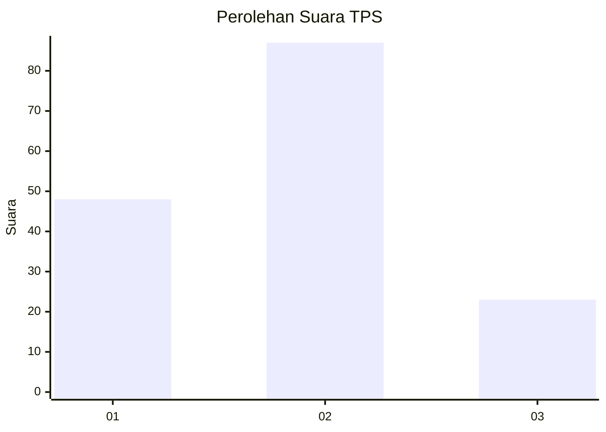
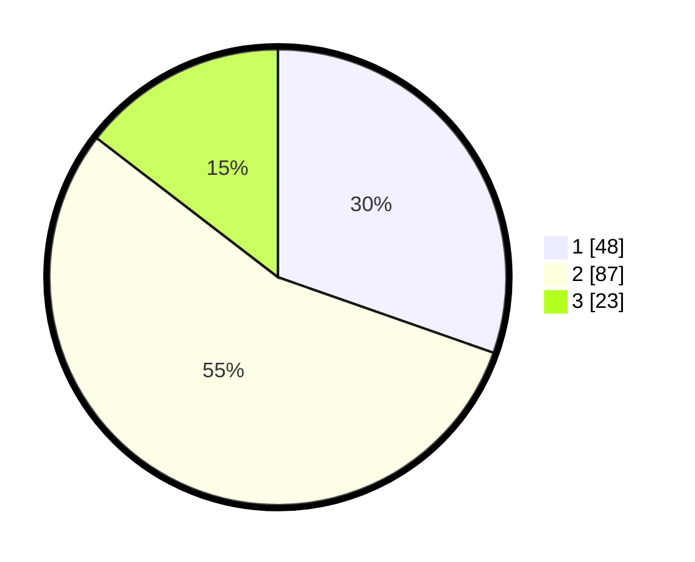

# Hasil

## Grafik

## Tabel

| No. | Nama Paslon    | Suara | Suara (raw) | Persentase |
|:--- |:-------------- | -----:| -----------:| ----------:|
| 1   | ANIES MUHAIMIN | 48    | [48][p-1]   | 30,38      |
| 2   | PRABOWO GIBRAN | 87    | [87][p-2]   | 55,06      |
| 3   | GANJAR MAHFUD  | 23    | [23][p-3]   | 14,56      |

[p-1]: https://github.com/gigit-pemilu/pemilu-2024/blob/main/pilpres/hitung-suara/sub/35-jawa-timur/sub/78-kota-surabaya/sub/13-bubutan/sub/1005-tembok-dukuh/sub/061-tps/sub/paslon-1.txt
[p-2]: https://github.com/gigit-pemilu/pemilu-2024/blob/main/pilpres/hitung-suara/sub/35-jawa-timur/sub/78-kota-surabaya/sub/13-bubutan/sub/1005-tembok-dukuh/sub/061-tps/sub/paslon-2.txt
[p-3]: https://github.com/gigit-pemilu/pemilu-2024/blob/main/pilpres/hitung-suara/sub/35-jawa-timur/sub/78-kota-surabaya/sub/13-bubutan/sub/1005-tembok-dukuh/sub/061-tps/sub/paslon-3.txt

## Foto C Plano

https://sirekap-obj-formc.kpu.go.id/502b/pemilu/ppwp/35/78/13/10/05/3578131005061-20240225-234629--f93cd1ad-7a0e-4f0e-bb13-1ac3c3e8d59c.jpg

https://sirekap-obj-formc.kpu.go.id/502b/pemilu/ppwp/35/78/13/10/05/3578131005061-20240225-234721--c32de660-9146-4f68-97f6-384298cc8a70.jpg

https://sirekap-obj-formc.kpu.go.id/502b/pemilu/ppwp/35/78/13/10/05/3578131005061-20240225-234803--680a63d9-442b-430a-b3b8-40c24153b51b.jpg

## Metadata

| Key        | Value               |
| ---------- | ------------------- |
| Time Stamp | 2024-02-26 17:00:04 |

