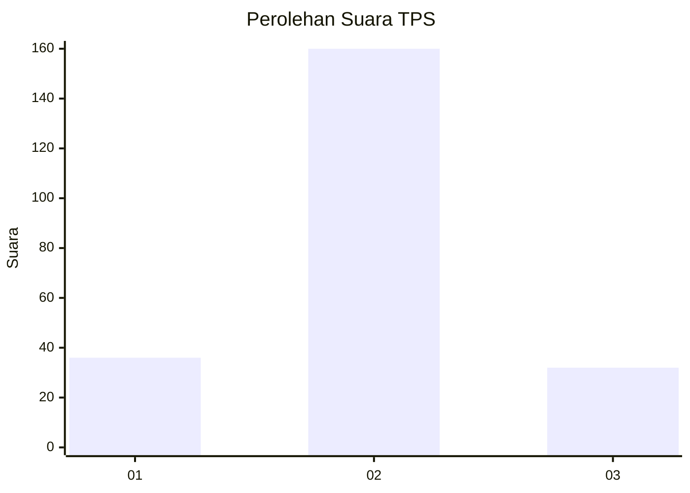

# Hasil

## Grafik

## Tabel

| No. | Nama Paslon    | Suara | Suara (raw) | Persentase |
|:--- |:-------------- | -----:| -----------:| ----------:|
| 1   | ANIES MUHAIMIN | 36    | [36][p-1]   | 15,79      |
| 2   | PRABOWO GIBRAN | 160   | [160][p-2]  | 70,18      |
| 3   | GANJAR MAHFUD  | 32    | [32][p-3]   | 14,04      |

[p-1]: https://github.com/gigit-pemilu/pemilu-2024/blob/main/pilpres/hitung-suara/sub/35-jawa-timur/sub/78-kota-surabaya/sub/14-tandes/sub/1006-karang-poh/sub/003-tps/sub/paslon-1.txt
[p-2]: https://github.com/gigit-pemilu/pemilu-2024/blob/main/pilpres/hitung-suara/sub/35-jawa-timur/sub/78-kota-surabaya/sub/14-tandes/sub/1006-karang-poh/sub/003-tps/sub/paslon-2.txt
[p-3]: https://github.com/gigit-pemilu/pemilu-2024/blob/main/pilpres/hitung-suara/sub/35-jawa-timur/sub/78-kota-surabaya/sub/14-tandes/sub/1006-karang-poh/sub/003-tps/sub/paslon-3.txt

## Foto C Plano

https://sirekap-obj-formc.kpu.go.id/f7d7/pemilu/ppwp/35/78/14/10/06/3578141006003-20240217-215505--4cf0d77a-6fcc-4947-bbce-7fe34bea95cd.jpg

https://sirekap-obj-formc.kpu.go.id/f7d7/pemilu/ppwp/35/78/14/10/06/3578141006003-20240217-215721--9fa77b9e-8ef8-44ee-a46e-b7c8cf0b798a.jpg

https://sirekap-obj-formc.kpu.go.id/f7d7/pemilu/ppwp/35/78/14/10/06/3578141006003-20240217-220109--3bc12cff-8028-40fe-870b-401995bb78a0.jpg

## Metadata

| Key        | Value               |
| ---------- | ------------------- |
| Time Stamp | 2024-02-25 11:00:00 |

