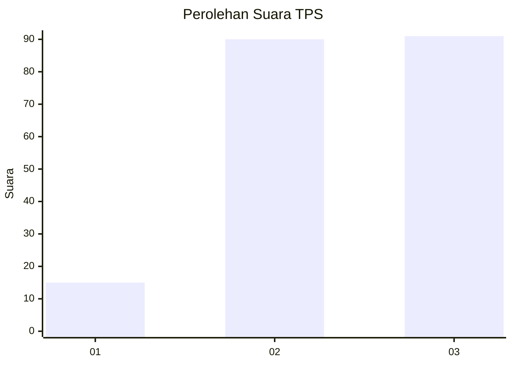
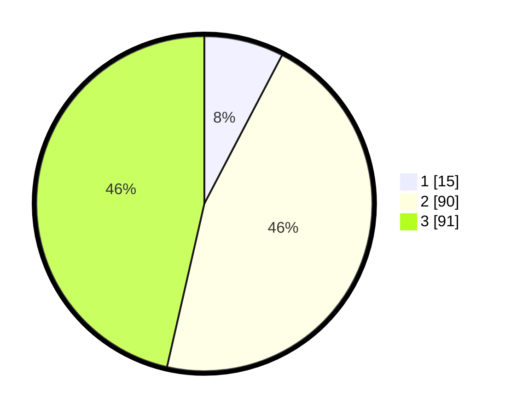

# Hasil

## Grafik

## Tabel

| No. | Nama Paslon    | Suara | Suara (raw) | Persentase |
|:--- |:-------------- | -----:| -----------:| ----------:|
| 1   | ANIES MUHAIMIN | 15    | [15][p-1]   | 7,65       |
| 2   | PRABOWO GIBRAN | 90    | [90][p-2]   | 45,92      |
| 3   | GANJAR MAHFUD  | 91    | [91][p-3]   | 46,43      |

[p-1]: https://github.com/gigit-pemilu/pemilu-2024/blob/main/pilpres/hitung-suara/sub/35-jawa-timur/sub/78-kota-surabaya/sub/14-tandes/sub/1006-karang-poh/sub/011-tps/sub/paslon-1.txt
[p-2]: https://github.com/gigit-pemilu/pemilu-2024/blob/main/pilpres/hitung-suara/sub/35-jawa-timur/sub/78-kota-surabaya/sub/14-tandes/sub/1006-karang-poh/sub/011-tps/sub/paslon-2.txt
[p-3]: https://github.com/gigit-pemilu/pemilu-2024/blob/main/pilpres/hitung-suara/sub/35-jawa-timur/sub/78-kota-surabaya/sub/14-tandes/sub/1006-karang-poh/sub/011-tps/sub/paslon-3.txt

## Foto C Plano

https://sirekap-obj-formc.kpu.go.id/6f7a/pemilu/ppwp/35/78/14/10/06/3578141006011-20240215-014235--b8175603-a3e6-44fd-83c7-230cd63fd0a1.jpg

https://sirekap-obj-formc.kpu.go.id/6f7a/pemilu/ppwp/35/78/14/10/06/3578141006011-20240215-014313--a7c533f8-3c51-4e3a-a7ec-669d6d0f418f.jpg

https://sirekap-obj-formc.kpu.go.id/6f7a/pemilu/ppwp/35/78/14/10/06/3578141006011-20240215-014343--389220d0-d0c3-4b8f-9789-a19d639e3cd3.jpg

## Metadata

| Key        | Value               |
| ---------- | ------------------- |
| Time Stamp | 2024-02-25 15:00:00 |

