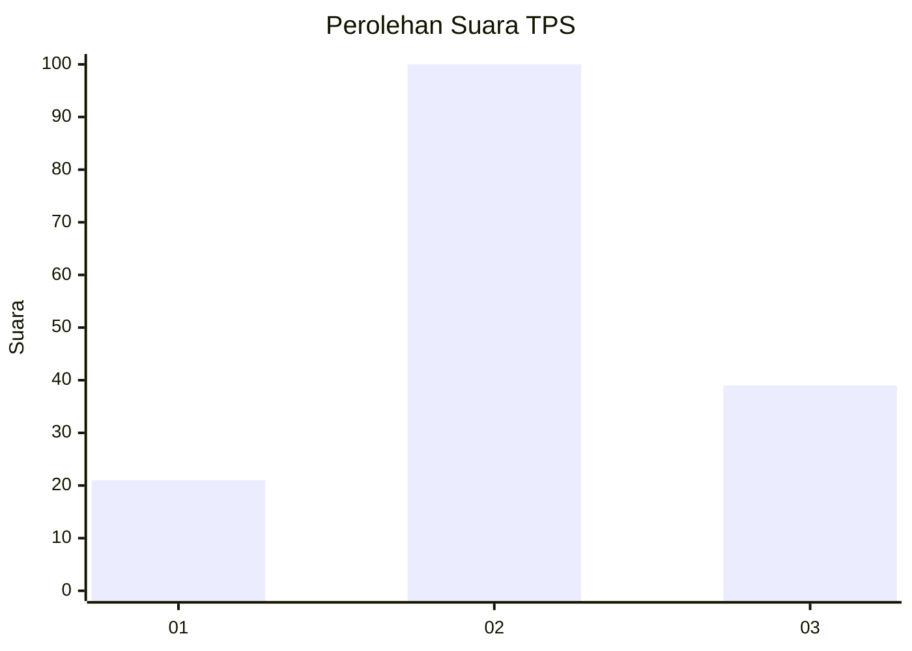
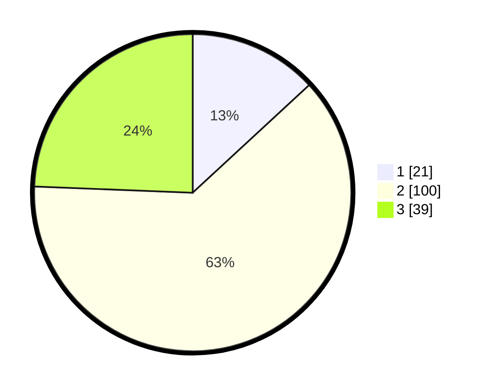

# Hasil

## Grafik

## Tabel

| No. | Nama Paslon    | Suara | Suara (raw) | Persentase |
|:--- |:-------------- | -----:| -----------:| ----------:|
| 1   | ANIES MUHAIMIN | 21    | [21][p-1]   | 13,13      |
| 2   | PRABOWO GIBRAN | 100   | [100][p-2]  | 62,50      |
| 3   | GANJAR MAHFUD  | 39    | [39][p-3]   | 24,38      |

[p-1]: https://github.com/gigit-pemilu/pemilu-2024-35-jawa-timur/blob/main/pilpres/hitung-suara/sub/35-jawa-timur/sub/78-kota-surabaya/sub/14-tandes/sub/1006-karang-poh/sub/013-tps/sub/paslon-1.txt
[p-2]: https://github.com/gigit-pemilu/pemilu-2024-35-jawa-timur/blob/main/pilpres/hitung-suara/sub/35-jawa-timur/sub/78-kota-surabaya/sub/14-tandes/sub/1006-karang-poh/sub/013-tps/sub/paslon-2.txt
[p-3]: https://github.com/gigit-pemilu/pemilu-2024-35-jawa-timur/blob/main/pilpres/hitung-suara/sub/35-jawa-timur/sub/78-kota-surabaya/sub/14-tandes/sub/1006-karang-poh/sub/013-tps/sub/paslon-3.txt

## Foto C Plano

https://sirekap-obj-formc.kpu.go.id/eb8d/pemilu/ppwp/35/78/14/10/06/3578141006013-20240214-213224--64674e02-89b8-479f-b042-0f9adf0c8d1a.jpg

https://sirekap-obj-formc.kpu.go.id/eb8d/pemilu/ppwp/35/78/14/10/06/3578141006013-20240214-215816--f6e6d2af-6fcf-472b-81ab-e9e86b992709.jpg

https://sirekap-obj-formc.kpu.go.id/eb8d/pemilu/ppwp/35/78/14/10/06/3578141006013-20240214-215103--abb6cd39-cf39-432b-900c-8cf7b8e74fd7.jpg

## Metadata

| Key        | Value               |
| ---------- | ------------------- |
| Time Stamp | 2024-02-25 17:00:00 |

