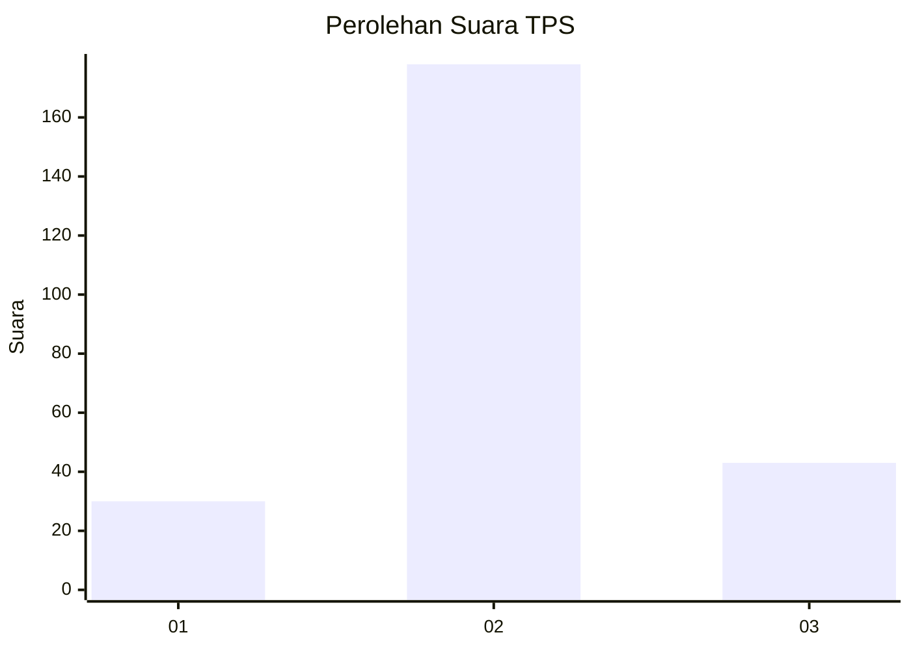
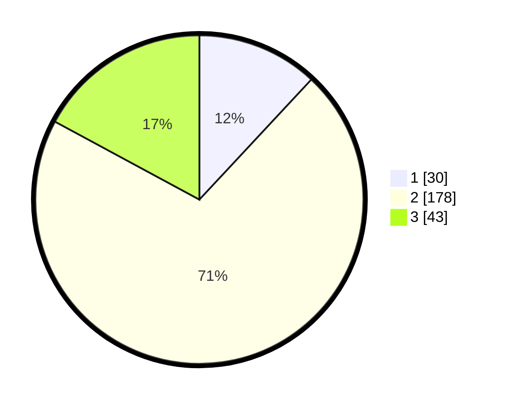

# Hasil

## Grafik

## Tabel

| No. | Nama Paslon    | Suara | Suara (raw) | Persentase |
|:--- |:-------------- | -----:| -----------:| ----------:|
| 1   | ANIES MUHAIMIN | 30    | [30][p-1]   | 11,95      |
| 2   | PRABOWO GIBRAN | 178   | [178][p-2]  | 70,92      |
| 3   | GANJAR MAHFUD  | 43    | [43][p-3]   | 17,13      |

[p-1]: https://github.com/gigit-pemilu/pemilu-2024-35-jawa-timur/blob/main/pilpres/hitung-suara/sub/35-jawa-timur/sub/78-kota-surabaya/sub/14-tandes/sub/1007-balongsari/sub/022-tps/sub/paslon-1.txt
[p-2]: https://github.com/gigit-pemilu/pemilu-2024-35-jawa-timur/blob/main/pilpres/hitung-suara/sub/35-jawa-timur/sub/78-kota-surabaya/sub/14-tandes/sub/1007-balongsari/sub/022-tps/sub/paslon-2.txt
[p-3]: https://github.com/gigit-pemilu/pemilu-2024-35-jawa-timur/blob/main/pilpres/hitung-suara/sub/35-jawa-timur/sub/78-kota-surabaya/sub/14-tandes/sub/1007-balongsari/sub/022-tps/sub/paslon-3.txt

## Foto C Plano

https://sirekap-obj-formc.kpu.go.id/6750/pemilu/ppwp/35/78/14/10/07/3578141007022-20240215-011811--0ff483f7-f168-4c4b-83d7-92501ee98922.jpg

https://sirekap-obj-formc.kpu.go.id/6750/pemilu/ppwp/35/78/14/10/07/3578141007022-20240215-011940--a170ad1b-2db7-474d-a60e-63d22c8e76a0.jpg

https://sirekap-obj-formc.kpu.go.id/6750/pemilu/ppwp/35/78/14/10/07/3578141007022-20240215-012041--134235c8-3dfa-4ac4-83de-50700d3d728f.jpg

## Metadata

| Key        | Value               |
| ---------- | ------------------- |
| Time Stamp | 2024-02-26 12:00:00 |

