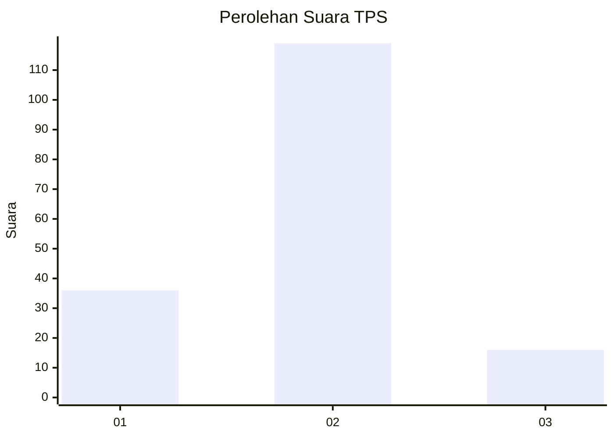

# Hasil

## Grafik

## Tabel

| No. | Nama Paslon    | Suara | Suara (raw) | Persentase |
|:--- |:-------------- | -----:| -----------:| ----------:|
| 1   | ANIES MUHAIMIN | 36    | [36][p-1]   | 21,05      |
| 2   | PRABOWO GIBRAN | 119   | [119][p-2]  | 69,59      |
| 3   | GANJAR MAHFUD  | 16    | [16][p-3]   | 9,36       |

[p-1]: https://github.com/gigit-pemilu/pemilu-2024/blob/main/pilpres/hitung-suara/sub/35-jawa-timur/sub/78-kota-surabaya/sub/14-tandes/sub/1009-manukan-kulon/sub/002-tps/sub/paslon-1.txt
[p-2]: https://github.com/gigit-pemilu/pemilu-2024/blob/main/pilpres/hitung-suara/sub/35-jawa-timur/sub/78-kota-surabaya/sub/14-tandes/sub/1009-manukan-kulon/sub/002-tps/sub/paslon-2.txt
[p-3]: https://github.com/gigit-pemilu/pemilu-2024/blob/main/pilpres/hitung-suara/sub/35-jawa-timur/sub/78-kota-surabaya/sub/14-tandes/sub/1009-manukan-kulon/sub/002-tps/sub/paslon-3.txt

## Foto C Plano

https://sirekap-obj-formc.kpu.go.id/c7c2/pemilu/ppwp/35/78/14/10/09/3578141009002-20240225-040906--648e63d1-e94c-4b40-a247-23a3e4baecb4.jpg

https://sirekap-obj-formc.kpu.go.id/c7c2/pemilu/ppwp/35/78/14/10/09/3578141009002-20240225-040932--bfcc87f1-35d0-40d9-93fb-73df0bb1304c.jpg

https://sirekap-obj-formc.kpu.go.id/c7c2/pemilu/ppwp/35/78/14/10/09/3578141009002-20240225-040953--cd94f74b-31fb-4385-9841-bf4a24ac068d.jpg

## Metadata

| Key        | Value               |
| ---------- | ------------------- |
| Time Stamp | 2024-02-28 21:00:00 |

