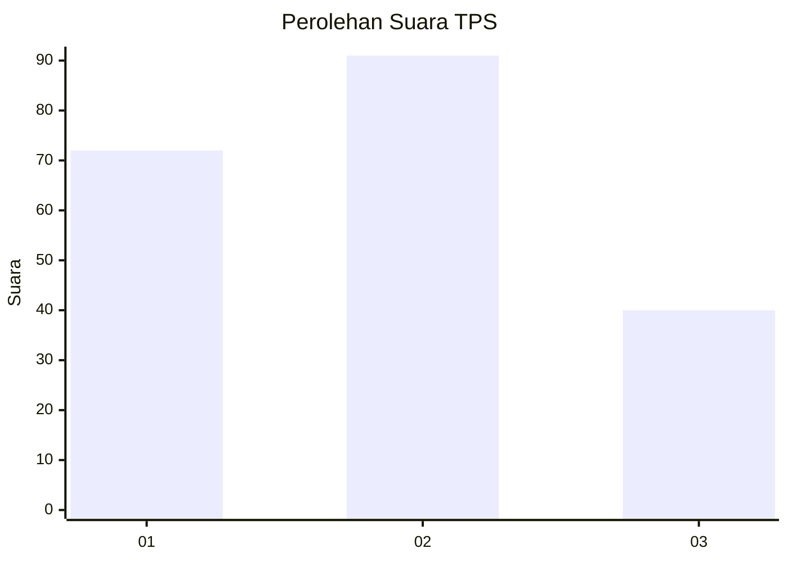
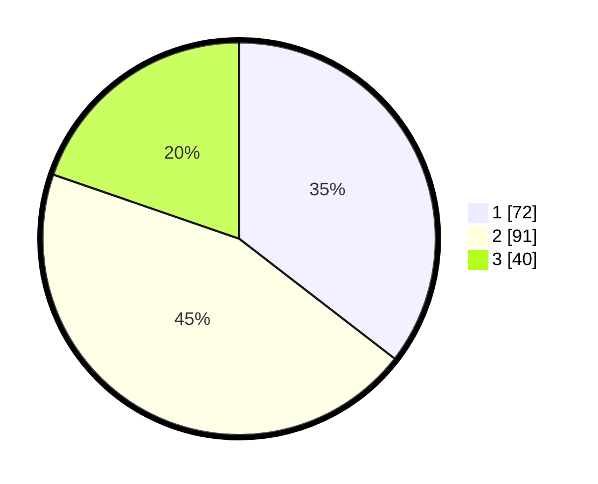

# Hasil

## Grafik

## Tabel

| No. | Nama Paslon    | Suara | Suara (raw) | Persentase |
|:--- |:-------------- | -----:| -----------:| ----------:|
| 1   | ANIES MUHAIMIN | 72    | [72][p-1]   | 35,47      |
| 2   | PRABOWO GIBRAN | 91    | [91][p-2]   | 44,83      |
| 3   | GANJAR MAHFUD  | 40    | [40][p-3]   | 19,70      |

[p-1]: https://github.com/gigit-pemilu/pemilu-2024/blob/main/pilpres/hitung-suara/sub/35-jawa-timur/sub/78-kota-surabaya/sub/14-tandes/sub/1009-manukan-kulon/sub/031-tps/sub/paslon-1.txt
[p-2]: https://github.com/gigit-pemilu/pemilu-2024/blob/main/pilpres/hitung-suara/sub/35-jawa-timur/sub/78-kota-surabaya/sub/14-tandes/sub/1009-manukan-kulon/sub/031-tps/sub/paslon-2.txt
[p-3]: https://github.com/gigit-pemilu/pemilu-2024/blob/main/pilpres/hitung-suara/sub/35-jawa-timur/sub/78-kota-surabaya/sub/14-tandes/sub/1009-manukan-kulon/sub/031-tps/sub/paslon-3.txt

## Foto C Plano

https://sirekap-obj-formc.kpu.go.id/700e/pemilu/ppwp/35/78/14/10/09/3578141009031-20240214-224757--c942c297-87da-4587-830c-0bab8658a4cb.jpg

https://sirekap-obj-formc.kpu.go.id/700e/pemilu/ppwp/35/78/14/10/09/3578141009031-20240214-224834--2c43dffb-a561-4fbb-8373-97ec5cff2f3a.jpg

https://sirekap-obj-formc.kpu.go.id/700e/pemilu/ppwp/35/78/14/10/09/3578141009031-20240214-224944--fe784360-63bd-41c1-9154-dbc6b169e75f.jpg

## Metadata

| Key        | Value               |
| ---------- | ------------------- |
| Time Stamp | 2024-02-26 17:00:04 |

