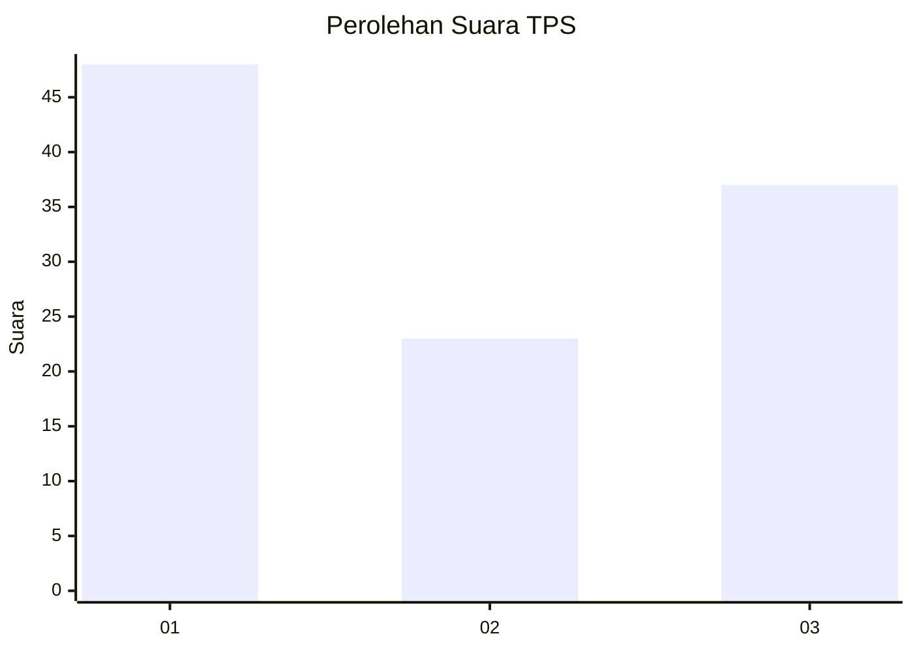
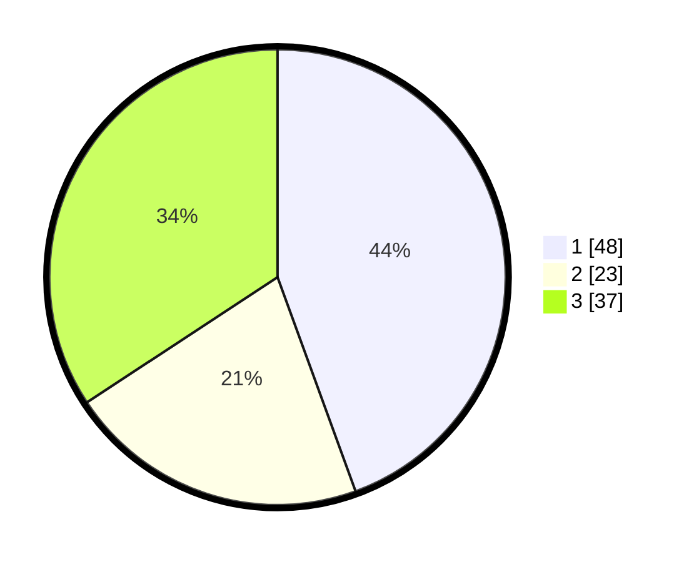

# Hasil

## Grafik

## Tabel

| No. | Nama Paslon    | Suara | Suara (raw) | Persentase |
|:--- |:-------------- | -----:| -----------:| ----------:|
| 1   | ANIES MUHAIMIN | 48    | [48][p-1]   | 44,44      |
| 2   | PRABOWO GIBRAN | 23    | [23][p-2]   | 21,30      |
| 3   | GANJAR MAHFUD  | 37    | [37][p-3]   | 34,26      |

[p-1]: https://github.com/gigit-pemilu/pemilu-2024-35-jawa-timur/blob/main/pilpres/hitung-suara/sub/35-jawa-timur/sub/78-kota-surabaya/sub/14-tandes/sub/1009-manukan-kulon/sub/085-tps/sub/paslon-1.txt
[p-2]: https://github.com/gigit-pemilu/pemilu-2024-35-jawa-timur/blob/main/pilpres/hitung-suara/sub/35-jawa-timur/sub/78-kota-surabaya/sub/14-tandes/sub/1009-manukan-kulon/sub/085-tps/sub/paslon-2.txt
[p-3]: https://github.com/gigit-pemilu/pemilu-2024-35-jawa-timur/blob/main/pilpres/hitung-suara/sub/35-jawa-timur/sub/78-kota-surabaya/sub/14-tandes/sub/1009-manukan-kulon/sub/085-tps/sub/paslon-3.txt

## Foto C Plano

https://sirekap-obj-formc.kpu.go.id/1aa6/pemilu/ppwp/35/78/14/10/09/3578141009085-20240214-201305--e389e549-c93b-428c-ae1c-1f2cbd3391b2.jpg

https://sirekap-obj-formc.kpu.go.id/1aa6/pemilu/ppwp/35/78/14/10/09/3578141009085-20240214-201759--b67eacef-4206-45a1-8ffc-127b95c4f474.jpg

https://sirekap-obj-formc.kpu.go.id/1aa6/pemilu/ppwp/35/78/14/10/09/3578141009085-20240214-201806--b9d0458e-8793-438d-a7b1-d13ade49da53.jpg

## Metadata

| Key        | Value               |
| ---------- | ------------------- |
| Time Stamp | 2024-02-24 22:31:28 |

