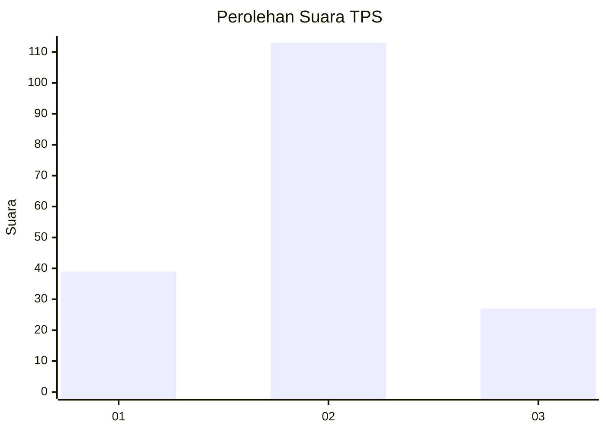
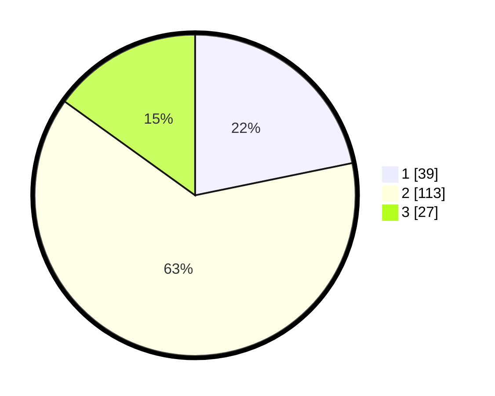

# Hasil

## Grafik

## Tabel

| No. | Nama Paslon    | Suara | Suara (raw) | Persentase |
|:--- |:-------------- | -----:| -----------:| ----------:|
| 1   | ANIES MUHAIMIN | 39    | [39][p-1]   | 21,79      |
| 2   | PRABOWO GIBRAN | 113   | [113][p-2]  | 63,13      |
| 3   | GANJAR MAHFUD  | 27    | [27][p-3]   | 15,08      |

[p-1]: https://github.com/gigit-pemilu/pemilu-2024-35-jawa-timur/blob/main/pilpres/hitung-suara/sub/35-jawa-timur/sub/78-kota-surabaya/sub/15-krembangan/sub/1001-krembangan-selatan/sub/002-tps/sub/paslon-1.txt
[p-2]: https://github.com/gigit-pemilu/pemilu-2024-35-jawa-timur/blob/main/pilpres/hitung-suara/sub/35-jawa-timur/sub/78-kota-surabaya/sub/15-krembangan/sub/1001-krembangan-selatan/sub/002-tps/sub/paslon-2.txt
[p-3]: https://github.com/gigit-pemilu/pemilu-2024-35-jawa-timur/blob/main/pilpres/hitung-suara/sub/35-jawa-timur/sub/78-kota-surabaya/sub/15-krembangan/sub/1001-krembangan-selatan/sub/002-tps/sub/paslon-3.txt

## Foto C Plano

https://sirekap-obj-formc.kpu.go.id/80ee/pemilu/ppwp/35/78/15/10/01/3578151001002-20240219-152946--6ce8e3aa-3cff-4403-af22-f0985b4a2bfe.jpg

https://sirekap-obj-formc.kpu.go.id/80ee/pemilu/ppwp/35/78/15/10/01/3578151001002-20240219-153115--efbf6dbf-1661-48d6-bf44-18a36e5fedf3.jpg

https://sirekap-obj-formc.kpu.go.id/80ee/pemilu/ppwp/35/78/15/10/01/3578151001002-20240219-152856--502c7689-f164-42ca-85e3-62582b0af6ab.jpg

## Metadata

| Key        | Value               |
| ---------- | ------------------- |
| Time Stamp | 2024-02-24 22:31:28 |

