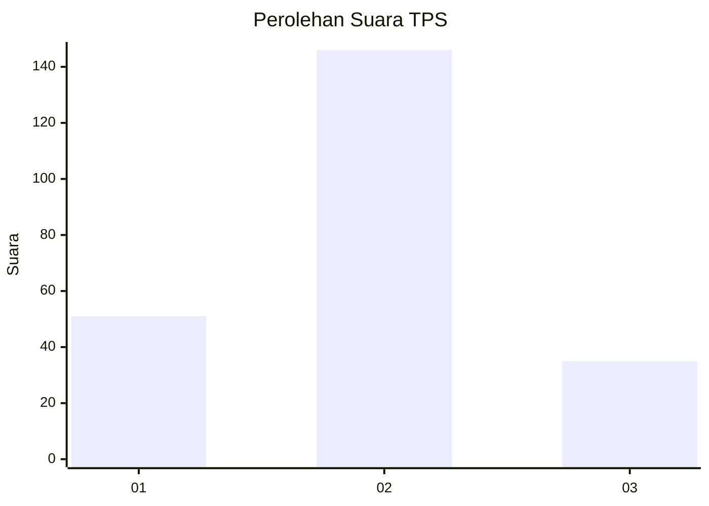
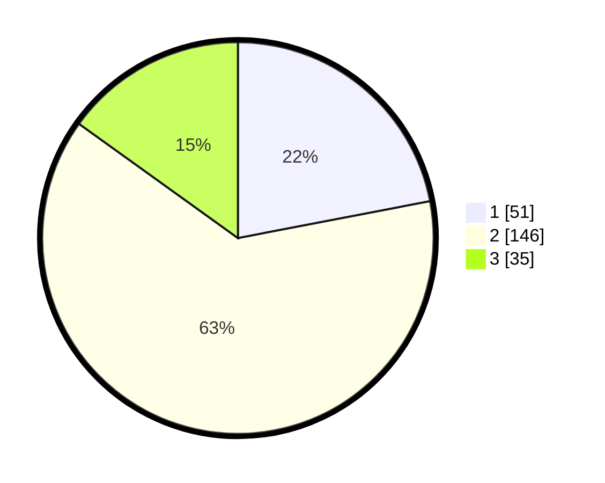

# Hasil

## Grafik

## Tabel

| No. | Nama Paslon    | Suara | Suara (raw) | Persentase |
|:--- |:-------------- | -----:| -----------:| ----------:|
| 1   | ANIES MUHAIMIN | 51    | [51][p-1]   | 21,98      |
| 2   | PRABOWO GIBRAN | 146   | [146][p-2]  | 62,93      |
| 3   | GANJAR MAHFUD  | 35    | [35][p-3]   | 15,09      |

[p-1]: https://github.com/gigit-pemilu/pemilu-2024-35-jawa-timur/blob/main/pilpres/hitung-suara/sub/35-jawa-timur/sub/78-kota-surabaya/sub/15-krembangan/sub/1001-krembangan-selatan/sub/009-tps/sub/paslon-1.txt
[p-2]: https://github.com/gigit-pemilu/pemilu-2024-35-jawa-timur/blob/main/pilpres/hitung-suara/sub/35-jawa-timur/sub/78-kota-surabaya/sub/15-krembangan/sub/1001-krembangan-selatan/sub/009-tps/sub/paslon-2.txt
[p-3]: https://github.com/gigit-pemilu/pemilu-2024-35-jawa-timur/blob/main/pilpres/hitung-suara/sub/35-jawa-timur/sub/78-kota-surabaya/sub/15-krembangan/sub/1001-krembangan-selatan/sub/009-tps/sub/paslon-3.txt

## Foto C Plano

https://sirekap-obj-formc.kpu.go.id/0203/pemilu/ppwp/35/78/15/10/01/3578151001009-20240214-191353--4f5cb197-4839-4543-967b-9f531a9087d2.jpg

https://sirekap-obj-formc.kpu.go.id/0203/pemilu/ppwp/35/78/15/10/01/3578151001009-20240214-191452--ad376880-6bf3-431b-9dc1-fe38b5ce9c9c.jpg

https://sirekap-obj-formc.kpu.go.id/0203/pemilu/ppwp/35/78/15/10/01/3578151001009-20240214-191220--69f8acfe-586f-4e9b-8417-88317d38c1d0.jpg

## Metadata

| Key        | Value               |
| ---------- | ------------------- |
| Time Stamp | 2024-02-16 14:00:34 |

