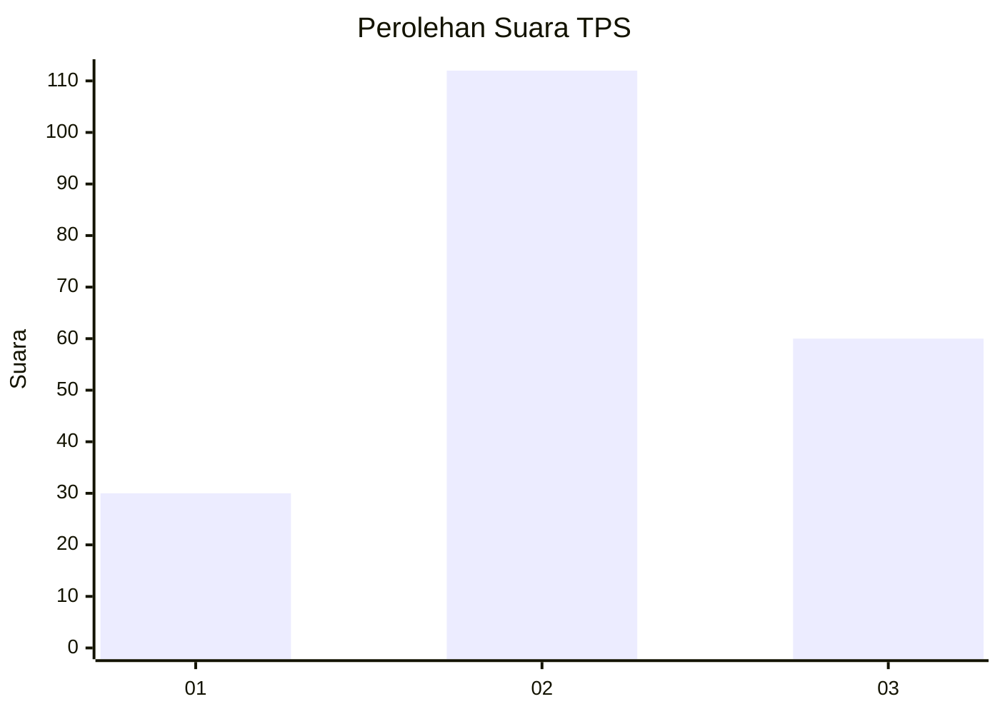
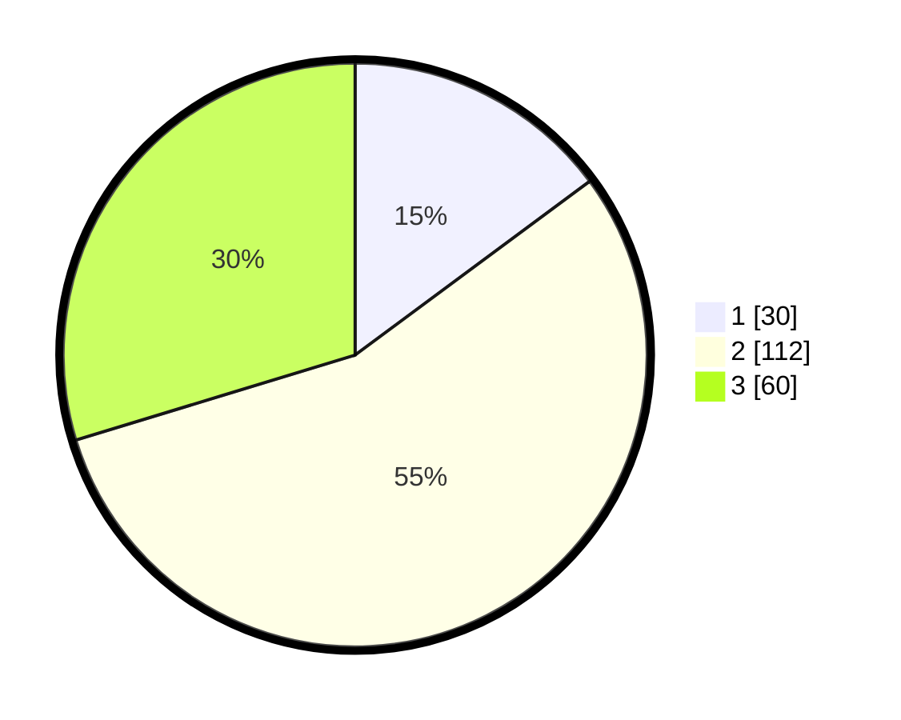

# Hasil

## Grafik

## Tabel

| No. | Nama Paslon    | Suara | Suara (raw) | Persentase |
|:--- |:-------------- | -----:| -----------:| ----------:|
| 1   | ANIES MUHAIMIN | 30    | [30][p-1]   | 14,85      |
| 2   | PRABOWO GIBRAN | 112   | [112][p-2]  | 55,45      |
| 3   | GANJAR MAHFUD  | 60    | [60][p-3]   | 29,70      |

[p-1]: https://github.com/gigit-pemilu/pemilu-2024-35-jawa-timur/blob/main/pilpres/hitung-suara/sub/35-jawa-timur/sub/78-kota-surabaya/sub/15-krembangan/sub/1001-krembangan-selatan/sub/017-tps/sub/paslon-1.txt
[p-2]: https://github.com/gigit-pemilu/pemilu-2024-35-jawa-timur/blob/main/pilpres/hitung-suara/sub/35-jawa-timur/sub/78-kota-surabaya/sub/15-krembangan/sub/1001-krembangan-selatan/sub/017-tps/sub/paslon-2.txt
[p-3]: https://github.com/gigit-pemilu/pemilu-2024-35-jawa-timur/blob/main/pilpres/hitung-suara/sub/35-jawa-timur/sub/78-kota-surabaya/sub/15-krembangan/sub/1001-krembangan-selatan/sub/017-tps/sub/paslon-3.txt

## Foto C Plano

https://sirekap-obj-formc.kpu.go.id/b6db/pemilu/ppwp/35/78/15/10/01/3578151001017-20240219-110658--09608484-e03c-4c37-87c5-92425453947b.jpg

https://sirekap-obj-formc.kpu.go.id/b6db/pemilu/ppwp/35/78/15/10/01/3578151001017-20240219-110916--ee1a16b9-e92c-43b2-bc4a-a03c1563f67d.jpg

https://sirekap-obj-formc.kpu.go.id/b6db/pemilu/ppwp/35/78/15/10/01/3578151001017-20240219-111411--a1ca7e73-6cb5-43f7-a1cd-cffd15c7c718.jpg

## Metadata

| Key        | Value               |
| ---------- | ------------------- |
| Time Stamp | 2024-02-25 15:00:00 |

