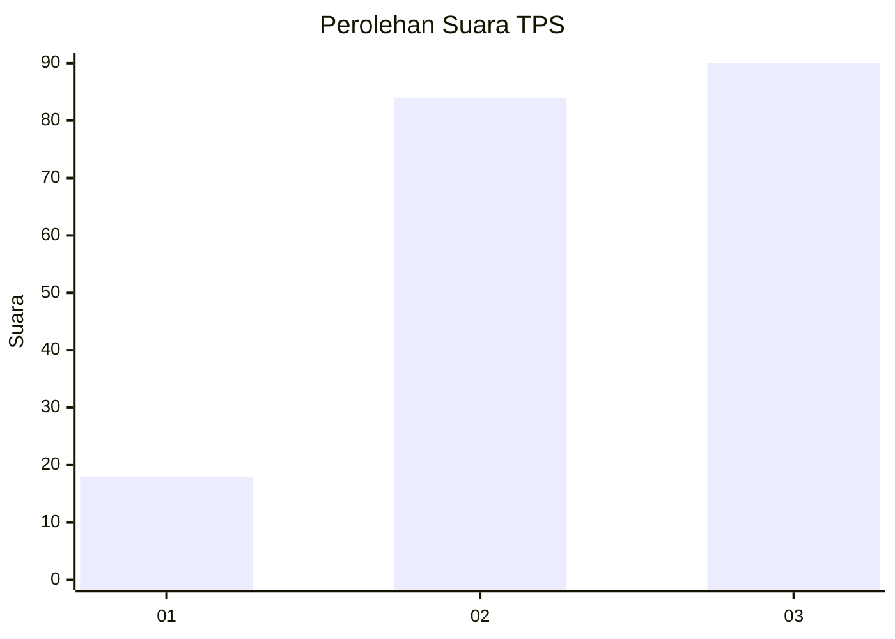
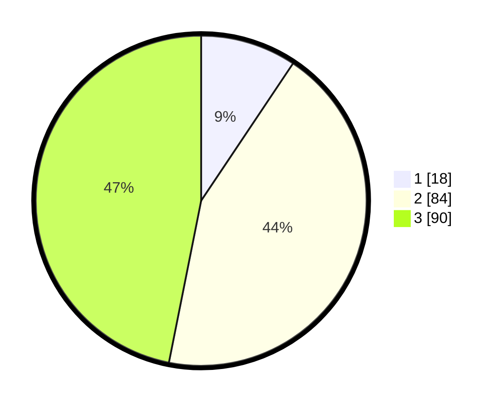

# Hasil

## Grafik

## Tabel

| No. | Nama Paslon    | Suara | Suara (raw) | Persentase |
|:--- |:-------------- | -----:| -----------:| ----------:|
| 1   | ANIES MUHAIMIN | 18    | [18][p-1]   | 9,38       |
| 2   | PRABOWO GIBRAN | 84    | [84][p-2]   | 43,75      |
| 3   | GANJAR MAHFUD  | 90    | [90][p-3]   | 46,88      |

[p-1]: https://github.com/gigit-pemilu/pemilu-2024-35-jawa-timur/blob/main/pilpres/hitung-suara/sub/35-jawa-timur/sub/78-kota-surabaya/sub/15-krembangan/sub/1001-krembangan-selatan/sub/023-tps/sub/paslon-1.txt
[p-2]: https://github.com/gigit-pemilu/pemilu-2024-35-jawa-timur/blob/main/pilpres/hitung-suara/sub/35-jawa-timur/sub/78-kota-surabaya/sub/15-krembangan/sub/1001-krembangan-selatan/sub/023-tps/sub/paslon-2.txt
[p-3]: https://github.com/gigit-pemilu/pemilu-2024-35-jawa-timur/blob/main/pilpres/hitung-suara/sub/35-jawa-timur/sub/78-kota-surabaya/sub/15-krembangan/sub/1001-krembangan-selatan/sub/023-tps/sub/paslon-3.txt

## Foto C Plano

https://sirekap-obj-formc.kpu.go.id/1c5e/pemilu/ppwp/35/78/15/10/01/3578151001023-20240221-093919--7be997ba-57ee-432f-a8d5-ce8dd45f2b60.jpg

https://sirekap-obj-formc.kpu.go.id/1c5e/pemilu/ppwp/35/78/15/10/01/3578151001023-20240221-094227--e0f19388-4fd1-413a-ba95-fa5c5a42215d.jpg

https://sirekap-obj-formc.kpu.go.id/1c5e/pemilu/ppwp/35/78/15/10/01/3578151001023-20240221-094340--871b44ba-a141-4b85-846c-acdf76ce01ec.jpg

## Metadata

| Key        | Value               |
| ---------- | ------------------- |
| Time Stamp | 2024-02-21 10:00:00 |

