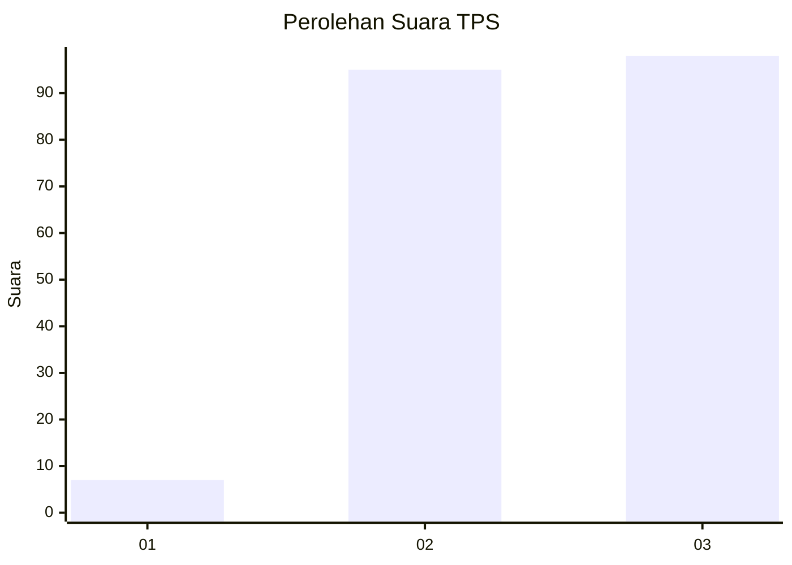
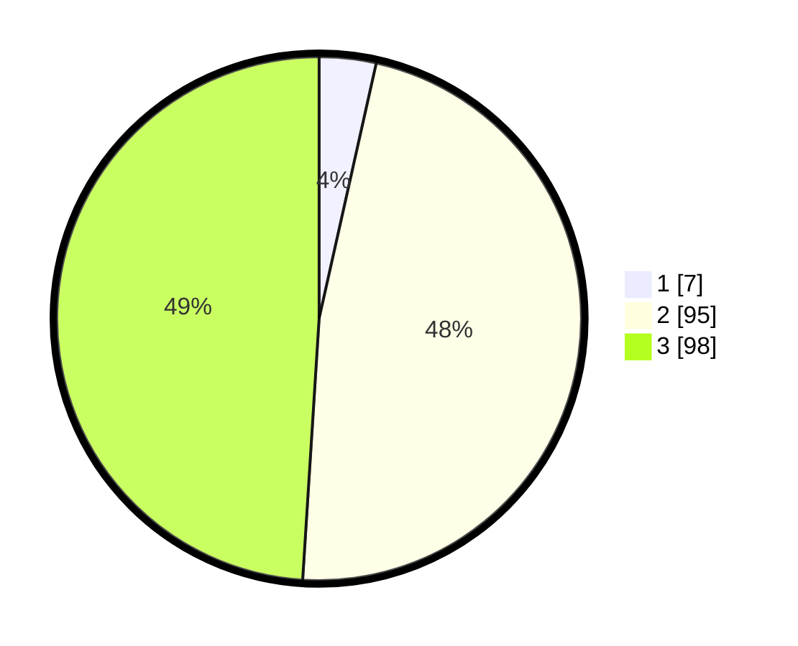

# Hasil

## Grafik

## Tabel

| No. | Nama Paslon    | Suara | Suara (raw) | Persentase |
|:--- |:-------------- | -----:| -----------:| ----------:|
| 1   | ANIES MUHAIMIN | 7     | [7][p-1]    | 3,50       |
| 2   | PRABOWO GIBRAN | 95    | [95][p-2]   | 47,50      |
| 3   | GANJAR MAHFUD  | 98    | [98][p-3]   | 49,00      |

[p-1]: https://github.com/gigit-pemilu/pemilu-2024/blob/main/pilpres/hitung-suara/sub/35-jawa-timur/sub/78-kota-surabaya/sub/15-krembangan/sub/1001-krembangan-selatan/sub/029-tps/sub/paslon-1.txt
[p-2]: https://github.com/gigit-pemilu/pemilu-2024/blob/main/pilpres/hitung-suara/sub/35-jawa-timur/sub/78-kota-surabaya/sub/15-krembangan/sub/1001-krembangan-selatan/sub/029-tps/sub/paslon-2.txt
[p-3]: https://github.com/gigit-pemilu/pemilu-2024/blob/main/pilpres/hitung-suara/sub/35-jawa-timur/sub/78-kota-surabaya/sub/15-krembangan/sub/1001-krembangan-selatan/sub/029-tps/sub/paslon-3.txt

## Foto C Plano

https://sirekap-obj-formc.kpu.go.id/53b5/pemilu/ppwp/35/78/15/10/01/3578151001029-20240214-203725--a3a7d973-708c-4488-8cc7-c56c6a6ac76f.jpg

https://sirekap-obj-formc.kpu.go.id/53b5/pemilu/ppwp/35/78/15/10/01/3578151001029-20240214-203817--ca309283-fe60-4945-b2d1-4f01ab370eca.jpg

https://sirekap-obj-formc.kpu.go.id/53b5/pemilu/ppwp/35/78/15/10/01/3578151001029-20240214-203856--c83acf60-3415-42b8-8a82-56cdc0ae0d51.jpg

## Metadata

| Key        | Value               |
| ---------- | ------------------- |
| Time Stamp | 2024-02-24 22:31:28 |

