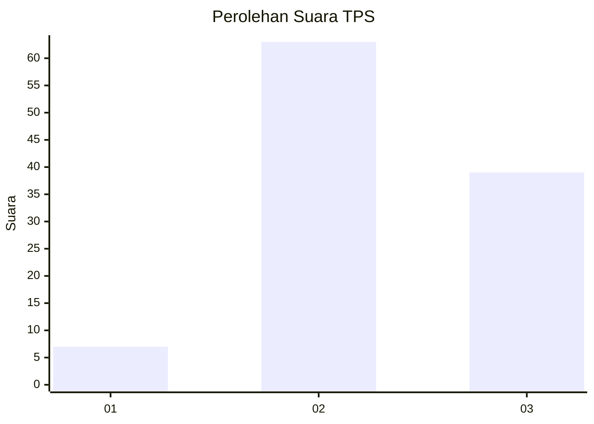
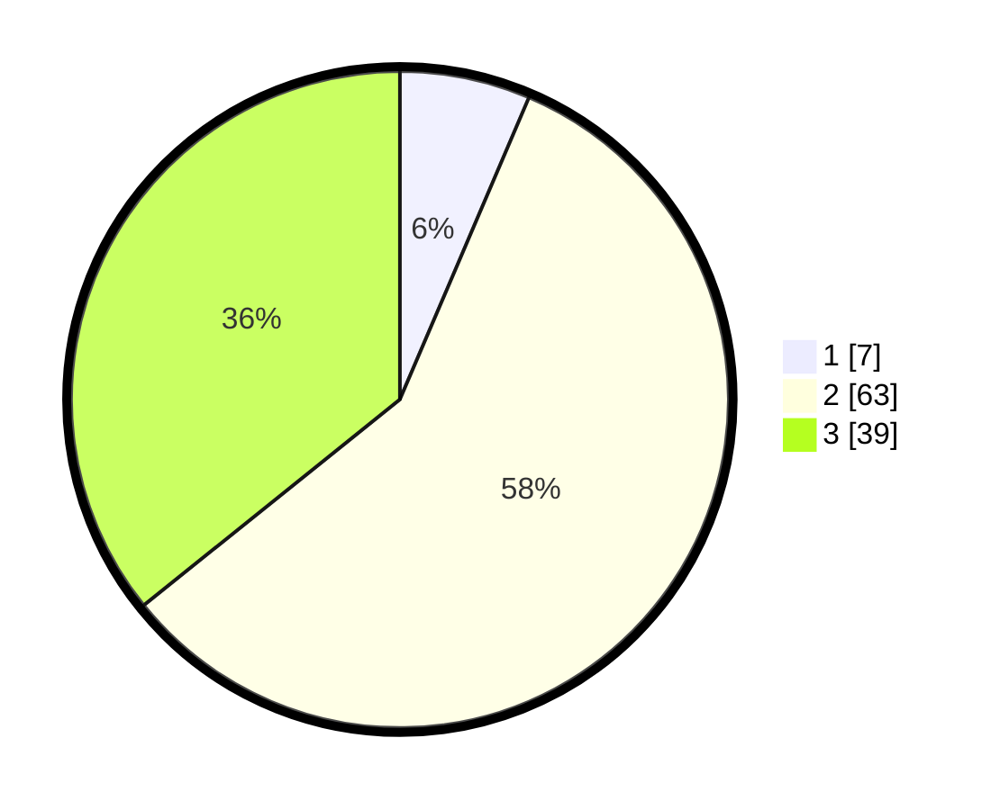

# Hasil

## Grafik

## Tabel

| No. | Nama Paslon    | Suara | Suara (raw) | Persentase |
|:--- |:-------------- | -----:| -----------:| ----------:|
| 1   | ANIES MUHAIMIN | 7     | [7][p-1]    | 6,42       |
| 2   | PRABOWO GIBRAN | 63    | [63][p-2]   | 57,80      |
| 3   | GANJAR MAHFUD  | 39    | [39][p-3]   | 35,78      |

[p-1]: https://github.com/gigit-pemilu/pemilu-2024-35-jawa-timur/blob/main/pilpres/hitung-suara/sub/35-jawa-timur/sub/78-kota-surabaya/sub/15-krembangan/sub/1001-krembangan-selatan/sub/035-tps/sub/paslon-1.txt
[p-2]: https://github.com/gigit-pemilu/pemilu-2024-35-jawa-timur/blob/main/pilpres/hitung-suara/sub/35-jawa-timur/sub/78-kota-surabaya/sub/15-krembangan/sub/1001-krembangan-selatan/sub/035-tps/sub/paslon-2.txt
[p-3]: https://github.com/gigit-pemilu/pemilu-2024-35-jawa-timur/blob/main/pilpres/hitung-suara/sub/35-jawa-timur/sub/78-kota-surabaya/sub/15-krembangan/sub/1001-krembangan-selatan/sub/035-tps/sub/paslon-3.txt

## Foto C Plano

https://sirekap-obj-formc.kpu.go.id/c0ff/pemilu/ppwp/35/78/15/10/01/3578151001035-20240219-163252--c982f8b5-09f4-4517-b815-f117b0e2aa15.jpg

https://sirekap-obj-formc.kpu.go.id/c0ff/pemilu/ppwp/35/78/15/10/01/3578151001035-20240219-163340--3e239ddf-0305-4b0c-a5c4-7b49860b812a.jpg

https://sirekap-obj-formc.kpu.go.id/c0ff/pemilu/ppwp/35/78/15/10/01/3578151001035-20240219-163425--3ad0056d-9a64-4e40-aa01-33e24ed2a02f.jpg

## Metadata

| Key        | Value               |
| ---------- | ------------------- |
| Time Stamp | 2024-03-01 18:00:00 |

