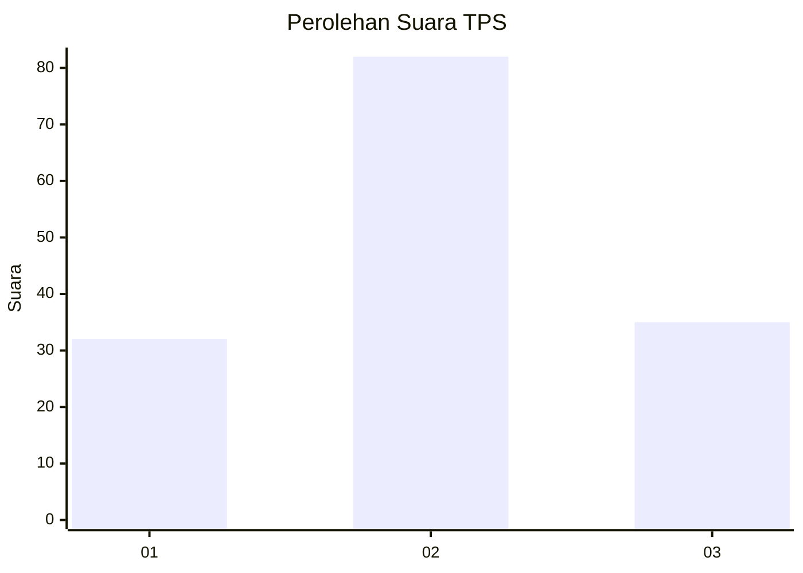
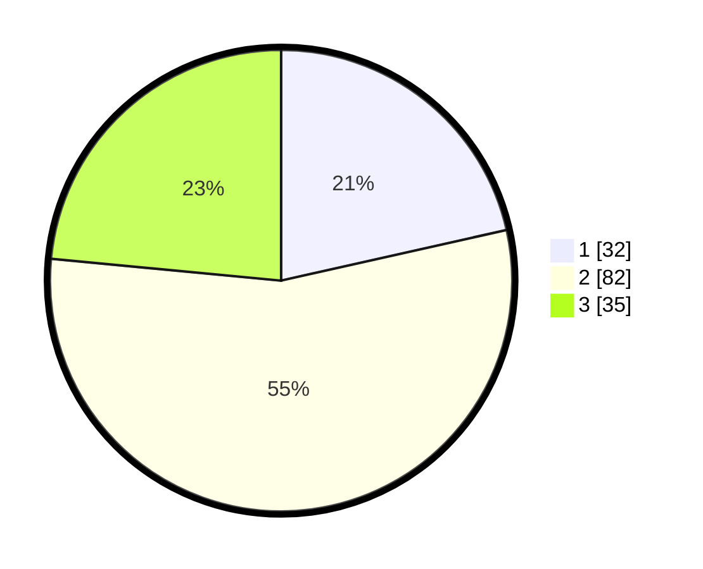

# Hasil

## Grafik

## Tabel

| No. | Nama Paslon    | Suara | Suara (raw) | Persentase |
|:--- |:-------------- | -----:| -----------:| ----------:|
| 1   | ANIES MUHAIMIN | 32    | [32][p-1]   | 21,48      |
| 2   | PRABOWO GIBRAN | 82    | [82][p-2]   | 55,03      |
| 3   | GANJAR MAHFUD  | 35    | [35][p-3]   | 23,49      |

[p-1]: https://github.com/gigit-pemilu/pemilu-2024/blob/main/pilpres/hitung-suara/sub/35-jawa-timur/sub/78-kota-surabaya/sub/15-krembangan/sub/1003-perak-barat/sub/020-tps/sub/paslon-1.txt
[p-2]: https://github.com/gigit-pemilu/pemilu-2024/blob/main/pilpres/hitung-suara/sub/35-jawa-timur/sub/78-kota-surabaya/sub/15-krembangan/sub/1003-perak-barat/sub/020-tps/sub/paslon-2.txt
[p-3]: https://github.com/gigit-pemilu/pemilu-2024/blob/main/pilpres/hitung-suara/sub/35-jawa-timur/sub/78-kota-surabaya/sub/15-krembangan/sub/1003-perak-barat/sub/020-tps/sub/paslon-3.txt

## Foto C Plano

https://sirekap-obj-formc.kpu.go.id/8f64/pemilu/ppwp/35/78/15/10/03/3578151003020-20240214-233851--295f84e8-0726-4fe8-be32-a47a19747f34.jpg

https://sirekap-obj-formc.kpu.go.id/8f64/pemilu/ppwp/35/78/15/10/03/3578151003020-20240214-234035--94abed11-29f7-4ea7-81ec-b9a6787152d0.jpg

https://sirekap-obj-formc.kpu.go.id/8f64/pemilu/ppwp/35/78/15/10/03/3578151003020-20240214-234338--648e9cc0-272c-4682-b94e-d582c10b9cb9.jpg

## Metadata

| Key        | Value               |
| ---------- | ------------------- |
| Time Stamp | 2024-02-25 17:00:00 |

