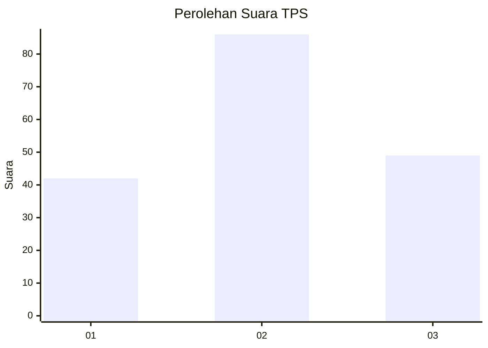
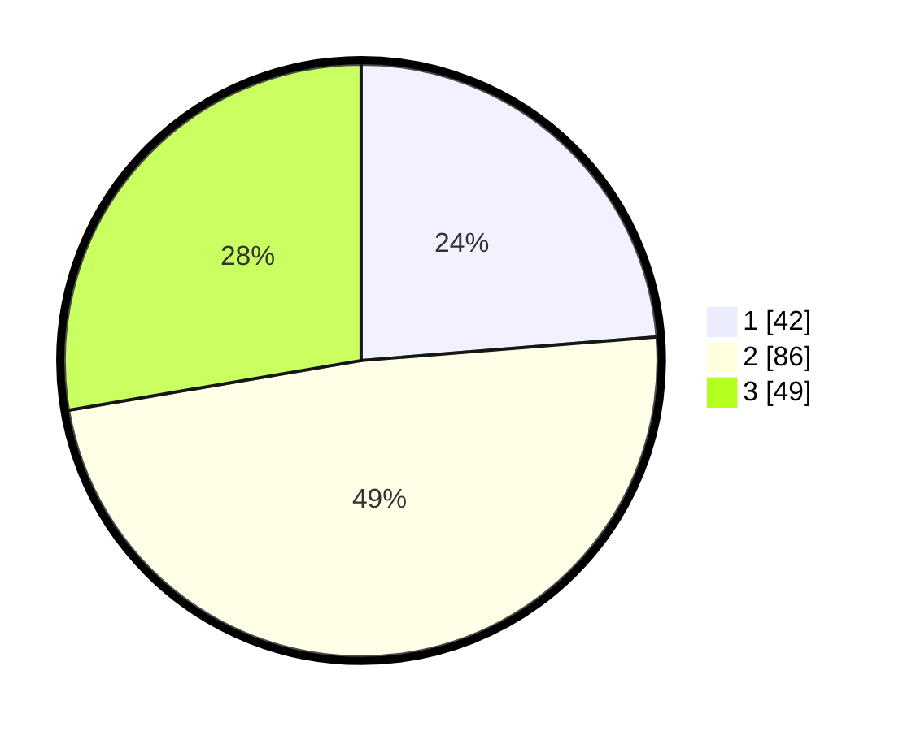

# Hasil

## Grafik

## Tabel

| No. | Nama Paslon    | Suara | Suara (raw) | Persentase |
|:--- |:-------------- | -----:| -----------:| ----------:|
| 1   | ANIES MUHAIMIN | 42    | [42][p-1]   | 23,73      |
| 2   | PRABOWO GIBRAN | 86    | [86][p-2]   | 48,59      |
| 3   | GANJAR MAHFUD  | 49    | [49][p-3]   | 27,68      |

[p-1]: https://github.com/gigit-pemilu/pemilu-2024/blob/main/pilpres/hitung-suara/sub/35-jawa-timur/sub/78-kota-surabaya/sub/15-krembangan/sub/1003-perak-barat/sub/038-tps/sub/paslon-1.txt
[p-2]: https://github.com/gigit-pemilu/pemilu-2024/blob/main/pilpres/hitung-suara/sub/35-jawa-timur/sub/78-kota-surabaya/sub/15-krembangan/sub/1003-perak-barat/sub/038-tps/sub/paslon-2.txt
[p-3]: https://github.com/gigit-pemilu/pemilu-2024/blob/main/pilpres/hitung-suara/sub/35-jawa-timur/sub/78-kota-surabaya/sub/15-krembangan/sub/1003-perak-barat/sub/038-tps/sub/paslon-3.txt

## Foto C Plano

https://sirekap-obj-formc.kpu.go.id/5f92/pemilu/ppwp/35/78/15/10/03/3578151003038-20240215-110455--58cb1c28-b6b3-4730-b74b-53e3b8278bbe.jpg

https://sirekap-obj-formc.kpu.go.id/5f92/pemilu/ppwp/35/78/15/10/03/3578151003038-20240214-141938--a5dfdbc8-2cc3-4825-b43f-ac2cca291ab9.jpg

https://sirekap-obj-formc.kpu.go.id/5f92/pemilu/ppwp/35/78/15/10/03/3578151003038-20240214-221218--a12bc171-8d09-4ffa-8d64-f8143b6cacfa.jpg

## Metadata

| Key        | Value               |
| ---------- | ------------------- |
| Time Stamp | 2024-02-16 14:30:33 |

