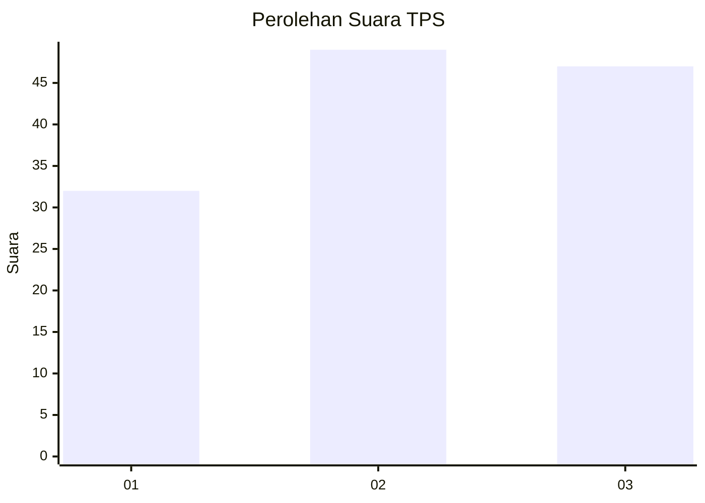
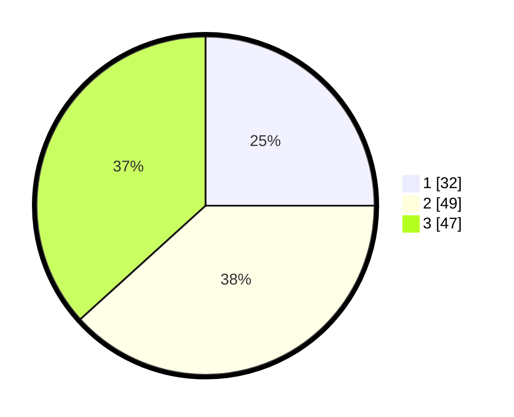

# Hasil

## Grafik

## Tabel

| No. | Nama Paslon    | Suara | Suara (raw) | Persentase |
|:--- |:-------------- | -----:| -----------:| ----------:|
| 1   | ANIES MUHAIMIN | 32    | [32][p-1]   | 25,00      |
| 2   | PRABOWO GIBRAN | 49    | [49][p-2]   | 38,28      |
| 3   | GANJAR MAHFUD  | 47    | [47][p-3]   | 36,72      |

[p-1]: https://github.com/gigit-pemilu/pemilu-2024/blob/main/pilpres/hitung-suara/sub/35-jawa-timur/sub/78-kota-surabaya/sub/15-krembangan/sub/1004-dupak/sub/045-tps/sub/paslon-1.txt
[p-2]: https://github.com/gigit-pemilu/pemilu-2024/blob/main/pilpres/hitung-suara/sub/35-jawa-timur/sub/78-kota-surabaya/sub/15-krembangan/sub/1004-dupak/sub/045-tps/sub/paslon-2.txt
[p-3]: https://github.com/gigit-pemilu/pemilu-2024/blob/main/pilpres/hitung-suara/sub/35-jawa-timur/sub/78-kota-surabaya/sub/15-krembangan/sub/1004-dupak/sub/045-tps/sub/paslon-3.txt

## Foto C Plano

https://sirekap-obj-formc.kpu.go.id/63a4/pemilu/ppwp/35/78/15/10/04/3578151004045-20240215-004025--187ee7b6-2b12-4ca0-b17e-85286a69d941.jpg

https://sirekap-obj-formc.kpu.go.id/63a4/pemilu/ppwp/35/78/15/10/04/3578151004045-20240215-004108--30f156eb-265c-4336-b22b-4f3404f579b3.jpg

https://sirekap-obj-formc.kpu.go.id/63a4/pemilu/ppwp/35/78/15/10/04/3578151004045-20240215-020334--1bf6abc5-8606-4150-a588-ad724ec5f3f4.jpg

## Metadata

| Key        | Value               |
| ---------- | ------------------- |
| Time Stamp | 2024-02-25 17:00:00 |

