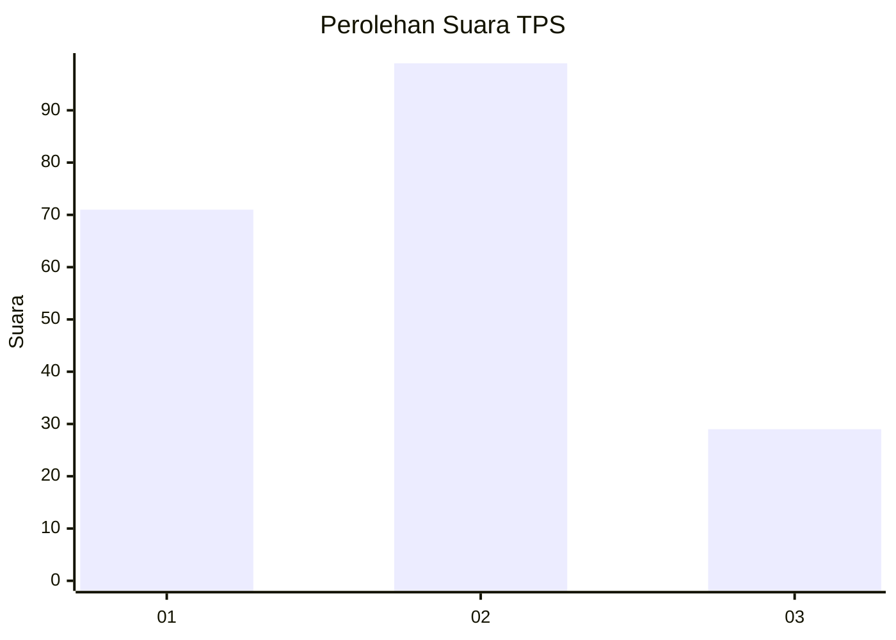
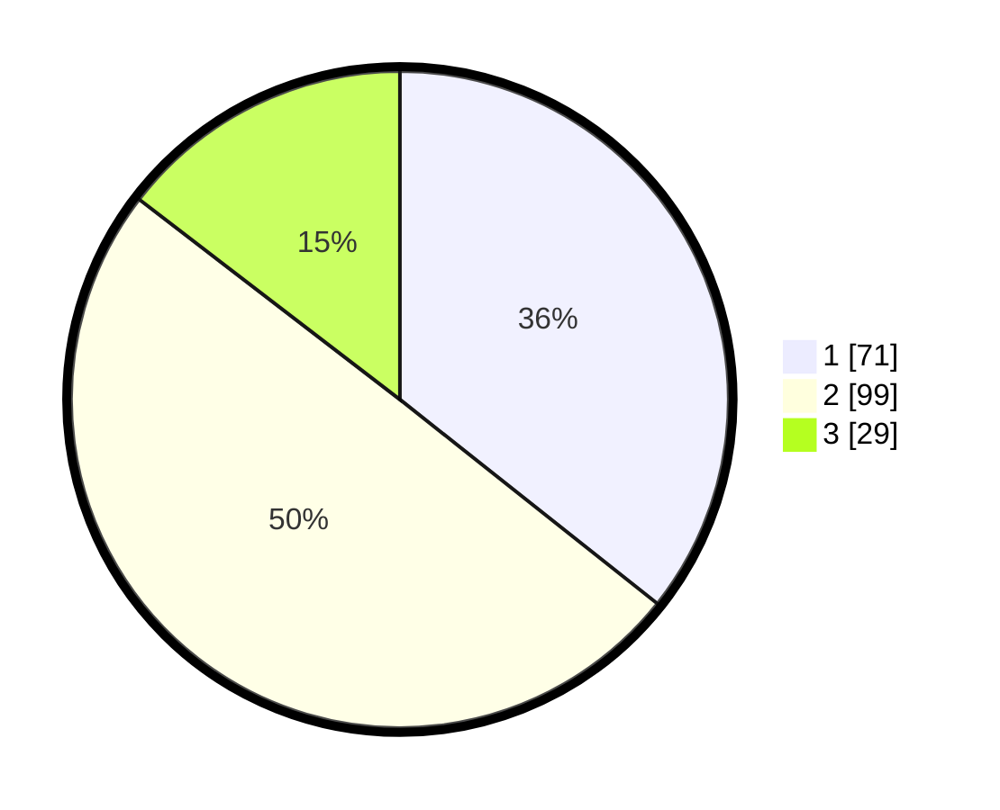

# Hasil

## Grafik

## Tabel

| No. | Nama Paslon    | Suara | Suara (raw) | Persentase |
|:--- |:-------------- | -----:| -----------:| ----------:|
| 1   | ANIES MUHAIMIN | 71    | [71][p-1]   | 35,68      |
| 2   | PRABOWO GIBRAN | 99    | [99][p-2]   | 49,75      |
| 3   | GANJAR MAHFUD  | 29    | [29][p-3]   | 14,57      |

[p-1]: https://github.com/gigit-pemilu/pemilu-2024/blob/main/pilpres/hitung-suara/sub/35-jawa-timur/sub/78-kota-surabaya/sub/15-krembangan/sub/1005-morokrembangan/sub/010-tps/sub/paslon-1.txt
[p-2]: https://github.com/gigit-pemilu/pemilu-2024/blob/main/pilpres/hitung-suara/sub/35-jawa-timur/sub/78-kota-surabaya/sub/15-krembangan/sub/1005-morokrembangan/sub/010-tps/sub/paslon-2.txt
[p-3]: https://github.com/gigit-pemilu/pemilu-2024/blob/main/pilpres/hitung-suara/sub/35-jawa-timur/sub/78-kota-surabaya/sub/15-krembangan/sub/1005-morokrembangan/sub/010-tps/sub/paslon-3.txt

## Foto C Plano

https://sirekap-obj-formc.kpu.go.id/21ae/pemilu/ppwp/35/78/15/10/05/3578151005010-20240216-140009--d42b4528-036e-4501-aa71-1b5300fe1913.jpg

https://sirekap-obj-formc.kpu.go.id/21ae/pemilu/ppwp/35/78/15/10/05/3578151005010-20240216-141724--6b00cd21-2f74-4247-b581-d8480d63ad5e.jpg

https://sirekap-obj-formc.kpu.go.id/21ae/pemilu/ppwp/35/78/15/10/05/3578151005010-20240216-141423--c124cbe1-7fae-44f7-a4a4-b8c844d1b81b.jpg

## Metadata

| Key        | Value               |
| ---------- | ------------------- |
| Time Stamp | 2024-02-24 22:31:28 |

