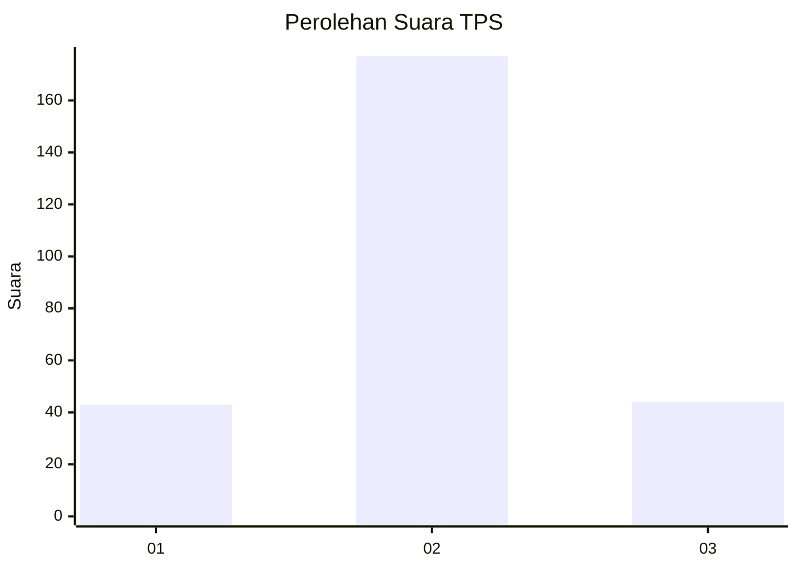
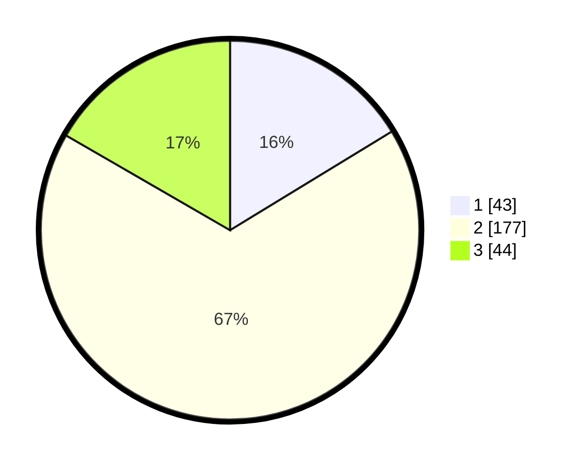

# Hasil

## Grafik

## Tabel

| No. | Nama Paslon    | Suara | Suara (raw) | Persentase |
|:--- |:-------------- | -----:| -----------:| ----------:|
| 1   | ANIES MUHAIMIN | 43    | [43][p-1]   | 16,29      |
| 2   | PRABOWO GIBRAN | 177   | [177][p-2]  | 67,05      |
| 3   | GANJAR MAHFUD  | 44    | [44][p-3]   | 16,67      |

[p-1]: https://github.com/gigit-pemilu/pemilu-2024/blob/main/pilpres/hitung-suara/sub/35-jawa-timur/sub/78-kota-surabaya/sub/15-krembangan/sub/1005-morokrembangan/sub/080-tps/sub/paslon-1.txt
[p-2]: https://github.com/gigit-pemilu/pemilu-2024/blob/main/pilpres/hitung-suara/sub/35-jawa-timur/sub/78-kota-surabaya/sub/15-krembangan/sub/1005-morokrembangan/sub/080-tps/sub/paslon-2.txt
[p-3]: https://github.com/gigit-pemilu/pemilu-2024/blob/main/pilpres/hitung-suara/sub/35-jawa-timur/sub/78-kota-surabaya/sub/15-krembangan/sub/1005-morokrembangan/sub/080-tps/sub/paslon-3.txt

## Foto C Plano

https://sirekap-obj-formc.kpu.go.id/74fc/pemilu/ppwp/35/78/15/10/05/3578151005080-20240214-195459--487660d6-3788-4c42-aff1-6260a746f2ae.jpg

https://sirekap-obj-formc.kpu.go.id/74fc/pemilu/ppwp/35/78/15/10/05/3578151005080-20240214-193432--1633c8a7-b234-406d-8c55-65ae5e29e380.jpg

https://sirekap-obj-formc.kpu.go.id/74fc/pemilu/ppwp/35/78/15/10/05/3578151005080-20240214-193445--37adcc43-51c7-4fd9-846b-5433653682de.jpg

## Metadata

| Key        | Value               |
| ---------- | ------------------- |
| Time Stamp | 2024-02-16 16:25:10 |

