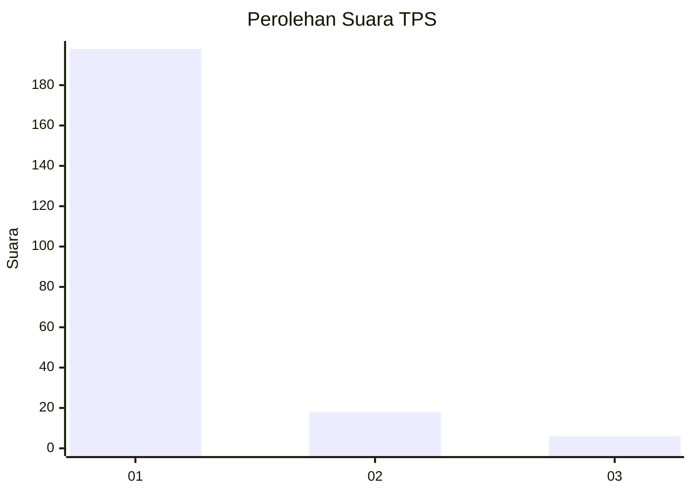
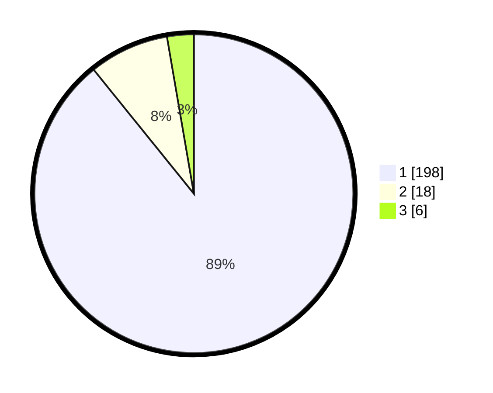

# Hasil

## Grafik

## Tabel

| No. | Nama Paslon    | Suara | Suara (raw) | Persentase |
|:--- |:-------------- | -----:| -----------:| ----------:|
| 1   | ANIES MUHAIMIN | 198   | [198][p-1]  | 89,19      |
| 2   | PRABOWO GIBRAN | 18    | [18][p-2]   | 8,11       |
| 3   | GANJAR MAHFUD  | 6     | [6][p-3]    | 2,70       |

[p-1]: https://github.com/gigit-pemilu/pemilu-2024-35-jawa-timur/blob/main/pilpres/hitung-suara/sub/35-jawa-timur/sub/78-kota-surabaya/sub/16-semampir/sub/1001-ampel/sub/012-tps/sub/paslon-1.txt
[p-2]: https://github.com/gigit-pemilu/pemilu-2024-35-jawa-timur/blob/main/pilpres/hitung-suara/sub/35-jawa-timur/sub/78-kota-surabaya/sub/16-semampir/sub/1001-ampel/sub/012-tps/sub/paslon-2.txt
[p-3]: https://github.com/gigit-pemilu/pemilu-2024-35-jawa-timur/blob/main/pilpres/hitung-suara/sub/35-jawa-timur/sub/78-kota-surabaya/sub/16-semampir/sub/1001-ampel/sub/012-tps/sub/paslon-3.txt

## Foto C Plano

https://sirekap-obj-formc.kpu.go.id/df9e/pemilu/ppwp/35/78/16/10/01/3578161001012-20240214-211735--cd059a87-a556-495a-bc1d-105c9b7e70d6.jpg

https://sirekap-obj-formc.kpu.go.id/df9e/pemilu/ppwp/35/78/16/10/01/3578161001012-20240218-150850--e9601c81-6d22-4479-984e-1a89d688f048.jpg

https://sirekap-obj-formc.kpu.go.id/df9e/pemilu/ppwp/35/78/16/10/01/3578161001012-20240218-160339--79a00f89-9c24-4163-af68-a05e40b96a1e.jpg

## Metadata

| Key        | Value               |
| ---------- | ------------------- |
| Time Stamp | 2024-02-24 23:00:00 |

