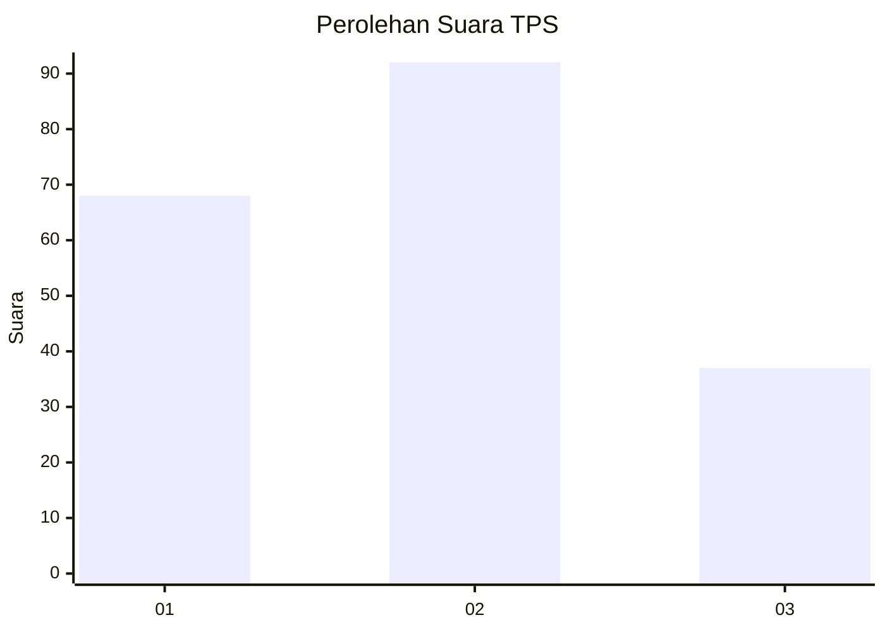
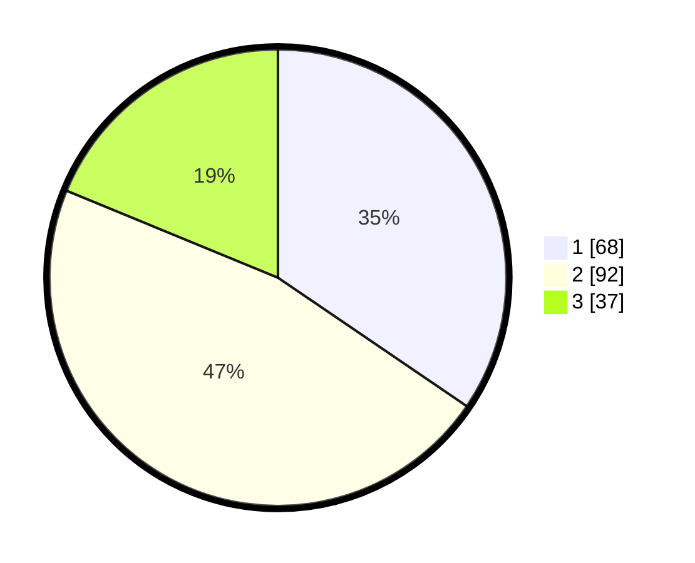

# Hasil

## Grafik

## Tabel

| No. | Nama Paslon    | Suara | Suara (raw) | Persentase |
|:--- |:-------------- | -----:| -----------:| ----------:|
| 1   | ANIES MUHAIMIN | 68    | [68][p-1]   | 34,52      |
| 2   | PRABOWO GIBRAN | 92    | [92][p-2]   | 46,70      |
| 3   | GANJAR MAHFUD  | 37    | [37][p-3]   | 18,78      |

[p-1]: https://github.com/gigit-pemilu/pemilu-2024-35-jawa-timur/blob/main/pilpres/hitung-suara/sub/35-jawa-timur/sub/78-kota-surabaya/sub/16-semampir/sub/1001-ampel/sub/016-tps/sub/paslon-1.txt
[p-2]: https://github.com/gigit-pemilu/pemilu-2024-35-jawa-timur/blob/main/pilpres/hitung-suara/sub/35-jawa-timur/sub/78-kota-surabaya/sub/16-semampir/sub/1001-ampel/sub/016-tps/sub/paslon-2.txt
[p-3]: https://github.com/gigit-pemilu/pemilu-2024-35-jawa-timur/blob/main/pilpres/hitung-suara/sub/35-jawa-timur/sub/78-kota-surabaya/sub/16-semampir/sub/1001-ampel/sub/016-tps/sub/paslon-3.txt

## Foto C Plano

https://sirekap-obj-formc.kpu.go.id/4421/pemilu/ppwp/35/78/16/10/01/3578161001016-20240215-011435--a877cdee-6651-4a51-8877-53e24540e96a.jpg

https://sirekap-obj-formc.kpu.go.id/4421/pemilu/ppwp/35/78/16/10/01/3578161001016-20240215-011547--42109fd2-fd1c-41d4-8be9-86ed6673d44d.jpg

https://sirekap-obj-formc.kpu.go.id/4421/pemilu/ppwp/35/78/16/10/01/3578161001016-20240218-152219--227a65c7-47f3-4682-904e-3f65b855ccee.jpg

## Metadata

| Key        | Value               |
| ---------- | ------------------- |
| Time Stamp | 2024-02-25 18:00:00 |

