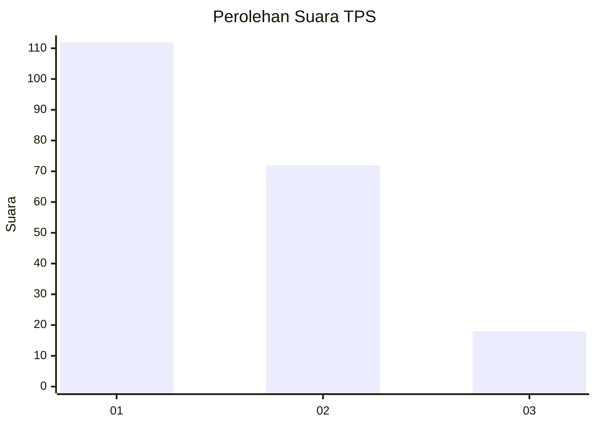
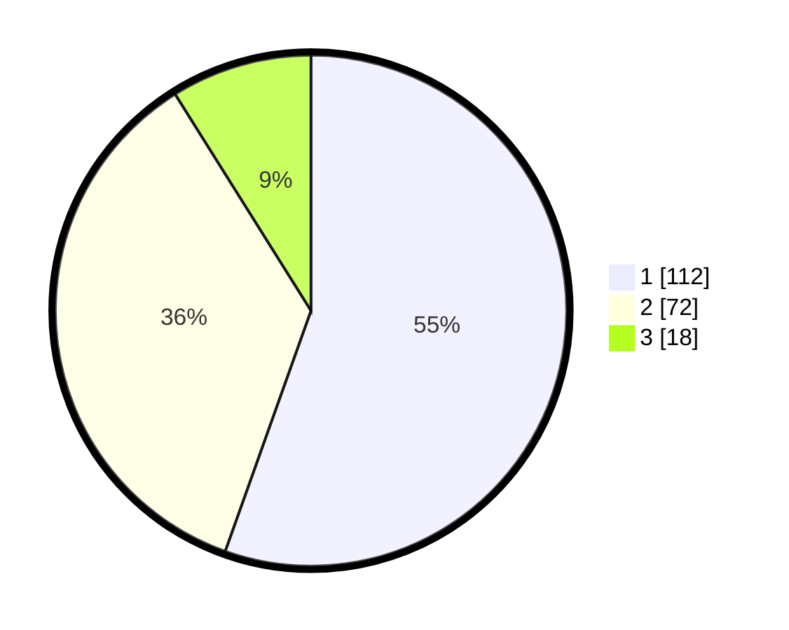

# Hasil

## Grafik

## Tabel

| No. | Nama Paslon    | Suara | Suara (raw) | Persentase |
|:--- |:-------------- | -----:| -----------:| ----------:|
| 1   | ANIES MUHAIMIN | 112   | [112][p-1]  | 55,45      |
| 2   | PRABOWO GIBRAN | 72    | [72][p-2]   | 35,64      |
| 3   | GANJAR MAHFUD  | 18    | [18][p-3]   | 8,91       |

[p-1]: https://github.com/gigit-pemilu/pemilu-2024-35-jawa-timur/blob/main/pilpres/hitung-suara/sub/35-jawa-timur/sub/78-kota-surabaya/sub/16-semampir/sub/1001-ampel/sub/019-tps/sub/paslon-1.txt
[p-2]: https://github.com/gigit-pemilu/pemilu-2024-35-jawa-timur/blob/main/pilpres/hitung-suara/sub/35-jawa-timur/sub/78-kota-surabaya/sub/16-semampir/sub/1001-ampel/sub/019-tps/sub/paslon-2.txt
[p-3]: https://github.com/gigit-pemilu/pemilu-2024-35-jawa-timur/blob/main/pilpres/hitung-suara/sub/35-jawa-timur/sub/78-kota-surabaya/sub/16-semampir/sub/1001-ampel/sub/019-tps/sub/paslon-3.txt

## Foto C Plano

https://sirekap-obj-formc.kpu.go.id/56fd/pemilu/ppwp/35/78/16/10/01/3578161001019-20240214-214653--3216aca6-d6ce-473d-a855-061a65b7ba46.jpg

https://sirekap-obj-formc.kpu.go.id/56fd/pemilu/ppwp/35/78/16/10/01/3578161001019-20240214-214638--e042924e-810b-4865-838d-b4025897f36f.jpg

https://sirekap-obj-formc.kpu.go.id/56fd/pemilu/ppwp/35/78/16/10/01/3578161001019-20240218-161946--3216222e-9d13-4c3d-bd4f-5080ba31141d.jpg

## Metadata

| Key        | Value               |
| ---------- | ------------------- |
| Time Stamp | 2024-02-24 22:31:28 |

