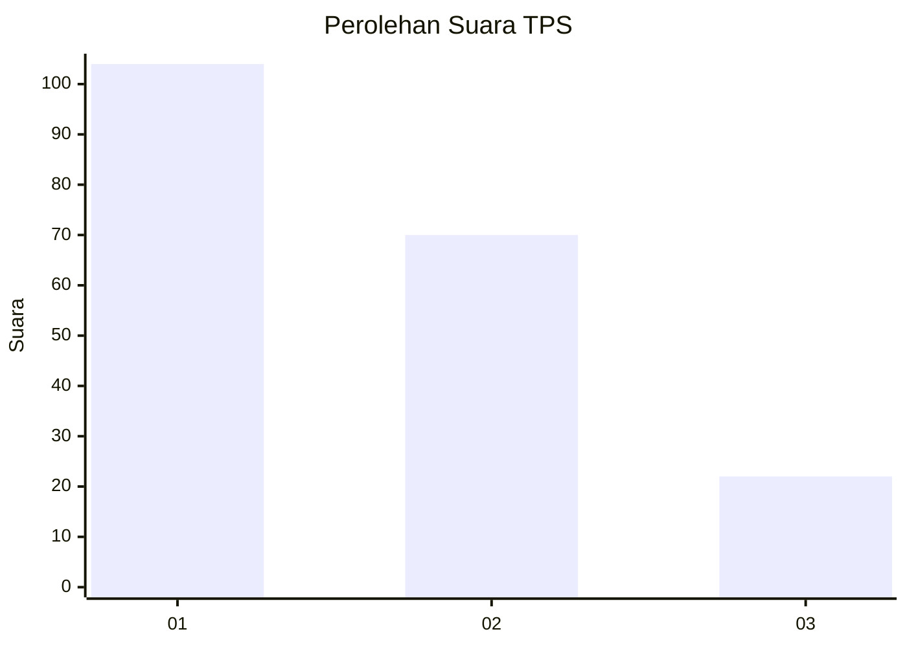
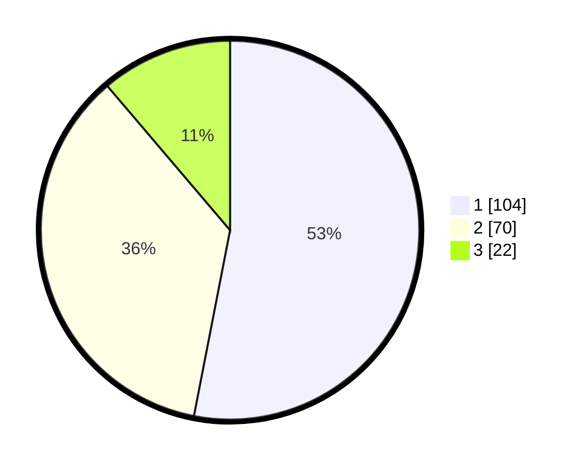

# Hasil

## Grafik

## Tabel

| No. | Nama Paslon    | Suara | Suara (raw) | Persentase |
|:--- |:-------------- | -----:| -----------:| ----------:|
| 1   | ANIES MUHAIMIN | 104   | [104][p-1]  | 53,06      |
| 2   | PRABOWO GIBRAN | 70    | [70][p-2]   | 35,71      |
| 3   | GANJAR MAHFUD  | 22    | [22][p-3]   | 11,22      |

[p-1]: https://github.com/gigit-pemilu/pemilu-2024/blob/main/pilpres/hitung-suara/sub/35-jawa-timur/sub/78-kota-surabaya/sub/16-semampir/sub/1001-ampel/sub/025-tps/sub/paslon-1.txt
[p-2]: https://github.com/gigit-pemilu/pemilu-2024/blob/main/pilpres/hitung-suara/sub/35-jawa-timur/sub/78-kota-surabaya/sub/16-semampir/sub/1001-ampel/sub/025-tps/sub/paslon-2.txt
[p-3]: https://github.com/gigit-pemilu/pemilu-2024/blob/main/pilpres/hitung-suara/sub/35-jawa-timur/sub/78-kota-surabaya/sub/16-semampir/sub/1001-ampel/sub/025-tps/sub/paslon-3.txt

## Foto C Plano

https://sirekap-obj-formc.kpu.go.id/8e4f/pemilu/ppwp/35/78/16/10/01/3578161001025-20240215-011518--bf61888d-a01e-4fdd-b176-bdeb7d3a5fcc.jpg

https://sirekap-obj-formc.kpu.go.id/8e4f/pemilu/ppwp/35/78/16/10/01/3578161001025-20240215-011616--73ae1176-0eec-4db7-a229-20703b9ec9ad.jpg

https://sirekap-obj-formc.kpu.go.id/8e4f/pemilu/ppwp/35/78/16/10/01/3578161001025-20240215-011656--af927dbd-2233-4062-9cea-7a2e88f52dab.jpg

## Metadata

| Key        | Value               |
| ---------- | ------------------- |
| Time Stamp | 2024-02-24 22:31:28 |

