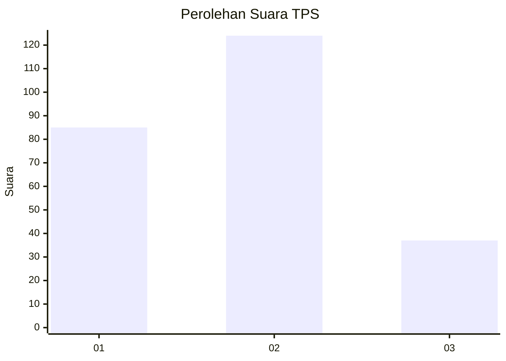
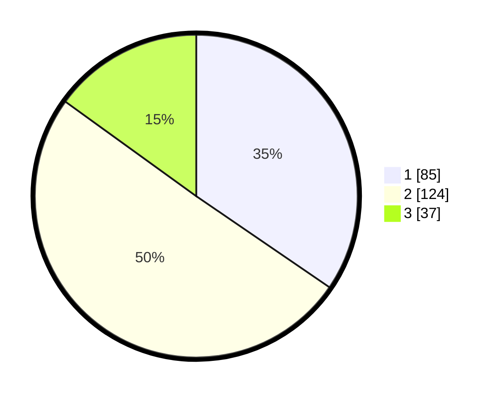

# Hasil

## Grafik

## Tabel

| No. | Nama Paslon    | Suara | Suara (raw) | Persentase |
|:--- |:-------------- | -----:| -----------:| ----------:|
| 1   | ANIES MUHAIMIN | 85    | [85][p-1]   | 34,55      |
| 2   | PRABOWO GIBRAN | 124   | [124][p-2]  | 50,41      |
| 3   | GANJAR MAHFUD  | 37    | [37][p-3]   | 15,04      |

[p-1]: https://github.com/gigit-pemilu/pemilu-2024-35-jawa-timur/blob/main/pilpres/hitung-suara/sub/35-jawa-timur/sub/78-kota-surabaya/sub/16-semampir/sub/1001-ampel/sub/038-tps/sub/paslon-1.txt
[p-2]: https://github.com/gigit-pemilu/pemilu-2024-35-jawa-timur/blob/main/pilpres/hitung-suara/sub/35-jawa-timur/sub/78-kota-surabaya/sub/16-semampir/sub/1001-ampel/sub/038-tps/sub/paslon-2.txt
[p-3]: https://github.com/gigit-pemilu/pemilu-2024-35-jawa-timur/blob/main/pilpres/hitung-suara/sub/35-jawa-timur/sub/78-kota-surabaya/sub/16-semampir/sub/1001-ampel/sub/038-tps/sub/paslon-3.txt

## Foto C Plano

https://sirekap-obj-formc.kpu.go.id/c246/pemilu/ppwp/35/78/16/10/01/3578161001038-20240215-055948--ebe83192-7fe6-4b97-962a-bc7d38886edf.jpg

https://sirekap-obj-formc.kpu.go.id/c246/pemilu/ppwp/35/78/16/10/01/3578161001038-20240215-060141--1238b9e2-33b2-43b7-bfd4-198b9c1ba54e.jpg

https://sirekap-obj-formc.kpu.go.id/c246/pemilu/ppwp/35/78/16/10/01/3578161001038-20240215-060223--93953a53-80ee-41ab-ba6a-4cc2d6e5263c.jpg

## Metadata

| Key        | Value               |
| ---------- | ------------------- |
| Time Stamp | 2024-02-24 22:31:28 |

