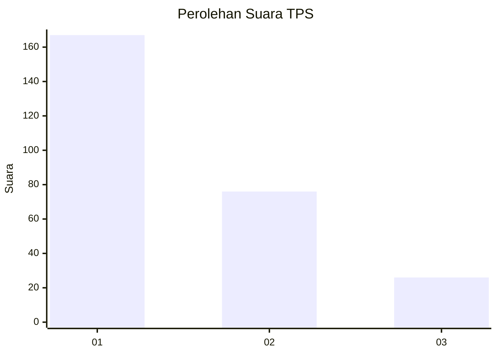
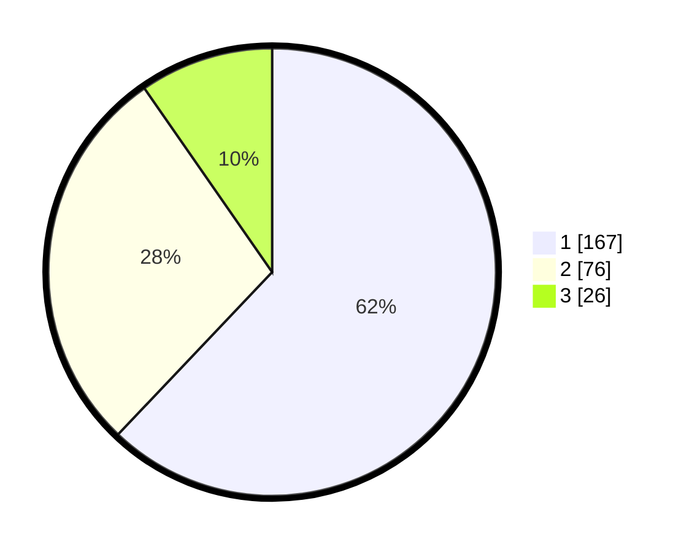

# Hasil

## Grafik

## Tabel

| No. | Nama Paslon    | Suara | Suara (raw) | Persentase |
|:--- |:-------------- | -----:| -----------:| ----------:|
| 1   | ANIES MUHAIMIN | 167   | [167][p-1]  | 62,08      |
| 2   | PRABOWO GIBRAN | 76    | [76][p-2]   | 28,25      |
| 3   | GANJAR MAHFUD  | 26    | [26][p-3]   | 9,67       |

[p-1]: https://github.com/gigit-pemilu/pemilu-2024/blob/main/pilpres/hitung-suara/sub/35-jawa-timur/sub/78-kota-surabaya/sub/16-semampir/sub/1001-ampel/sub/047-tps/sub/paslon-1.txt
[p-2]: https://github.com/gigit-pemilu/pemilu-2024/blob/main/pilpres/hitung-suara/sub/35-jawa-timur/sub/78-kota-surabaya/sub/16-semampir/sub/1001-ampel/sub/047-tps/sub/paslon-2.txt
[p-3]: https://github.com/gigit-pemilu/pemilu-2024/blob/main/pilpres/hitung-suara/sub/35-jawa-timur/sub/78-kota-surabaya/sub/16-semampir/sub/1001-ampel/sub/047-tps/sub/paslon-3.txt

## Foto C Plano

https://sirekap-obj-formc.kpu.go.id/d79d/pemilu/ppwp/35/78/16/10/01/3578161001047-20240222-154925--c37de98e-c8fa-48ed-a198-e804efc5ad3e.jpg

https://sirekap-obj-formc.kpu.go.id/d79d/pemilu/ppwp/35/78/16/10/01/3578161001047-20240222-154423--bc07a276-d1a8-4cd7-bdd8-38302b0fac66.jpg

https://sirekap-obj-formc.kpu.go.id/d79d/pemilu/ppwp/35/78/16/10/01/3578161001047-20240222-155003--bcb1ab67-ff46-471c-8aca-bb5347286f6a.jpg

## Metadata

| Key        | Value               |
| ---------- | ------------------- |
| Time Stamp | 2024-02-22 16:00:00 |

