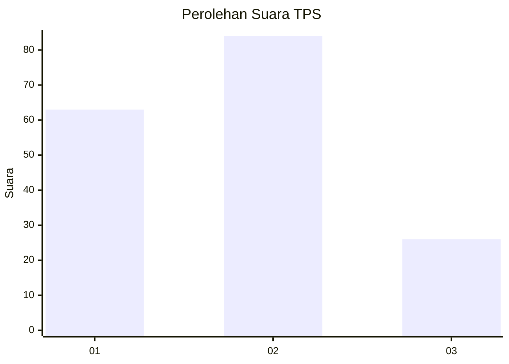
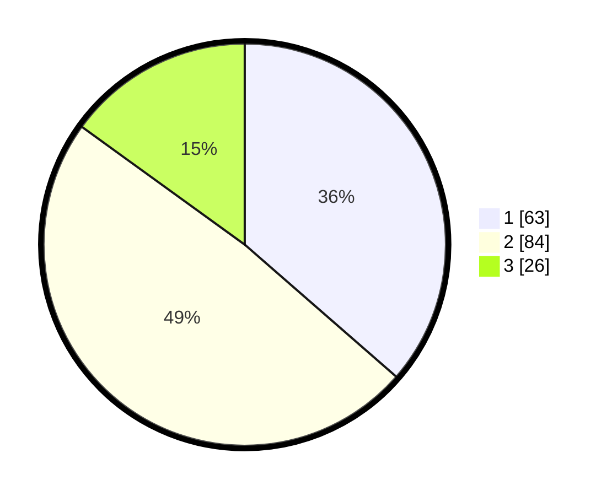

# Hasil

## Grafik

## Tabel

| No. | Nama Paslon    | Suara | Suara (raw) | Persentase |
|:--- |:-------------- | -----:| -----------:| ----------:|
| 1   | ANIES MUHAIMIN | 63    | [63][p-1]   | 36,42      |
| 2   | PRABOWO GIBRAN | 84    | [84][p-2]   | 48,55      |
| 3   | GANJAR MAHFUD  | 26    | [26][p-3]   | 15,03      |

[p-1]: https://github.com/gigit-pemilu/pemilu-2024-35-jawa-timur/blob/main/pilpres/hitung-suara/sub/35-jawa-timur/sub/78-kota-surabaya/sub/16-semampir/sub/1001-ampel/sub/050-tps/sub/paslon-1.txt
[p-2]: https://github.com/gigit-pemilu/pemilu-2024-35-jawa-timur/blob/main/pilpres/hitung-suara/sub/35-jawa-timur/sub/78-kota-surabaya/sub/16-semampir/sub/1001-ampel/sub/050-tps/sub/paslon-2.txt
[p-3]: https://github.com/gigit-pemilu/pemilu-2024-35-jawa-timur/blob/main/pilpres/hitung-suara/sub/35-jawa-timur/sub/78-kota-surabaya/sub/16-semampir/sub/1001-ampel/sub/050-tps/sub/paslon-3.txt

## Foto C Plano

https://sirekap-obj-formc.kpu.go.id/c118/pemilu/ppwp/35/78/16/10/01/3578161001050-20240214-231804--e4dd94d3-aa8c-4c5b-b558-0dcad9f752a8.jpg

https://sirekap-obj-formc.kpu.go.id/c118/pemilu/ppwp/35/78/16/10/01/3578161001050-20240214-230210--0df759f6-e590-4764-88bd-4e22ef0469c3.jpg

https://sirekap-obj-formc.kpu.go.id/c118/pemilu/ppwp/35/78/16/10/01/3578161001050-20240214-230341--424e9719-7c6a-4d9d-9b8c-27ded09a4428.jpg

## Metadata

| Key        | Value               |
| ---------- | ------------------- |
| Time Stamp | 2024-02-25 23:00:00 |

