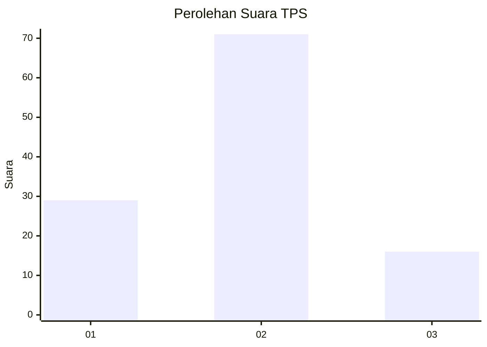
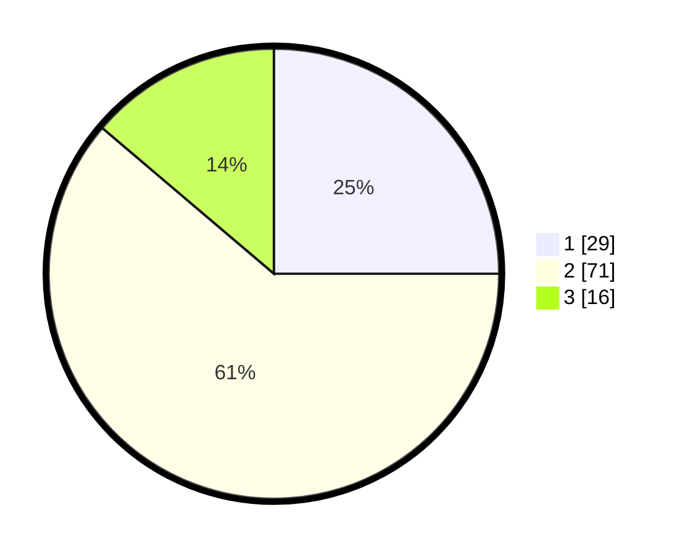

# Hasil

## Grafik

## Tabel

| No. | Nama Paslon    | Suara | Suara (raw) | Persentase |
|:--- |:-------------- | -----:| -----------:| ----------:|
| 1   | ANIES MUHAIMIN | 29    | [29][p-1]   | 25,00      |
| 2   | PRABOWO GIBRAN | 71    | [71][p-2]   | 61,21      |
| 3   | GANJAR MAHFUD  | 16    | [16][p-3]   | 13,79      |

[p-1]: https://github.com/gigit-pemilu/pemilu-2024-35-jawa-timur/blob/main/pilpres/hitung-suara/sub/35-jawa-timur/sub/78-kota-surabaya/sub/16-semampir/sub/1002-pegirian/sub/004-tps/sub/paslon-1.txt
[p-2]: https://github.com/gigit-pemilu/pemilu-2024-35-jawa-timur/blob/main/pilpres/hitung-suara/sub/35-jawa-timur/sub/78-kota-surabaya/sub/16-semampir/sub/1002-pegirian/sub/004-tps/sub/paslon-2.txt
[p-3]: https://github.com/gigit-pemilu/pemilu-2024-35-jawa-timur/blob/main/pilpres/hitung-suara/sub/35-jawa-timur/sub/78-kota-surabaya/sub/16-semampir/sub/1002-pegirian/sub/004-tps/sub/paslon-3.txt

## Foto C Plano

https://sirekap-obj-formc.kpu.go.id/94a6/pemilu/ppwp/35/78/16/10/02/3578161002004-20240214-215256--1a6db5be-20ed-4956-b5bb-184eb7c2b921.jpg

https://sirekap-obj-formc.kpu.go.id/94a6/pemilu/ppwp/35/78/16/10/02/3578161002004-20240214-215626--c451ffca-7141-4894-a9af-b7fb692552af.jpg

https://sirekap-obj-formc.kpu.go.id/94a6/pemilu/ppwp/35/78/16/10/02/3578161002004-20240214-215821--aef64d18-3564-4001-9d35-3fd01e086db7.jpg

## Metadata

| Key        | Value               |
| ---------- | ------------------- |
| Time Stamp | 2024-02-26 01:00:00 |

