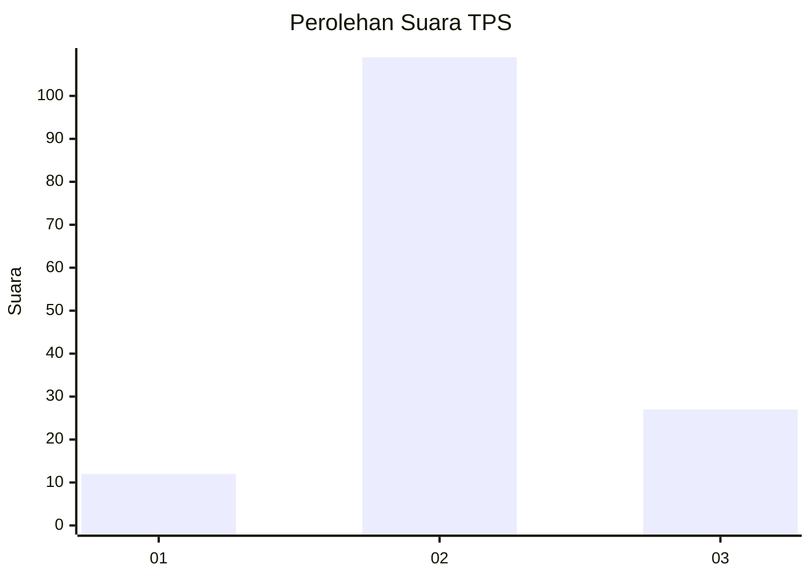
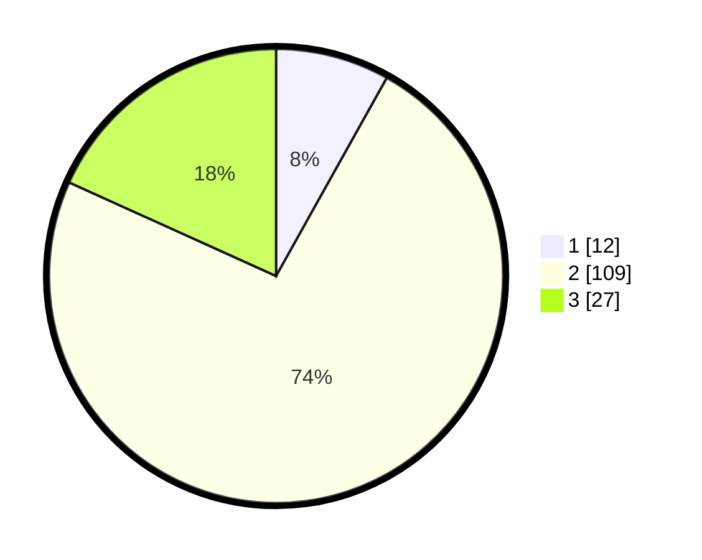

# Hasil

## Grafik

## Tabel

| No. | Nama Paslon    | Suara | Suara (raw) | Persentase |
|:--- |:-------------- | -----:| -----------:| ----------:|
| 1   | ANIES MUHAIMIN | 12    | [12][p-1]   | 8,11       |
| 2   | PRABOWO GIBRAN | 109   | [109][p-2]  | 73,65      |
| 3   | GANJAR MAHFUD  | 27    | [27][p-3]   | 18,24      |

[p-1]: https://github.com/gigit-pemilu/pemilu-2024-35-jawa-timur/blob/main/pilpres/hitung-suara/sub/35-jawa-timur/sub/78-kota-surabaya/sub/16-semampir/sub/1002-pegirian/sub/043-tps/sub/paslon-1.txt
[p-2]: https://github.com/gigit-pemilu/pemilu-2024-35-jawa-timur/blob/main/pilpres/hitung-suara/sub/35-jawa-timur/sub/78-kota-surabaya/sub/16-semampir/sub/1002-pegirian/sub/043-tps/sub/paslon-2.txt
[p-3]: https://github.com/gigit-pemilu/pemilu-2024-35-jawa-timur/blob/main/pilpres/hitung-suara/sub/35-jawa-timur/sub/78-kota-surabaya/sub/16-semampir/sub/1002-pegirian/sub/043-tps/sub/paslon-3.txt

## Foto C Plano

https://sirekap-obj-formc.kpu.go.id/f2ba/pemilu/ppwp/35/78/16/10/02/3578161002043-20240214-204006--58d107af-1024-432d-920c-474f899ca927.jpg

https://sirekap-obj-formc.kpu.go.id/f2ba/pemilu/ppwp/35/78/16/10/02/3578161002043-20240214-203935--6fd53939-663d-49e8-a85d-8d11b9c049b8.jpg

https://sirekap-obj-formc.kpu.go.id/f2ba/pemilu/ppwp/35/78/16/10/02/3578161002043-20240214-204135--087e2a4b-9ce4-4c66-9524-2468fb7dbdb7.jpg

## Metadata

| Key        | Value               |
| ---------- | ------------------- |
| Time Stamp | 2024-02-25 16:00:00 |

