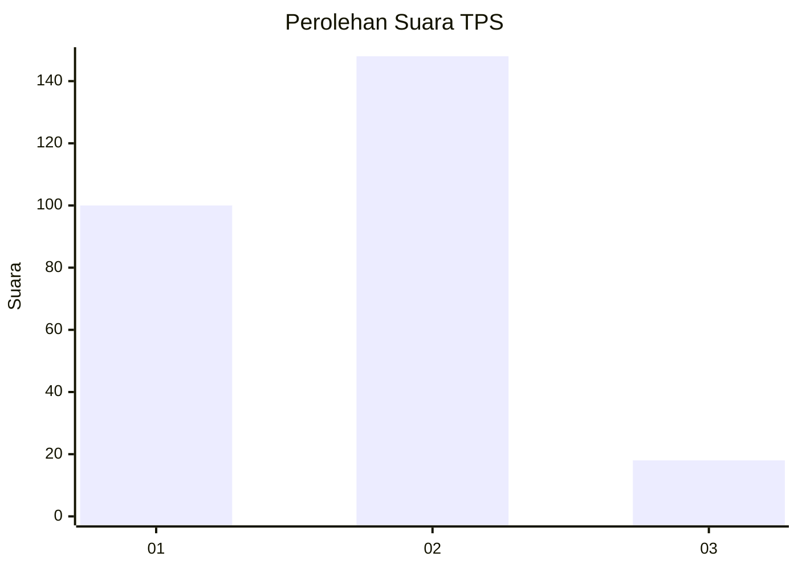
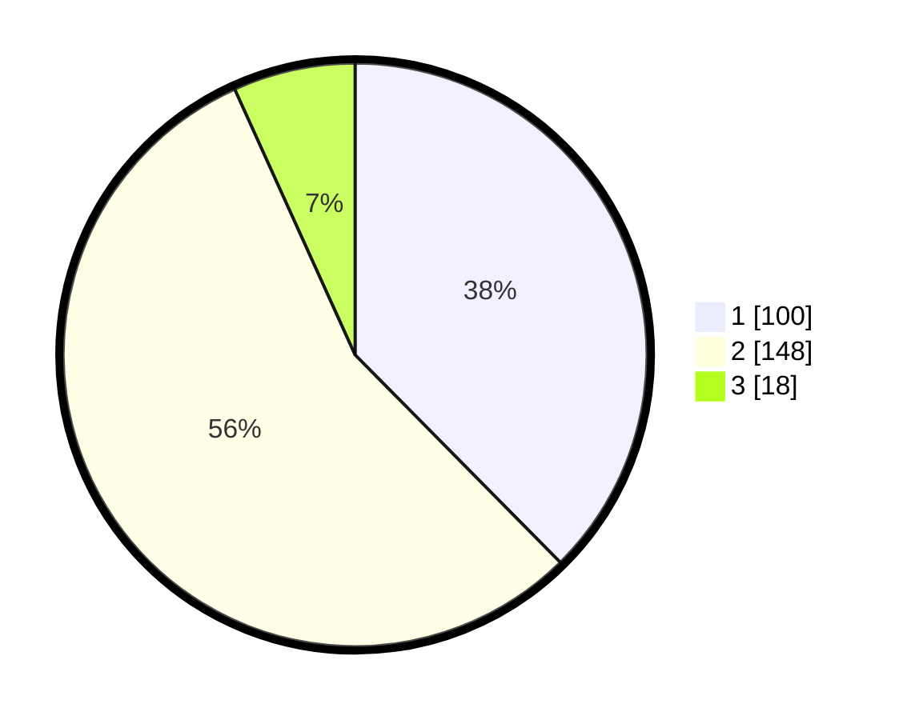

# Hasil

## Grafik

## Tabel

| No. | Nama Paslon    | Suara | Suara (raw) | Persentase |
|:--- |:-------------- | -----:| -----------:| ----------:|
| 1   | ANIES MUHAIMIN | 100   | [100][p-1]  | 37,59      |
| 2   | PRABOWO GIBRAN | 148   | [148][p-2]  | 55,64      |
| 3   | GANJAR MAHFUD  | 18    | [18][p-3]   | 6,77       |

[p-1]: https://github.com/gigit-pemilu/pemilu-2024-35-jawa-timur/blob/main/pilpres/hitung-suara/sub/35-jawa-timur/sub/78-kota-surabaya/sub/16-semampir/sub/1002-pegirian/sub/081-tps/sub/paslon-1.txt
[p-2]: https://github.com/gigit-pemilu/pemilu-2024-35-jawa-timur/blob/main/pilpres/hitung-suara/sub/35-jawa-timur/sub/78-kota-surabaya/sub/16-semampir/sub/1002-pegirian/sub/081-tps/sub/paslon-2.txt
[p-3]: https://github.com/gigit-pemilu/pemilu-2024-35-jawa-timur/blob/main/pilpres/hitung-suara/sub/35-jawa-timur/sub/78-kota-surabaya/sub/16-semampir/sub/1002-pegirian/sub/081-tps/sub/paslon-3.txt

## Foto C Plano

https://sirekap-obj-formc.kpu.go.id/d01b/pemilu/ppwp/35/78/16/10/02/3578161002081-20240214-223333--789a0b04-0354-4b46-a5f7-f8dfdeec066c.jpg

https://sirekap-obj-formc.kpu.go.id/d01b/pemilu/ppwp/35/78/16/10/02/3578161002081-20240214-223451--63171df0-1167-49c5-b234-aa9f80fa9109.jpg

https://sirekap-obj-formc.kpu.go.id/d01b/pemilu/ppwp/35/78/16/10/02/3578161002081-20240215-011646--3c822be8-b34f-4896-9e72-70ff6eefc5d5.jpg

## Metadata

| Key        | Value               |
| ---------- | ------------------- |
| Time Stamp | 2024-02-25 11:00:00 |

