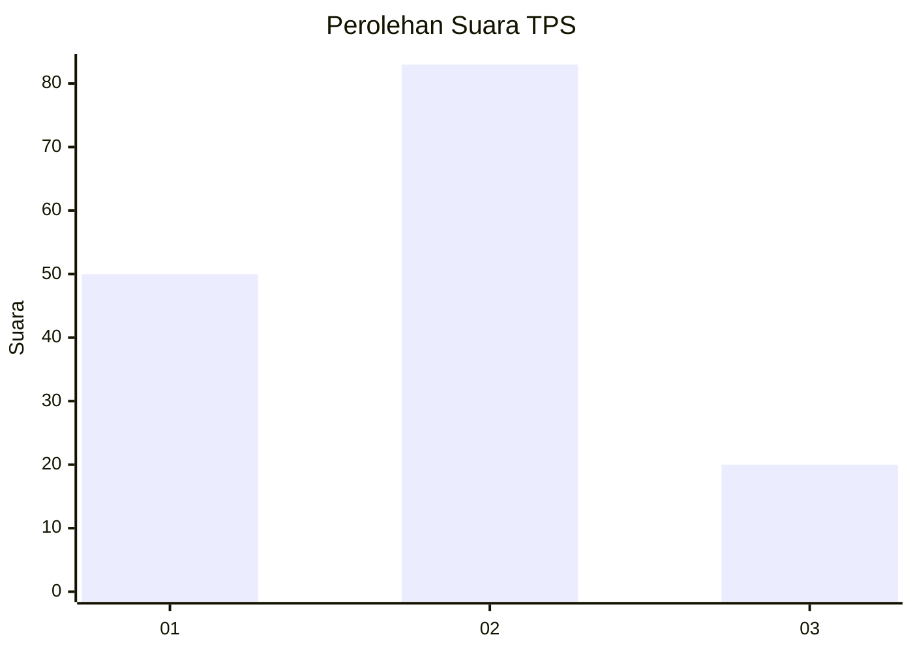
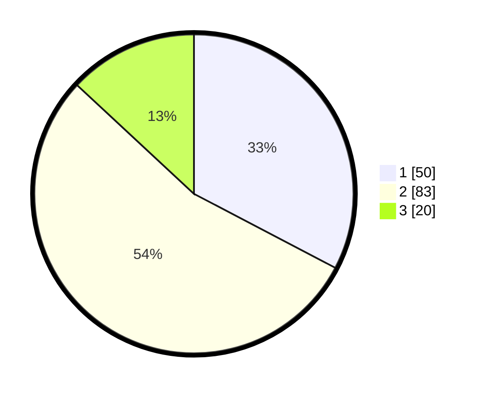

# Hasil

## Grafik

## Tabel

| No. | Nama Paslon    | Suara | Suara (raw) | Persentase |
|:--- |:-------------- | -----:| -----------:| ----------:|
| 1   | ANIES MUHAIMIN | 50    | [50][p-1]   | 32,68      |
| 2   | PRABOWO GIBRAN | 83    | [83][p-2]   | 54,25      |
| 3   | GANJAR MAHFUD  | 20    | [20][p-3]   | 13,07      |

[p-1]: https://github.com/gigit-pemilu/pemilu-2024/blob/main/pilpres/hitung-suara/sub/35-jawa-timur/sub/78-kota-surabaya/sub/16-semampir/sub/1003-wonokusumo/sub/002-tps/sub/paslon-1.txt
[p-2]: https://github.com/gigit-pemilu/pemilu-2024/blob/main/pilpres/hitung-suara/sub/35-jawa-timur/sub/78-kota-surabaya/sub/16-semampir/sub/1003-wonokusumo/sub/002-tps/sub/paslon-2.txt
[p-3]: https://github.com/gigit-pemilu/pemilu-2024/blob/main/pilpres/hitung-suara/sub/35-jawa-timur/sub/78-kota-surabaya/sub/16-semampir/sub/1003-wonokusumo/sub/002-tps/sub/paslon-3.txt

## Foto C Plano

https://sirekap-obj-formc.kpu.go.id/9663/pemilu/ppwp/35/78/16/10/03/3578161003002-20240220-205956--efa08deb-2fed-43e6-8b72-00487ebe6c61.jpg

https://sirekap-obj-formc.kpu.go.id/9663/pemilu/ppwp/35/78/16/10/03/3578161003002-20240220-225659--86b43389-0183-426c-9185-23a2158c993f.jpg

https://sirekap-obj-formc.kpu.go.id/9663/pemilu/ppwp/35/78/16/10/03/3578161003002-20240220-205243--1a0fe7b3-e5b4-4614-8d07-763cbde46e57.jpg

## Metadata

| Key        | Value               |
| ---------- | ------------------- |
| Time Stamp | 2024-02-21 12:00:00 |

