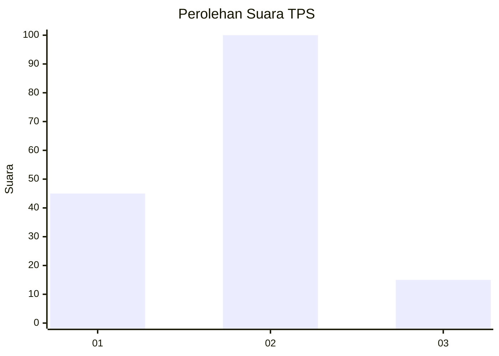
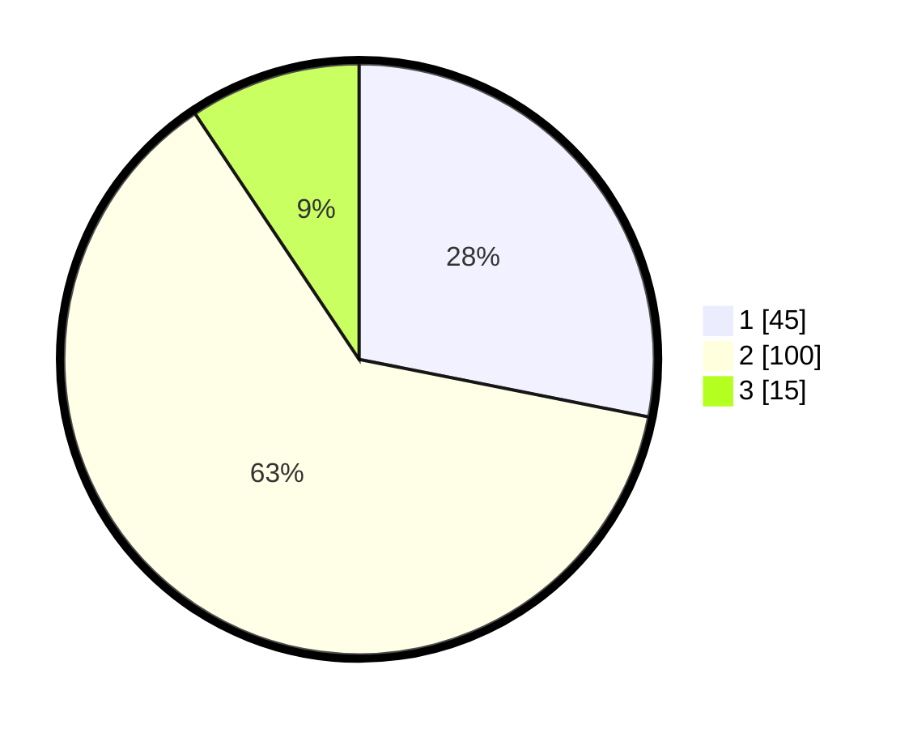

# Hasil

## Grafik

## Tabel

| No. | Nama Paslon    | Suara | Suara (raw) | Persentase |
|:--- |:-------------- | -----:| -----------:| ----------:|
| 1   | ANIES MUHAIMIN | 45    | [45][p-1]   | 28,13      |
| 2   | PRABOWO GIBRAN | 100   | [100][p-2]  | 62,50      |
| 3   | GANJAR MAHFUD  | 15    | [15][p-3]   | 9,38       |

[p-1]: https://github.com/gigit-pemilu/pemilu-2024/blob/main/pilpres/hitung-suara/sub/35-jawa-timur/sub/78-kota-surabaya/sub/16-semampir/sub/1003-wonokusumo/sub/014-tps/sub/paslon-1.txt
[p-2]: https://github.com/gigit-pemilu/pemilu-2024/blob/main/pilpres/hitung-suara/sub/35-jawa-timur/sub/78-kota-surabaya/sub/16-semampir/sub/1003-wonokusumo/sub/014-tps/sub/paslon-2.txt
[p-3]: https://github.com/gigit-pemilu/pemilu-2024/blob/main/pilpres/hitung-suara/sub/35-jawa-timur/sub/78-kota-surabaya/sub/16-semampir/sub/1003-wonokusumo/sub/014-tps/sub/paslon-3.txt

## Foto C Plano

https://sirekap-obj-formc.kpu.go.id/5877/pemilu/ppwp/35/78/16/10/03/3578161003014-20240214-220419--8de4b29e-a09e-46df-b955-bd7c47062316.jpg

https://sirekap-obj-formc.kpu.go.id/5877/pemilu/ppwp/35/78/16/10/03/3578161003014-20240214-185447--7f10755a-8678-439d-b43e-0732fff7f345.jpg

https://sirekap-obj-formc.kpu.go.id/5877/pemilu/ppwp/35/78/16/10/03/3578161003014-20240214-185412--20d57f75-b89a-4367-9495-3bd781112714.jpg

## Metadata

| Key        | Value               |
| ---------- | ------------------- |
| Time Stamp | 2024-02-21 12:00:00 |

