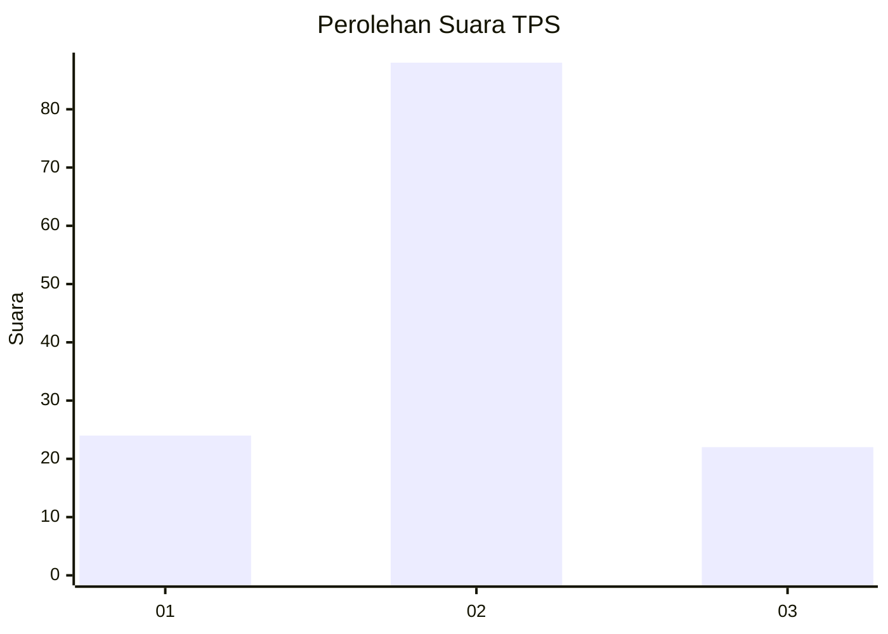
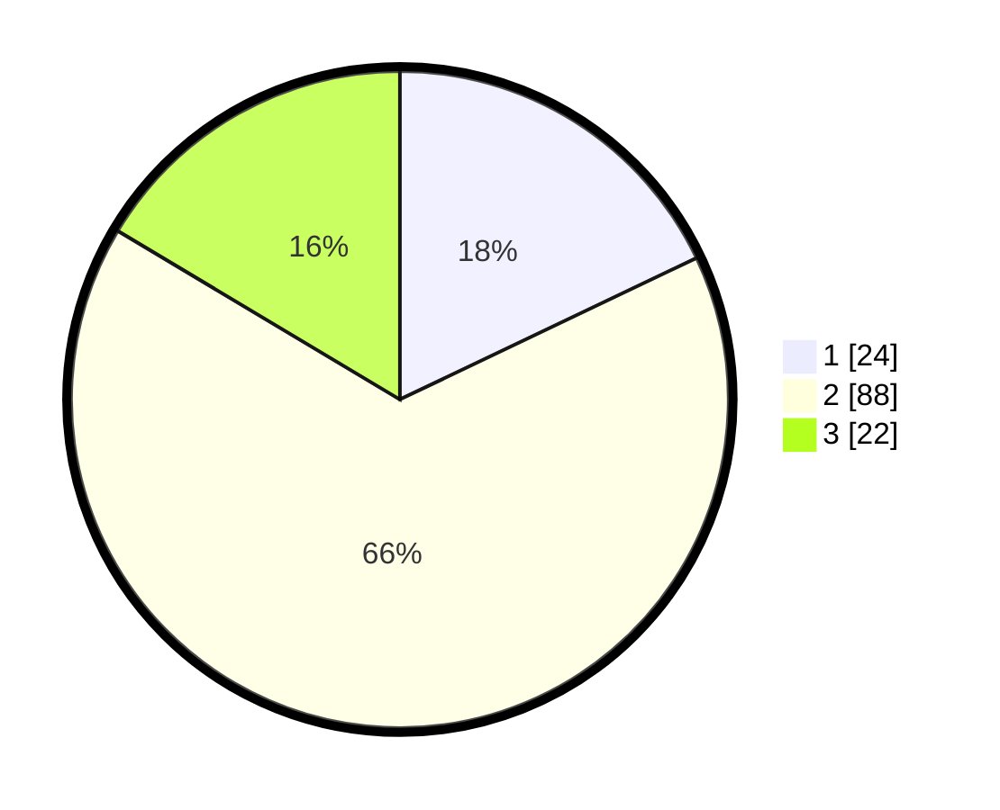

# Hasil

## Grafik

## Tabel

| No. | Nama Paslon    | Suara | Suara (raw) | Persentase |
|:--- |:-------------- | -----:| -----------:| ----------:|
| 1   | ANIES MUHAIMIN | 24    | [24][p-1]   | 17,91      |
| 2   | PRABOWO GIBRAN | 88    | [88][p-2]   | 65,67      |
| 3   | GANJAR MAHFUD  | 22    | [22][p-3]   | 16,42      |

[p-1]: https://github.com/gigit-pemilu/pemilu-2024/blob/main/pilpres/hitung-suara/sub/35-jawa-timur/sub/78-kota-surabaya/sub/16-semampir/sub/1003-wonokusumo/sub/034-tps/sub/paslon-1.txt
[p-2]: https://github.com/gigit-pemilu/pemilu-2024/blob/main/pilpres/hitung-suara/sub/35-jawa-timur/sub/78-kota-surabaya/sub/16-semampir/sub/1003-wonokusumo/sub/034-tps/sub/paslon-2.txt
[p-3]: https://github.com/gigit-pemilu/pemilu-2024/blob/main/pilpres/hitung-suara/sub/35-jawa-timur/sub/78-kota-surabaya/sub/16-semampir/sub/1003-wonokusumo/sub/034-tps/sub/paslon-3.txt

## Foto C Plano

https://sirekap-obj-formc.kpu.go.id/ac40/pemilu/ppwp/35/78/16/10/03/3578161003034-20240214-190129--ecd8ecad-2473-4266-944c-f677955df62b.jpg

https://sirekap-obj-formc.kpu.go.id/ac40/pemilu/ppwp/35/78/16/10/03/3578161003034-20240214-223443--3414d541-189e-4dc1-9a3d-8a72e7ccfe74.jpg

https://sirekap-obj-formc.kpu.go.id/ac40/pemilu/ppwp/35/78/16/10/03/3578161003034-20240214-223527--c7c0871a-01b2-47e8-a03a-eec21f260bb3.jpg

## Metadata

| Key        | Value               |
| ---------- | ------------------- |
| Time Stamp | 2024-03-01 22:00:00 |

