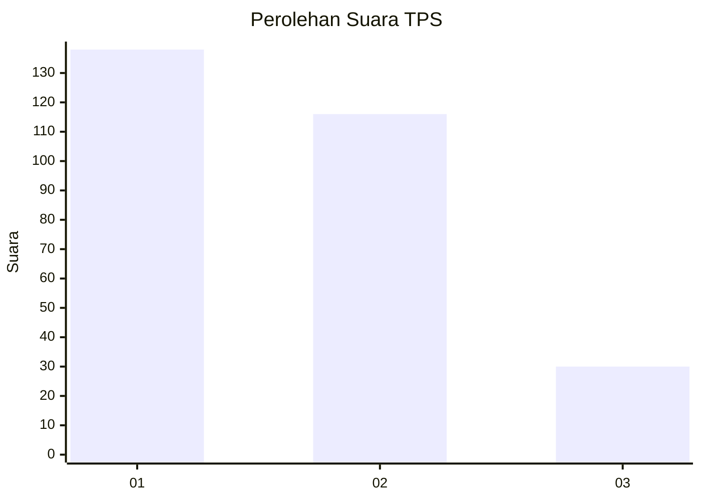
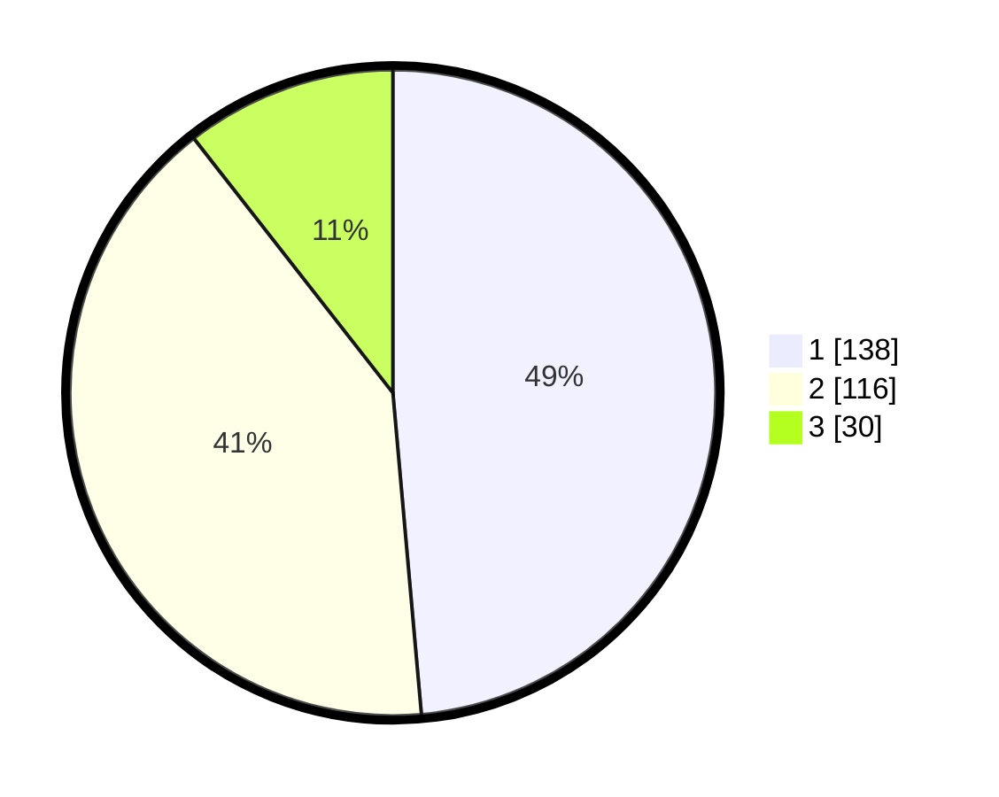

# Hasil

## Grafik

## Tabel

| No. | Nama Paslon    | Suara | Suara (raw) | Persentase |
|:--- |:-------------- | -----:| -----------:| ----------:|
| 1   | ANIES MUHAIMIN | 138   | [138][p-1]  | 48,59      |
| 2   | PRABOWO GIBRAN | 116   | [116][p-2]  | 40,85      |
| 3   | GANJAR MAHFUD  | 30    | [30][p-3]   | 10,56      |

[p-1]: https://github.com/gigit-pemilu/pemilu-2024/blob/main/pilpres/hitung-suara/sub/35-jawa-timur/sub/78-kota-surabaya/sub/16-semampir/sub/1003-wonokusumo/sub/047-tps/sub/paslon-1.txt
[p-2]: https://github.com/gigit-pemilu/pemilu-2024/blob/main/pilpres/hitung-suara/sub/35-jawa-timur/sub/78-kota-surabaya/sub/16-semampir/sub/1003-wonokusumo/sub/047-tps/sub/paslon-2.txt
[p-3]: https://github.com/gigit-pemilu/pemilu-2024/blob/main/pilpres/hitung-suara/sub/35-jawa-timur/sub/78-kota-surabaya/sub/16-semampir/sub/1003-wonokusumo/sub/047-tps/sub/paslon-3.txt

## Foto C Plano

https://sirekap-obj-formc.kpu.go.id/b1f1/pemilu/ppwp/35/78/16/10/03/3578161003047-20240215-002713--ae3d94bd-7bf2-4baf-aa5f-aa8d075530f3.jpg

https://sirekap-obj-formc.kpu.go.id/b1f1/pemilu/ppwp/35/78/16/10/03/3578161003047-20240215-003009--02550f94-2e22-4b75-923f-a2b938fa7dfe.jpg

https://sirekap-obj-formc.kpu.go.id/b1f1/pemilu/ppwp/35/78/16/10/03/3578161003047-20240215-003243--0d04f212-e52c-4ec3-aa97-3b94ef18e6f5.jpg

## Metadata

| Key        | Value               |
| ---------- | ------------------- |
| Time Stamp | 2024-02-24 22:31:28 |

