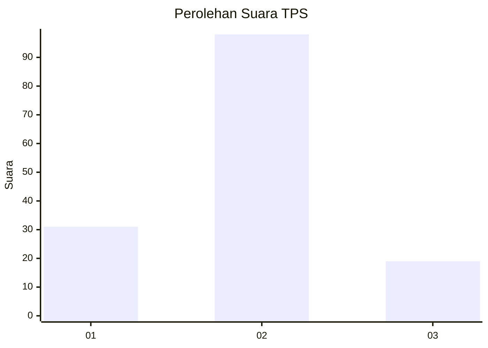
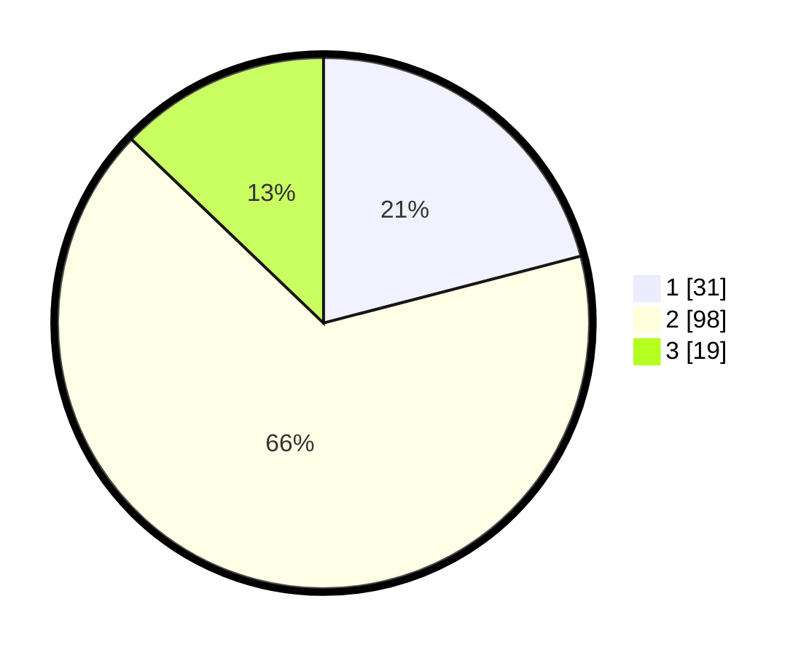

# Hasil

## Grafik

## Tabel

| No. | Nama Paslon    | Suara | Suara (raw) | Persentase |
|:--- |:-------------- | -----:| -----------:| ----------:|
| 1   | ANIES MUHAIMIN | 31    | [31][p-1]   | 20,95      |
| 2   | PRABOWO GIBRAN | 98    | [98][p-2]   | 66,22      |
| 3   | GANJAR MAHFUD  | 19    | [19][p-3]   | 12,84      |

[p-1]: https://github.com/gigit-pemilu/pemilu-2024-35-jawa-timur/blob/main/pilpres/hitung-suara/sub/35-jawa-timur/sub/78-kota-surabaya/sub/16-semampir/sub/1003-wonokusumo/sub/074-tps/sub/paslon-1.txt
[p-2]: https://github.com/gigit-pemilu/pemilu-2024-35-jawa-timur/blob/main/pilpres/hitung-suara/sub/35-jawa-timur/sub/78-kota-surabaya/sub/16-semampir/sub/1003-wonokusumo/sub/074-tps/sub/paslon-2.txt
[p-3]: https://github.com/gigit-pemilu/pemilu-2024-35-jawa-timur/blob/main/pilpres/hitung-suara/sub/35-jawa-timur/sub/78-kota-surabaya/sub/16-semampir/sub/1003-wonokusumo/sub/074-tps/sub/paslon-3.txt

## Foto C Plano

https://sirekap-obj-formc.kpu.go.id/195e/pemilu/ppwp/35/78/16/10/03/3578161003074-20240214-202403--5e774ffe-8ed8-4182-b718-3271e746a273.jpg

https://sirekap-obj-formc.kpu.go.id/195e/pemilu/ppwp/35/78/16/10/03/3578161003074-20240214-214825--a496f2c6-765c-4ed4-9bce-48572a56895e.jpg

https://sirekap-obj-formc.kpu.go.id/195e/pemilu/ppwp/35/78/16/10/03/3578161003074-20240214-202415--2b465753-e692-43a6-9867-0c96969fbc19.jpg

## Metadata

| Key        | Value               |
| ---------- | ------------------- |
| Time Stamp | 2024-02-24 22:31:28 |

