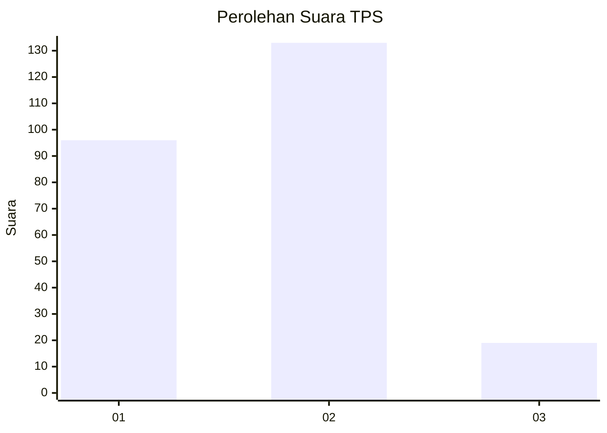

# Hasil

## Grafik

## Tabel

| No. | Nama Paslon    | Suara | Suara (raw) | Persentase |
|:--- |:-------------- | -----:| -----------:| ----------:|
| 1   | ANIES MUHAIMIN | 96    | [96][p-1]   | 38,71      |
| 2   | PRABOWO GIBRAN | 133   | [133][p-2]  | 53,63      |
| 3   | GANJAR MAHFUD  | 19    | [19][p-3]   | 7,66       |

[p-1]: https://github.com/gigit-pemilu/pemilu-2024/blob/main/pilpres/hitung-suara/sub/35-jawa-timur/sub/78-kota-surabaya/sub/16-semampir/sub/1003-wonokusumo/sub/081-tps/sub/paslon-1.txt
[p-2]: https://github.com/gigit-pemilu/pemilu-2024/blob/main/pilpres/hitung-suara/sub/35-jawa-timur/sub/78-kota-surabaya/sub/16-semampir/sub/1003-wonokusumo/sub/081-tps/sub/paslon-2.txt
[p-3]: https://github.com/gigit-pemilu/pemilu-2024/blob/main/pilpres/hitung-suara/sub/35-jawa-timur/sub/78-kota-surabaya/sub/16-semampir/sub/1003-wonokusumo/sub/081-tps/sub/paslon-3.txt

## Foto C Plano

https://sirekap-obj-formc.kpu.go.id/7a81/pemilu/ppwp/35/78/16/10/03/3578161003081-20240215-041402--076f417a-eaab-4784-9c19-4c2adc685b6c.jpg

https://sirekap-obj-formc.kpu.go.id/7a81/pemilu/ppwp/35/78/16/10/03/3578161003081-20240215-041512--1fe7e3ce-2bda-4cac-99f1-7da83a873a4a.jpg

https://sirekap-obj-formc.kpu.go.id/7a81/pemilu/ppwp/35/78/16/10/03/3578161003081-20240215-041550--18e8a531-045e-4023-add4-f3b21aa504e2.jpg

## Metadata

| Key        | Value               |
| ---------- | ------------------- |
| Time Stamp | 2024-02-24 22:31:28 |

