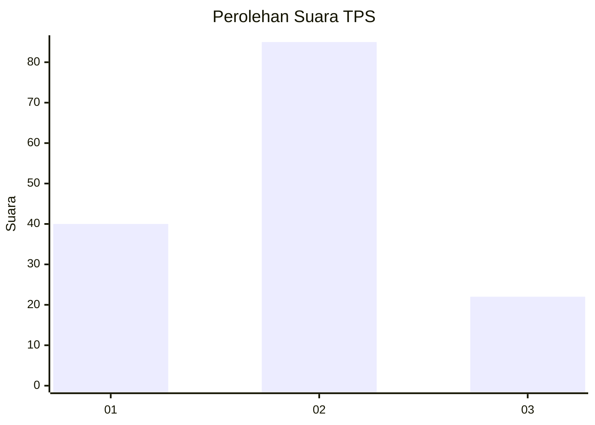
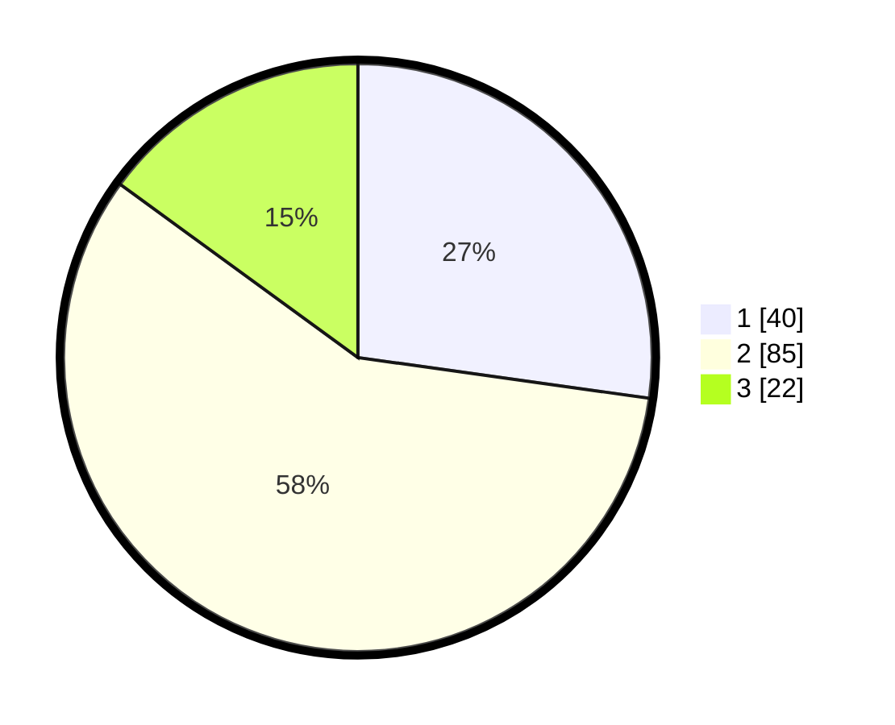

# Hasil

## Grafik

## Tabel

| No. | Nama Paslon    | Suara | Suara (raw) | Persentase |
|:--- |:-------------- | -----:| -----------:| ----------:|
| 1   | ANIES MUHAIMIN | 40    | [40][p-1]   | 27,21      |
| 2   | PRABOWO GIBRAN | 85    | [85][p-2]   | 57,82      |
| 3   | GANJAR MAHFUD  | 22    | [22][p-3]   | 14,97      |

[p-1]: https://github.com/gigit-pemilu/pemilu-2024/blob/main/pilpres/hitung-suara/sub/35-jawa-timur/sub/78-kota-surabaya/sub/16-semampir/sub/1003-wonokusumo/sub/111-tps/sub/paslon-1.txt
[p-2]: https://github.com/gigit-pemilu/pemilu-2024/blob/main/pilpres/hitung-suara/sub/35-jawa-timur/sub/78-kota-surabaya/sub/16-semampir/sub/1003-wonokusumo/sub/111-tps/sub/paslon-2.txt
[p-3]: https://github.com/gigit-pemilu/pemilu-2024/blob/main/pilpres/hitung-suara/sub/35-jawa-timur/sub/78-kota-surabaya/sub/16-semampir/sub/1003-wonokusumo/sub/111-tps/sub/paslon-3.txt

## Foto C Plano

https://sirekap-obj-formc.kpu.go.id/15b1/pemilu/ppwp/35/78/16/10/03/3578161003111-20240215-012719--cf92211f-b02e-4f94-8f2d-37434f4f5bd5.jpg

https://sirekap-obj-formc.kpu.go.id/15b1/pemilu/ppwp/35/78/16/10/03/3578161003111-20240215-013826--aba1106f-6009-4169-835f-36808932d3c6.jpg

https://sirekap-obj-formc.kpu.go.id/15b1/pemilu/ppwp/35/78/16/10/03/3578161003111-20240215-013643--9e728064-3561-4e01-83f7-e61f56af78ef.jpg

## Metadata

| Key        | Value               |
| ---------- | ------------------- |
| Time Stamp | 2024-02-25 14:00:00 |

