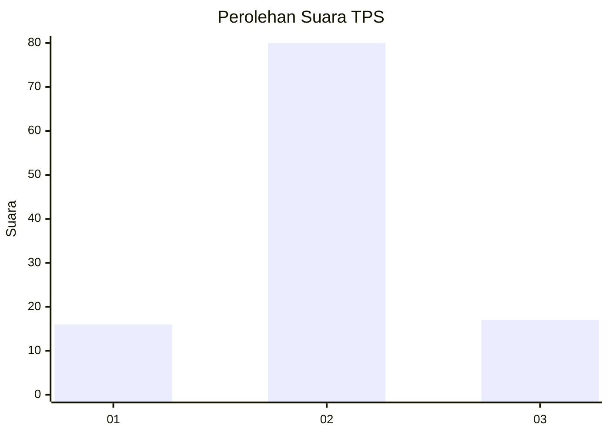
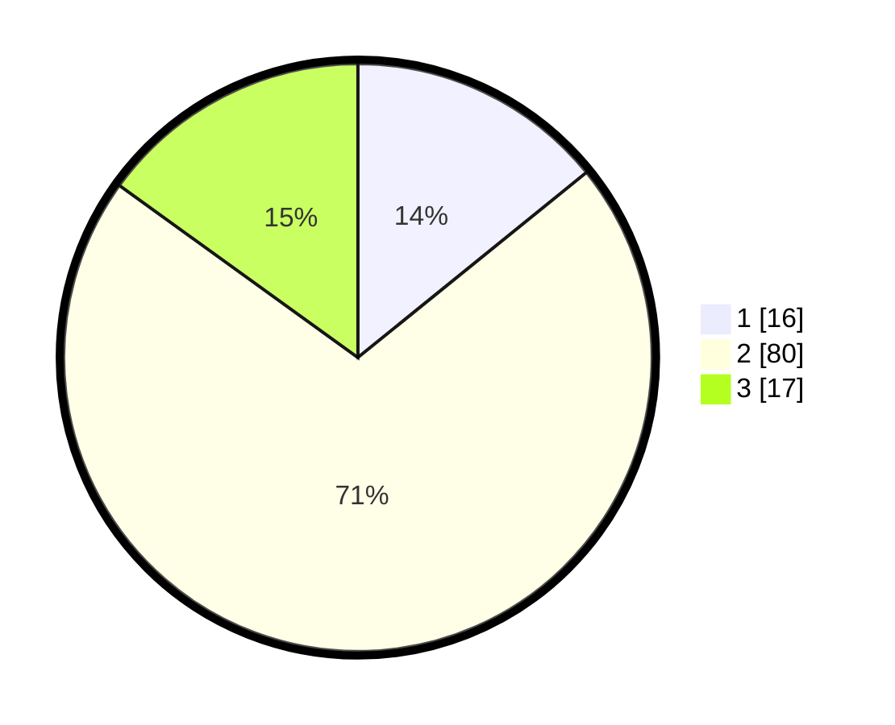

# Hasil

## Grafik

## Tabel

| No. | Nama Paslon    | Suara | Suara (raw) | Persentase |
|:--- |:-------------- | -----:| -----------:| ----------:|
| 1   | ANIES MUHAIMIN | 16    | [16][p-1]   | 14,16      |
| 2   | PRABOWO GIBRAN | 80    | [80][p-2]   | 70,80      |
| 3   | GANJAR MAHFUD  | 17    | [17][p-3]   | 15,04      |

[p-1]: https://github.com/gigit-pemilu/pemilu-2024/blob/main/pilpres/hitung-suara/sub/35-jawa-timur/sub/78-kota-surabaya/sub/16-semampir/sub/1003-wonokusumo/sub/114-tps/sub/paslon-1.txt
[p-2]: https://github.com/gigit-pemilu/pemilu-2024/blob/main/pilpres/hitung-suara/sub/35-jawa-timur/sub/78-kota-surabaya/sub/16-semampir/sub/1003-wonokusumo/sub/114-tps/sub/paslon-2.txt
[p-3]: https://github.com/gigit-pemilu/pemilu-2024/blob/main/pilpres/hitung-suara/sub/35-jawa-timur/sub/78-kota-surabaya/sub/16-semampir/sub/1003-wonokusumo/sub/114-tps/sub/paslon-3.txt

## Foto C Plano

https://sirekap-obj-formc.kpu.go.id/3af2/pemilu/ppwp/35/78/16/10/03/3578161003114-20240214-201901--8759d0cf-97ce-4281-8d34-7f063f83e5ce.jpg

https://sirekap-obj-formc.kpu.go.id/3af2/pemilu/ppwp/35/78/16/10/03/3578161003114-20240214-201955--73728ae6-b810-48a1-bae1-d48506cc4cec.jpg

https://sirekap-obj-formc.kpu.go.id/3af2/pemilu/ppwp/35/78/16/10/03/3578161003114-20240214-202046--4b0d58df-66e5-4d08-b84b-a97c8c07ddd3.jpg

## Metadata

| Key        | Value               |
| ---------- | ------------------- |
| Time Stamp | 2024-02-25 13:00:00 |

