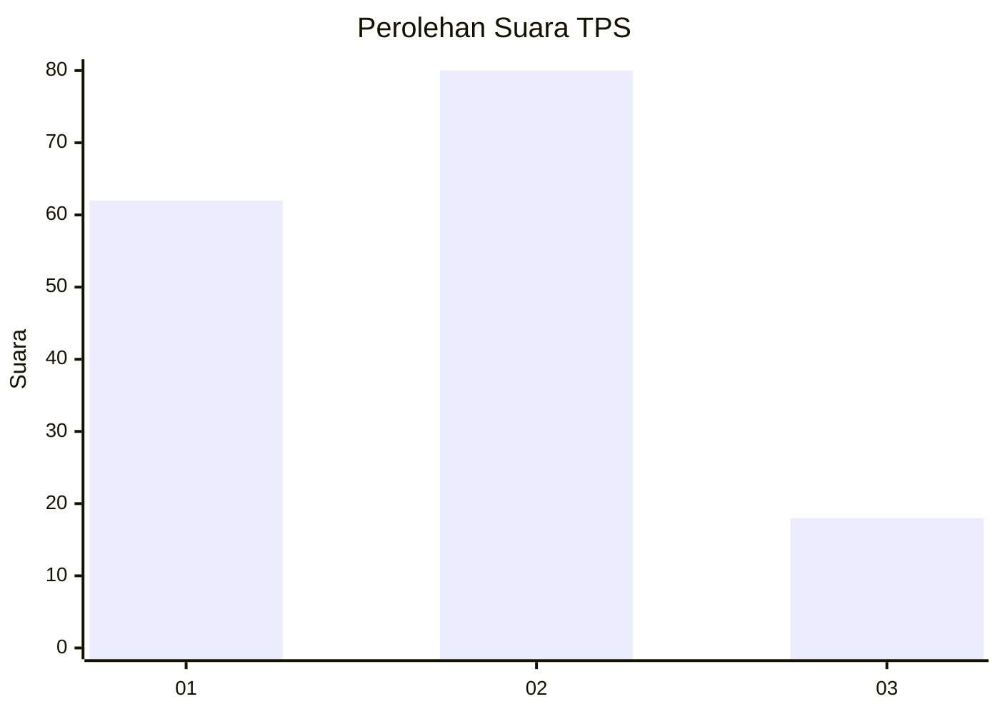
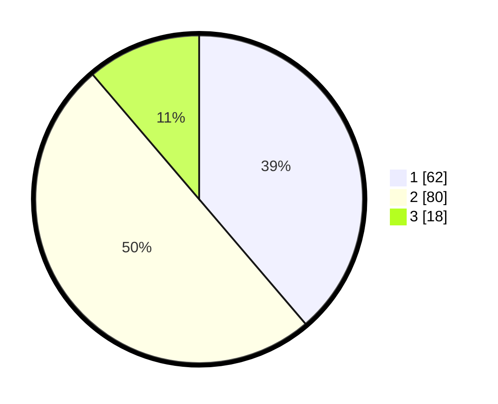

# Hasil

## Grafik

## Tabel

| No. | Nama Paslon    | Suara | Suara (raw) | Persentase |
|:--- |:-------------- | -----:| -----------:| ----------:|
| 1   | ANIES MUHAIMIN | 62    | [62][p-1]   | 38,75      |
| 2   | PRABOWO GIBRAN | 80    | [80][p-2]   | 50,00      |
| 3   | GANJAR MAHFUD  | 18    | [18][p-3]   | 11,25      |

[p-1]: https://github.com/gigit-pemilu/pemilu-2024-35-jawa-timur/blob/main/pilpres/hitung-suara/sub/35-jawa-timur/sub/78-kota-surabaya/sub/16-semampir/sub/1003-wonokusumo/sub/173-tps/sub/paslon-1.txt
[p-2]: https://github.com/gigit-pemilu/pemilu-2024-35-jawa-timur/blob/main/pilpres/hitung-suara/sub/35-jawa-timur/sub/78-kota-surabaya/sub/16-semampir/sub/1003-wonokusumo/sub/173-tps/sub/paslon-2.txt
[p-3]: https://github.com/gigit-pemilu/pemilu-2024-35-jawa-timur/blob/main/pilpres/hitung-suara/sub/35-jawa-timur/sub/78-kota-surabaya/sub/16-semampir/sub/1003-wonokusumo/sub/173-tps/sub/paslon-3.txt

## Foto C Plano

https://sirekap-obj-formc.kpu.go.id/4750/pemilu/ppwp/35/78/16/10/03/3578161003173-20240220-222513--c889a70a-363b-456f-8281-96ee62355408.jpg

https://sirekap-obj-formc.kpu.go.id/4750/pemilu/ppwp/35/78/16/10/03/3578161003173-20240220-223554--919aea8c-7e61-4d46-8ebd-dfa8a6d2d0c8.jpg

https://sirekap-obj-formc.kpu.go.id/4750/pemilu/ppwp/35/78/16/10/03/3578161003173-20240220-225247--923d98f8-7f70-4921-ae4a-766d92e36e23.jpg

## Metadata

| Key        | Value               |
| ---------- | ------------------- |
| Time Stamp | 2024-02-21 14:00:00 |

