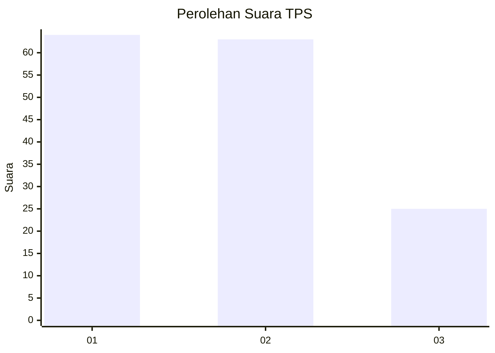
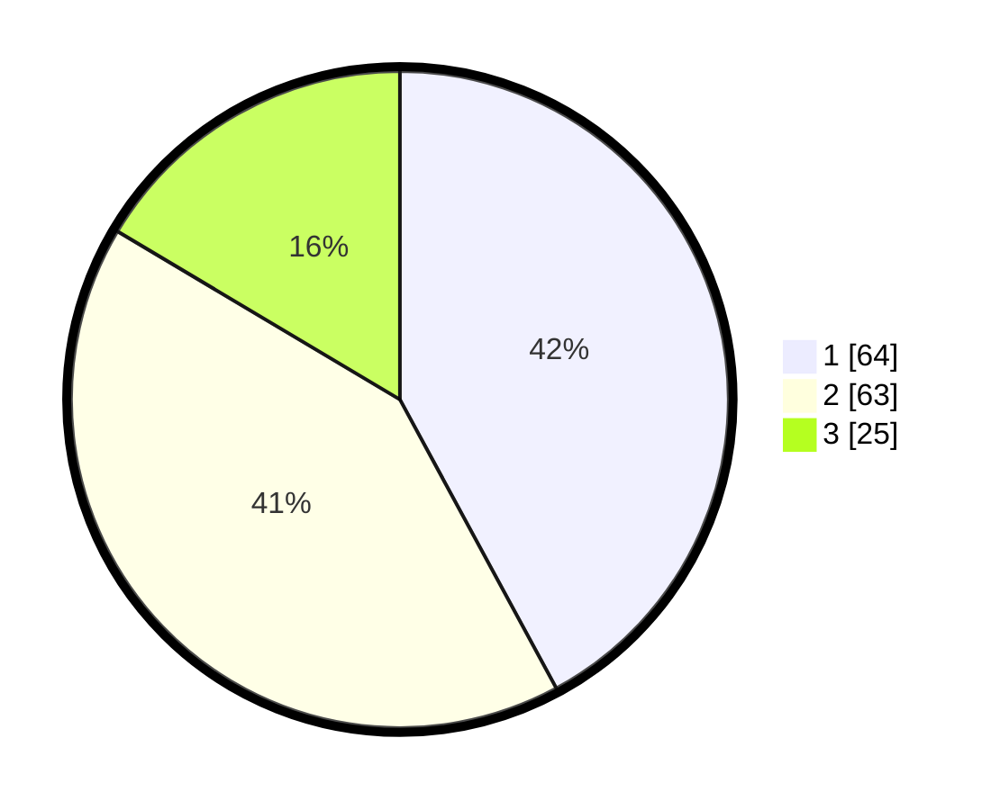

# Hasil

## Grafik

## Tabel

| No. | Nama Paslon    | Suara | Suara (raw) | Persentase |
|:--- |:-------------- | -----:| -----------:| ----------:|
| 1   | ANIES MUHAIMIN | 64    | [64][p-1]   | 42,11      |
| 2   | PRABOWO GIBRAN | 63    | [63][p-2]   | 41,45      |
| 3   | GANJAR MAHFUD  | 25    | [25][p-3]   | 16,45      |

[p-1]: https://github.com/gigit-pemilu/pemilu-2024-35-jawa-timur/blob/main/pilpres/hitung-suara/sub/35-jawa-timur/sub/78-kota-surabaya/sub/16-semampir/sub/1003-wonokusumo/sub/184-tps/sub/paslon-1.txt
[p-2]: https://github.com/gigit-pemilu/pemilu-2024-35-jawa-timur/blob/main/pilpres/hitung-suara/sub/35-jawa-timur/sub/78-kota-surabaya/sub/16-semampir/sub/1003-wonokusumo/sub/184-tps/sub/paslon-2.txt
[p-3]: https://github.com/gigit-pemilu/pemilu-2024-35-jawa-timur/blob/main/pilpres/hitung-suara/sub/35-jawa-timur/sub/78-kota-surabaya/sub/16-semampir/sub/1003-wonokusumo/sub/184-tps/sub/paslon-3.txt

## Foto C Plano

https://sirekap-obj-formc.kpu.go.id/5252/pemilu/ppwp/35/78/16/10/03/3578161003184-20240221-114836--4c94526c-0636-4f03-901d-48e307ca3c94.jpg

https://sirekap-obj-formc.kpu.go.id/5252/pemilu/ppwp/35/78/16/10/03/3578161003184-20240215-111912--d7e476b0-f75d-4ea4-89bf-45bdc693ad13.jpg

https://sirekap-obj-formc.kpu.go.id/5252/pemilu/ppwp/35/78/16/10/03/3578161003184-20240215-113216--61f5e0b7-65bc-4ef3-9d57-43cb6290d1ce.jpg

## Metadata

| Key        | Value               |
| ---------- | ------------------- |
| Time Stamp | 2024-02-21 14:00:00 |

