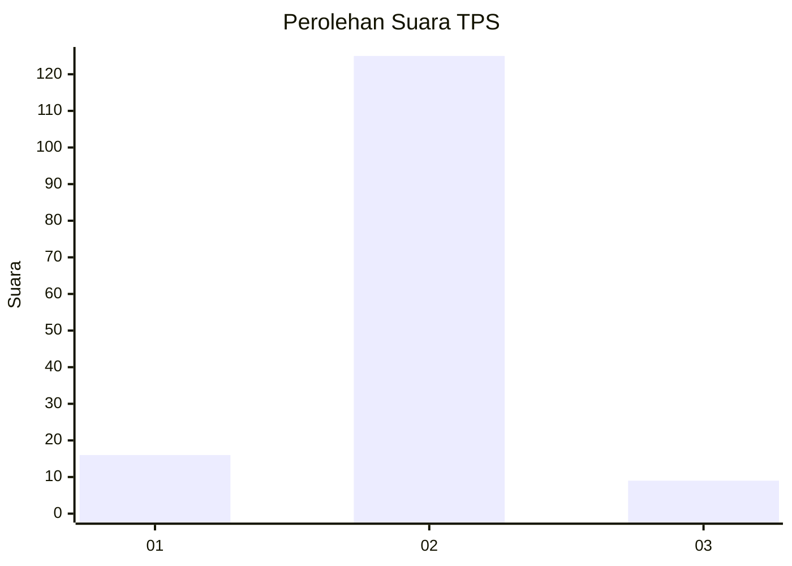
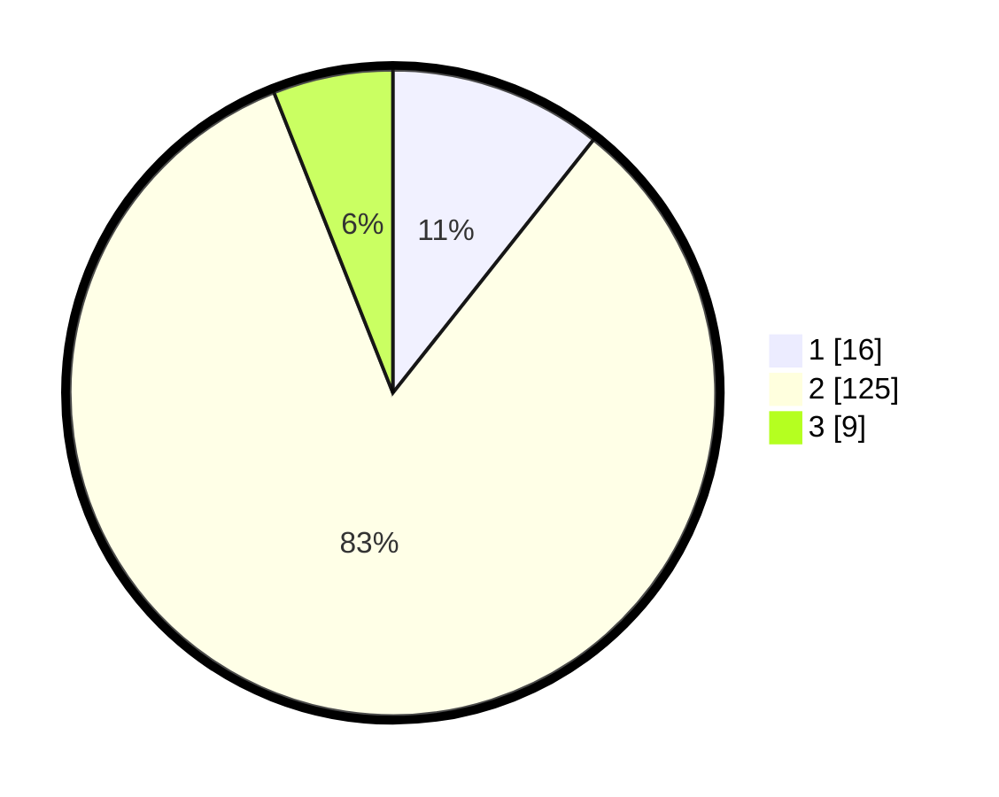

# Hasil

## Grafik

## Tabel

| No. | Nama Paslon    | Suara | Suara (raw) | Persentase |
|:--- |:-------------- | -----:| -----------:| ----------:|
| 1   | ANIES MUHAIMIN | 16    | [16][p-1]   | 10,67      |
| 2   | PRABOWO GIBRAN | 125   | [125][p-2]  | 83,33      |
| 3   | GANJAR MAHFUD  | 9     | [9][p-3]    | 6,00       |

[p-1]: https://github.com/gigit-pemilu/pemilu-2024/blob/main/pilpres/hitung-suara/sub/35-jawa-timur/sub/78-kota-surabaya/sub/16-semampir/sub/1004-ujung/sub/002-tps/sub/paslon-1.txt
[p-2]: https://github.com/gigit-pemilu/pemilu-2024/blob/main/pilpres/hitung-suara/sub/35-jawa-timur/sub/78-kota-surabaya/sub/16-semampir/sub/1004-ujung/sub/002-tps/sub/paslon-2.txt
[p-3]: https://github.com/gigit-pemilu/pemilu-2024/blob/main/pilpres/hitung-suara/sub/35-jawa-timur/sub/78-kota-surabaya/sub/16-semampir/sub/1004-ujung/sub/002-tps/sub/paslon-3.txt

## Foto C Plano

https://sirekap-obj-formc.kpu.go.id/1d82/pemilu/ppwp/35/78/16/10/04/3578161004002-20240219-134406--182c959d-6e2f-4875-b364-0f2d93ce7872.jpg

https://sirekap-obj-formc.kpu.go.id/1d82/pemilu/ppwp/35/78/16/10/04/3578161004002-20240219-134511--367302ad-77a5-4372-9184-2b0dffeb5e14.jpg

https://sirekap-obj-formc.kpu.go.id/1d82/pemilu/ppwp/35/78/16/10/04/3578161004002-20240219-134558--58bd7b9c-4143-45b9-927c-67159ea3fa45.jpg

## Metadata

| Key        | Value               |
| ---------- | ------------------- |
| Time Stamp | 2024-02-25 15:00:00 |

