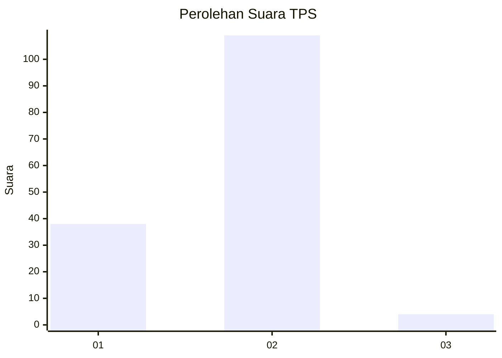
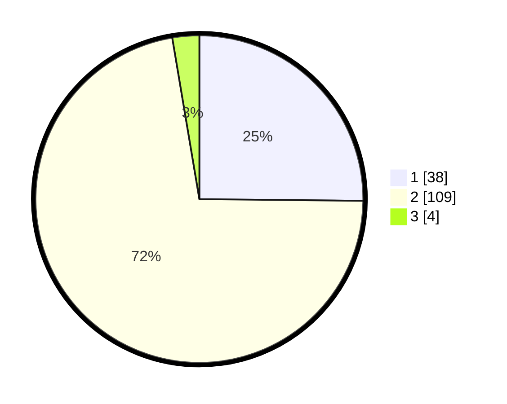

# Hasil

## Grafik

## Tabel

| No. | Nama Paslon    | Suara | Suara (raw) | Persentase |
|:--- |:-------------- | -----:| -----------:| ----------:|
| 1   | ANIES MUHAIMIN | 38    | [38][p-1]   | 25,17      |
| 2   | PRABOWO GIBRAN | 109   | [109][p-2]  | 72,19      |
| 3   | GANJAR MAHFUD  | 4     | [4][p-3]    | 2,65       |

[p-1]: https://github.com/gigit-pemilu/pemilu-2024/blob/main/pilpres/hitung-suara/sub/35-jawa-timur/sub/78-kota-surabaya/sub/16-semampir/sub/1004-ujung/sub/004-tps/sub/paslon-1.txt
[p-2]: https://github.com/gigit-pemilu/pemilu-2024/blob/main/pilpres/hitung-suara/sub/35-jawa-timur/sub/78-kota-surabaya/sub/16-semampir/sub/1004-ujung/sub/004-tps/sub/paslon-2.txt
[p-3]: https://github.com/gigit-pemilu/pemilu-2024/blob/main/pilpres/hitung-suara/sub/35-jawa-timur/sub/78-kota-surabaya/sub/16-semampir/sub/1004-ujung/sub/004-tps/sub/paslon-3.txt

## Foto C Plano

https://sirekap-obj-formc.kpu.go.id/6b8d/pemilu/ppwp/35/78/16/10/04/3578161004004-20240220-105256--1bcb9c6d-dd8f-4cc5-90b6-4894f6833758.jpg

https://sirekap-obj-formc.kpu.go.id/6b8d/pemilu/ppwp/35/78/16/10/04/3578161004004-20240220-110204--a4764314-f621-486a-95cd-5a3baca6f2a7.jpg

https://sirekap-obj-formc.kpu.go.id/6b8d/pemilu/ppwp/35/78/16/10/04/3578161004004-20240220-110005--31c723e4-c3a4-40d1-adef-a5b8e056e385.jpg

## Metadata

| Key        | Value               |
| ---------- | ------------------- |
| Time Stamp | 2024-02-25 18:00:00 |

