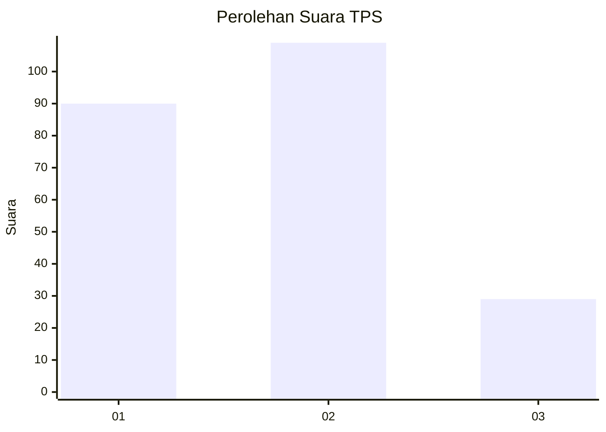
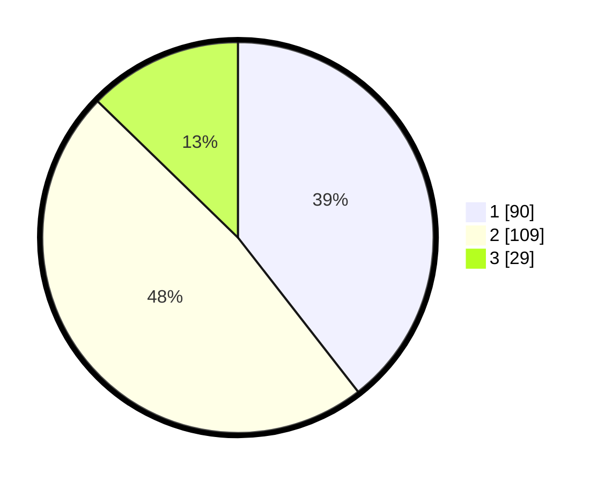

# Hasil

## Grafik

## Tabel

| No. | Nama Paslon    | Suara | Suara (raw) | Persentase |
|:--- |:-------------- | -----:| -----------:| ----------:|
| 1   | ANIES MUHAIMIN | 90    | [90][p-1]   | 39,47      |
| 2   | PRABOWO GIBRAN | 109   | [109][p-2]  | 47,81      |
| 3   | GANJAR MAHFUD  | 29    | [29][p-3]   | 12,72      |

[p-1]: https://github.com/gigit-pemilu/pemilu-2024/blob/main/pilpres/hitung-suara/sub/35-jawa-timur/sub/78-kota-surabaya/sub/16-semampir/sub/1004-ujung/sub/011-tps/sub/paslon-1.txt
[p-2]: https://github.com/gigit-pemilu/pemilu-2024/blob/main/pilpres/hitung-suara/sub/35-jawa-timur/sub/78-kota-surabaya/sub/16-semampir/sub/1004-ujung/sub/011-tps/sub/paslon-2.txt
[p-3]: https://github.com/gigit-pemilu/pemilu-2024/blob/main/pilpres/hitung-suara/sub/35-jawa-timur/sub/78-kota-surabaya/sub/16-semampir/sub/1004-ujung/sub/011-tps/sub/paslon-3.txt

## Foto C Plano

https://sirekap-obj-formc.kpu.go.id/3a9f/pemilu/ppwp/35/78/16/10/04/3578161004011-20240215-005540--f94285c7-dcb3-452e-a046-dc97b7f59f3a.jpg

https://sirekap-obj-formc.kpu.go.id/3a9f/pemilu/ppwp/35/78/16/10/04/3578161004011-20240214-213306--b90e9f57-bce1-4b0d-ad4a-704e929a963e.jpg

https://sirekap-obj-formc.kpu.go.id/3a9f/pemilu/ppwp/35/78/16/10/04/3578161004011-20240214-213714--e004139a-1970-418f-b6d4-695d8d2fb27e.jpg

## Metadata

| Key        | Value               |
| ---------- | ------------------- |
| Time Stamp | 2024-02-21 13:00:00 |

