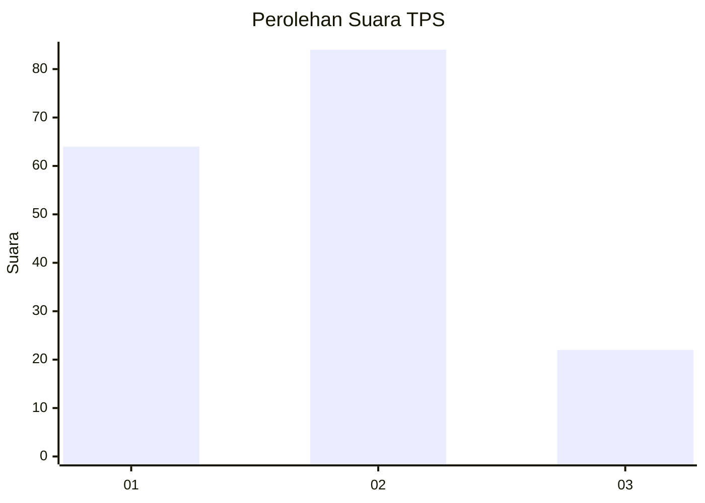
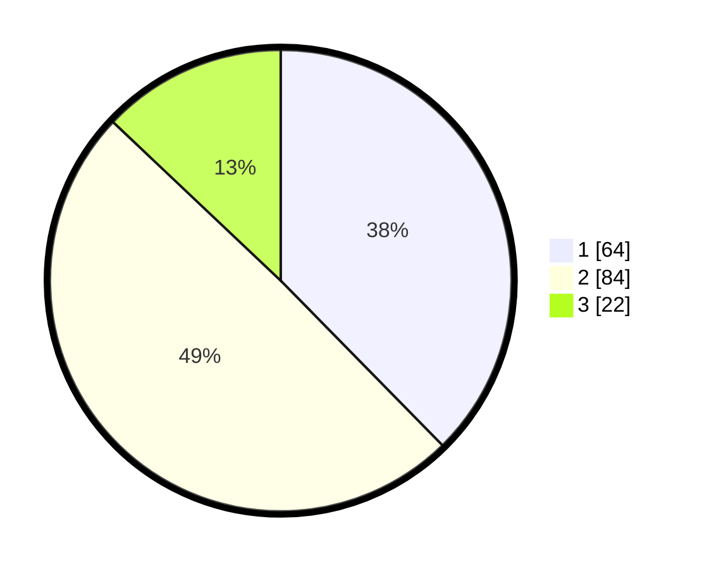

# Hasil

## Grafik

## Tabel

| No. | Nama Paslon    | Suara | Suara (raw) | Persentase |
|:--- |:-------------- | -----:| -----------:| ----------:|
| 1   | ANIES MUHAIMIN | 64    | [64][p-1]   | 37,65      |
| 2   | PRABOWO GIBRAN | 84    | [84][p-2]   | 49,41      |
| 3   | GANJAR MAHFUD  | 22    | [22][p-3]   | 12,94      |

[p-1]: https://github.com/gigit-pemilu/pemilu-2024-35-jawa-timur/blob/main/pilpres/hitung-suara/sub/35-jawa-timur/sub/78-kota-surabaya/sub/16-semampir/sub/1004-ujung/sub/019-tps/sub/paslon-1.txt
[p-2]: https://github.com/gigit-pemilu/pemilu-2024-35-jawa-timur/blob/main/pilpres/hitung-suara/sub/35-jawa-timur/sub/78-kota-surabaya/sub/16-semampir/sub/1004-ujung/sub/019-tps/sub/paslon-2.txt
[p-3]: https://github.com/gigit-pemilu/pemilu-2024-35-jawa-timur/blob/main/pilpres/hitung-suara/sub/35-jawa-timur/sub/78-kota-surabaya/sub/16-semampir/sub/1004-ujung/sub/019-tps/sub/paslon-3.txt

## Foto C Plano

https://sirekap-obj-formc.kpu.go.id/e7db/pemilu/ppwp/35/78/16/10/04/3578161004019-20240214-234333--826967aa-1b09-4827-b6de-f0e8fd9947f5.jpg

https://sirekap-obj-formc.kpu.go.id/e7db/pemilu/ppwp/35/78/16/10/04/3578161004019-20240214-234406--e79aa428-37f0-4971-9003-9033512608e7.jpg

https://sirekap-obj-formc.kpu.go.id/e7db/pemilu/ppwp/35/78/16/10/04/3578161004019-20240214-234557--b634e1c1-4efe-4e6b-8ad4-e3e872cd8e60.jpg

## Metadata

| Key        | Value               |
| ---------- | ------------------- |
| Time Stamp | 2024-02-24 22:31:28 |

