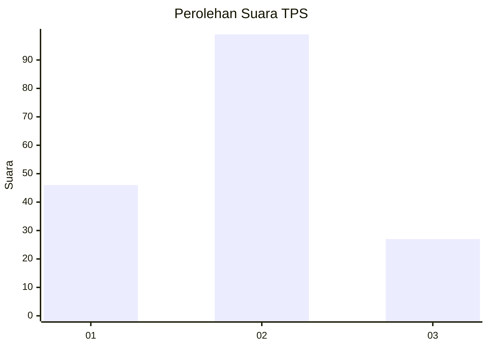
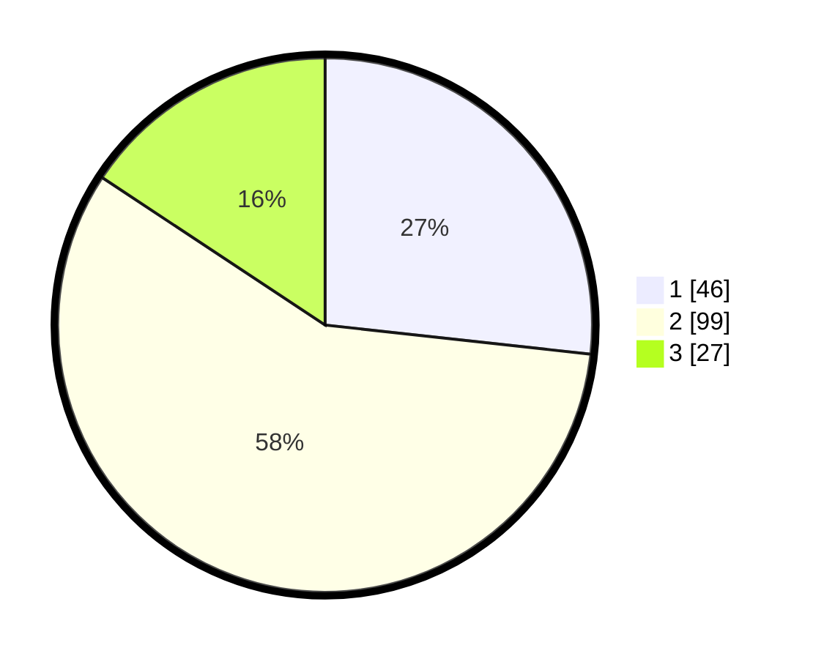

# Hasil

## Grafik

## Tabel

| No. | Nama Paslon    | Suara | Suara (raw) | Persentase |
|:--- |:-------------- | -----:| -----------:| ----------:|
| 1   | ANIES MUHAIMIN | 46    | [46][p-1]   | 26,74      |
| 2   | PRABOWO GIBRAN | 99    | [99][p-2]   | 57,56      |
| 3   | GANJAR MAHFUD  | 27    | [27][p-3]   | 15,70      |

[p-1]: https://github.com/gigit-pemilu/pemilu-2024-35-jawa-timur/blob/main/pilpres/hitung-suara/sub/35-jawa-timur/sub/78-kota-surabaya/sub/16-semampir/sub/1004-ujung/sub/023-tps/sub/paslon-1.txt
[p-2]: https://github.com/gigit-pemilu/pemilu-2024-35-jawa-timur/blob/main/pilpres/hitung-suara/sub/35-jawa-timur/sub/78-kota-surabaya/sub/16-semampir/sub/1004-ujung/sub/023-tps/sub/paslon-2.txt
[p-3]: https://github.com/gigit-pemilu/pemilu-2024-35-jawa-timur/blob/main/pilpres/hitung-suara/sub/35-jawa-timur/sub/78-kota-surabaya/sub/16-semampir/sub/1004-ujung/sub/023-tps/sub/paslon-3.txt

## Foto C Plano

https://sirekap-obj-formc.kpu.go.id/8bbc/pemilu/ppwp/35/78/16/10/04/3578161004023-20240214-210045--de0adee4-75b3-4698-a434-002deddd66be.jpg

https://sirekap-obj-formc.kpu.go.id/8bbc/pemilu/ppwp/35/78/16/10/04/3578161004023-20240214-210206--59670458-54a0-4455-bc01-1813e7655154.jpg

https://sirekap-obj-formc.kpu.go.id/8bbc/pemilu/ppwp/35/78/16/10/04/3578161004023-20240214-210316--e9e1df85-5146-4d4c-a765-a3faf49d9d79.jpg

## Metadata

| Key        | Value               |
| ---------- | ------------------- |
| Time Stamp | 2024-02-26 11:00:00 |

