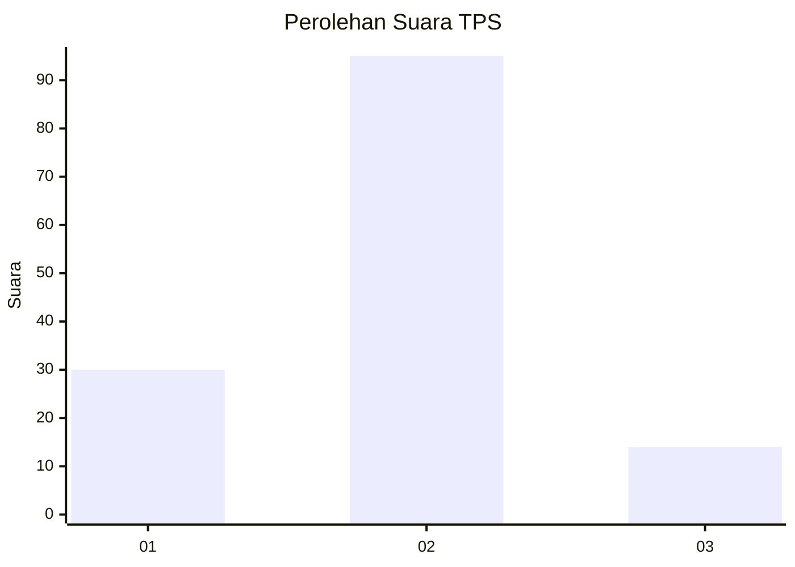

# Hasil

## Grafik

## Tabel

| No. | Nama Paslon    | Suara | Suara (raw) | Persentase |
|:--- |:-------------- | -----:| -----------:| ----------:|
| 1   | ANIES MUHAIMIN | 30    | [30][p-1]   | 21,58      |
| 2   | PRABOWO GIBRAN | 95    | [95][p-2]   | 68,35      |
| 3   | GANJAR MAHFUD  | 14    | [14][p-3]   | 10,07      |

[p-1]: https://github.com/gigit-pemilu/pemilu-2024-35-jawa-timur/blob/main/pilpres/hitung-suara/sub/35-jawa-timur/sub/78-kota-surabaya/sub/16-semampir/sub/1004-ujung/sub/027-tps/sub/paslon-1.txt
[p-2]: https://github.com/gigit-pemilu/pemilu-2024-35-jawa-timur/blob/main/pilpres/hitung-suara/sub/35-jawa-timur/sub/78-kota-surabaya/sub/16-semampir/sub/1004-ujung/sub/027-tps/sub/paslon-2.txt
[p-3]: https://github.com/gigit-pemilu/pemilu-2024-35-jawa-timur/blob/main/pilpres/hitung-suara/sub/35-jawa-timur/sub/78-kota-surabaya/sub/16-semampir/sub/1004-ujung/sub/027-tps/sub/paslon-3.txt

## Foto C Plano

https://sirekap-obj-formc.kpu.go.id/b1e6/pemilu/ppwp/35/78/16/10/04/3578161004027-20240215-005551--3ba08040-fece-41ea-99b9-37d46f9431a2.jpg

https://sirekap-obj-formc.kpu.go.id/b1e6/pemilu/ppwp/35/78/16/10/04/3578161004027-20240215-005755--c53cb12d-67ed-45b3-8c30-50c3ab07150e.jpg

https://sirekap-obj-formc.kpu.go.id/b1e6/pemilu/ppwp/35/78/16/10/04/3578161004027-20240215-005850--0123718d-6983-4132-a8ac-c91f38eea749.jpg

## Metadata

| Key        | Value               |
| ---------- | ------------------- |
| Time Stamp | 2024-02-24 22:31:28 |

