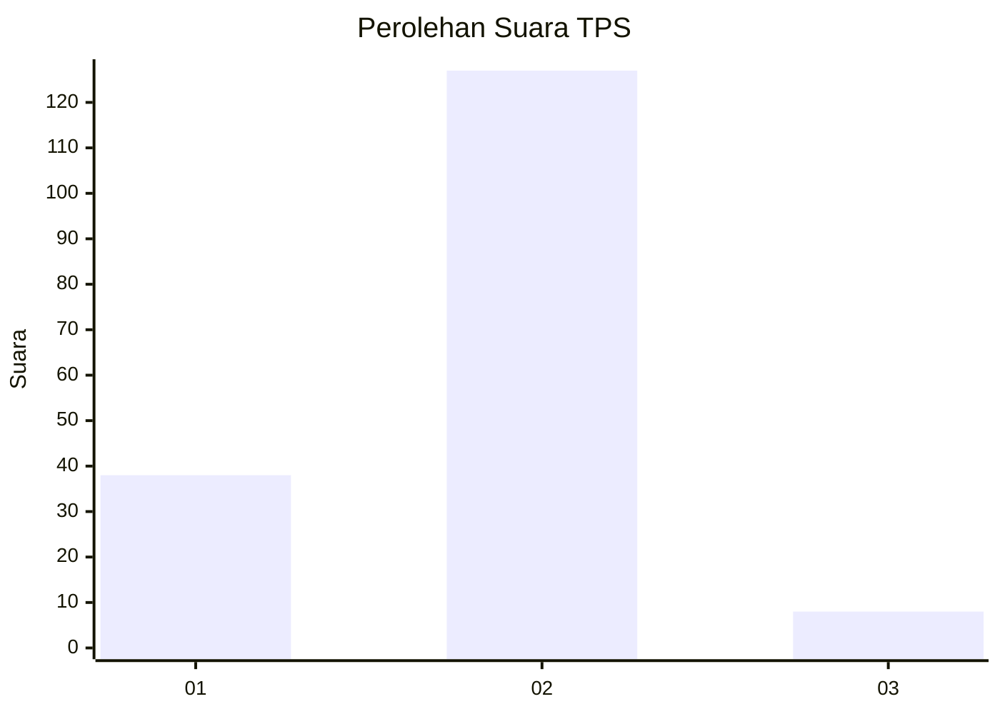
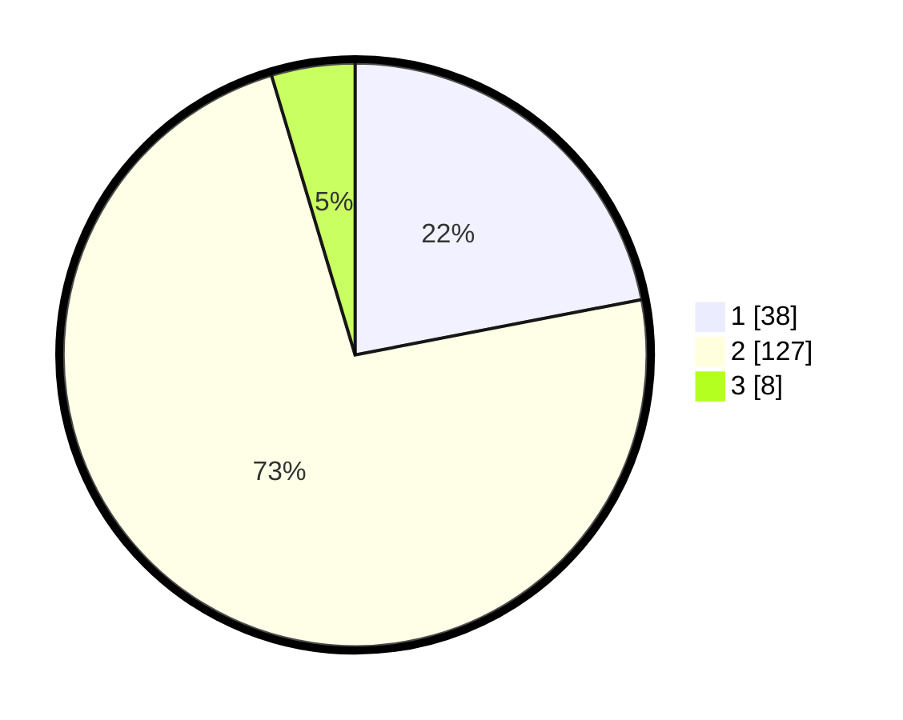

# Hasil

## Grafik

## Tabel

| No. | Nama Paslon    | Suara | Suara (raw) | Persentase |
|:--- |:-------------- | -----:| -----------:| ----------:|
| 1   | ANIES MUHAIMIN | 38    | [38][p-1]   | 21,97      |
| 2   | PRABOWO GIBRAN | 127   | [127][p-2]  | 73,41      |
| 3   | GANJAR MAHFUD  | 8     | [8][p-3]    | 4,62       |

[p-1]: https://github.com/gigit-pemilu/pemilu-2024/blob/main/pilpres/hitung-suara/sub/35-jawa-timur/sub/78-kota-surabaya/sub/16-semampir/sub/1004-ujung/sub/049-tps/sub/paslon-1.txt
[p-2]: https://github.com/gigit-pemilu/pemilu-2024/blob/main/pilpres/hitung-suara/sub/35-jawa-timur/sub/78-kota-surabaya/sub/16-semampir/sub/1004-ujung/sub/049-tps/sub/paslon-2.txt
[p-3]: https://github.com/gigit-pemilu/pemilu-2024/blob/main/pilpres/hitung-suara/sub/35-jawa-timur/sub/78-kota-surabaya/sub/16-semampir/sub/1004-ujung/sub/049-tps/sub/paslon-3.txt

## Foto C Plano

https://sirekap-obj-formc.kpu.go.id/8ad8/pemilu/ppwp/35/78/16/10/04/3578161004049-20240215-003205--df73c2d8-3e46-408b-97aa-446ebd11545f.jpg

https://sirekap-obj-formc.kpu.go.id/8ad8/pemilu/ppwp/35/78/16/10/04/3578161004049-20240215-003254--9f2d15c5-bbb0-4e86-ae2b-a3c1c7fbb00a.jpg

https://sirekap-obj-formc.kpu.go.id/8ad8/pemilu/ppwp/35/78/16/10/04/3578161004049-20240215-003323--d8a411c5-7478-49cf-8267-eabb96f05a3a.jpg

## Metadata

| Key        | Value               |
| ---------- | ------------------- |
| Time Stamp | 2024-02-25 11:00:00 |

