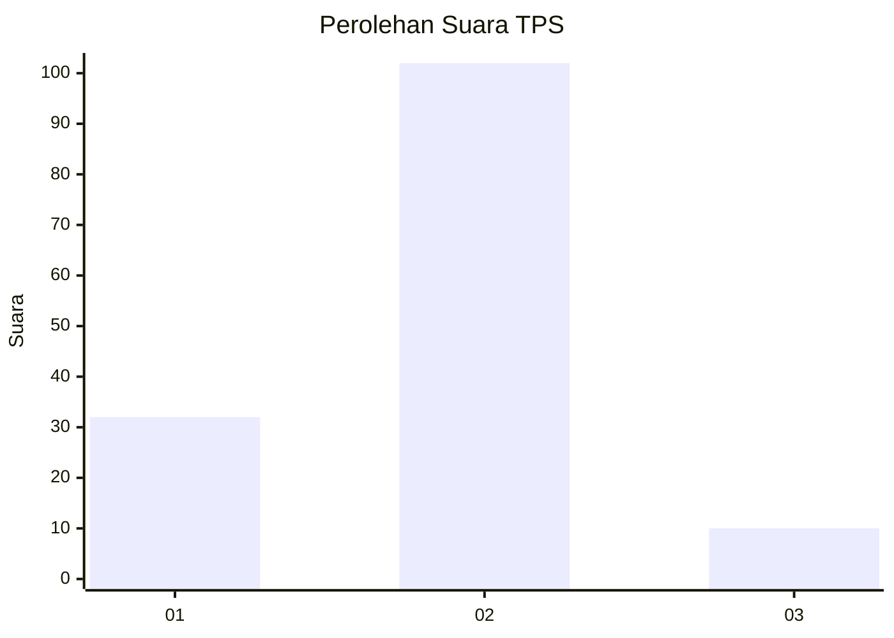
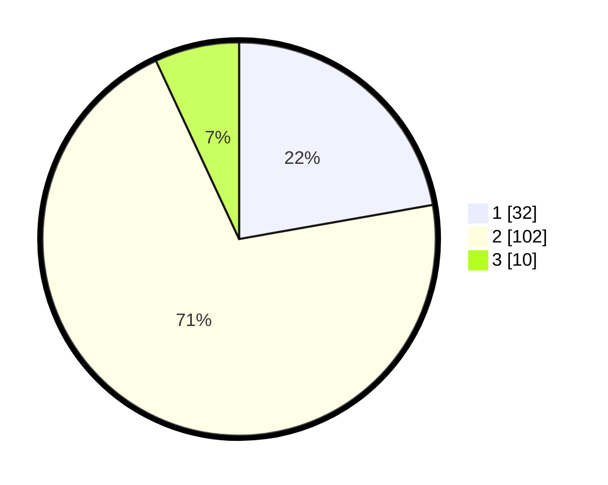

# Hasil

## Grafik

## Tabel

| No. | Nama Paslon    | Suara | Suara (raw) | Persentase |
|:--- |:-------------- | -----:| -----------:| ----------:|
| 1   | ANIES MUHAIMIN | 32    | [32][p-1]   | 22,22      |
| 2   | PRABOWO GIBRAN | 102   | [102][p-2]  | 70,83      |
| 3   | GANJAR MAHFUD  | 10    | [10][p-3]   | 6,94       |

[p-1]: https://github.com/gigit-pemilu/pemilu-2024-35-jawa-timur/blob/main/pilpres/hitung-suara/sub/35-jawa-timur/sub/78-kota-surabaya/sub/16-semampir/sub/1004-ujung/sub/053-tps/sub/paslon-1.txt
[p-2]: https://github.com/gigit-pemilu/pemilu-2024-35-jawa-timur/blob/main/pilpres/hitung-suara/sub/35-jawa-timur/sub/78-kota-surabaya/sub/16-semampir/sub/1004-ujung/sub/053-tps/sub/paslon-2.txt
[p-3]: https://github.com/gigit-pemilu/pemilu-2024-35-jawa-timur/blob/main/pilpres/hitung-suara/sub/35-jawa-timur/sub/78-kota-surabaya/sub/16-semampir/sub/1004-ujung/sub/053-tps/sub/paslon-3.txt

## Foto C Plano

https://sirekap-obj-formc.kpu.go.id/cf8b/pemilu/ppwp/35/78/16/10/04/3578161004053-20240214-224053--3404d8a9-cf17-4c47-b124-e5e4bb30cd9e.jpg

https://sirekap-obj-formc.kpu.go.id/cf8b/pemilu/ppwp/35/78/16/10/04/3578161004053-20240214-230917--ba4872f0-a013-4847-a168-afd83f6e37c6.jpg

https://sirekap-obj-formc.kpu.go.id/cf8b/pemilu/ppwp/35/78/16/10/04/3578161004053-20240214-231046--0e29cb86-ec08-42ee-a590-b1c652c6d8e0.jpg

## Metadata

| Key        | Value               |
| ---------- | ------------------- |
| Time Stamp | 2024-02-25 12:00:00 |

