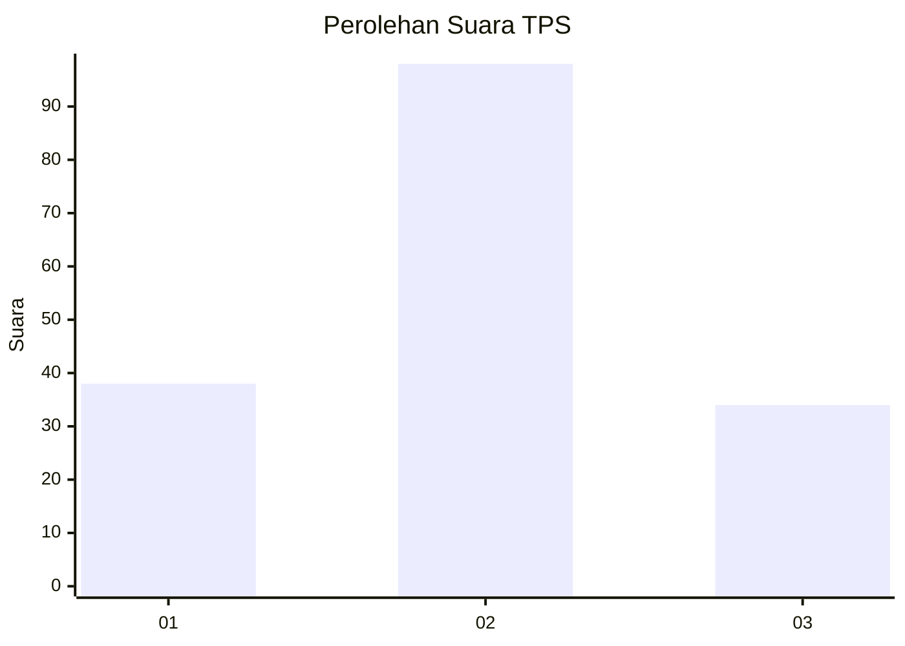
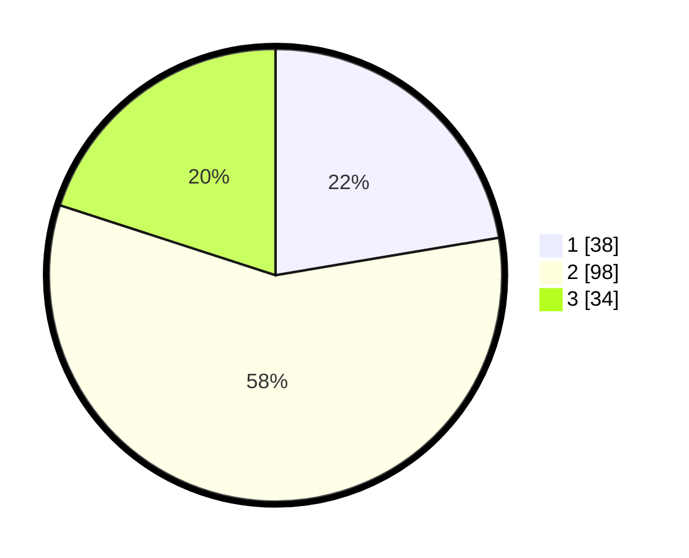

# Hasil

## Grafik

## Tabel

| No. | Nama Paslon    | Suara | Suara (raw) | Persentase |
|:--- |:-------------- | -----:| -----------:| ----------:|
| 1   | ANIES MUHAIMIN | 38    | [38][p-1]   | 22,35      |
| 2   | PRABOWO GIBRAN | 98    | [98][p-2]   | 57,65      |
| 3   | GANJAR MAHFUD  | 34    | [34][p-3]   | 20,00      |

[p-1]: https://github.com/gigit-pemilu/pemilu-2024-35-jawa-timur/blob/main/pilpres/hitung-suara/sub/35-jawa-timur/sub/78-kota-surabaya/sub/16-semampir/sub/1004-ujung/sub/061-tps/sub/paslon-1.txt
[p-2]: https://github.com/gigit-pemilu/pemilu-2024-35-jawa-timur/blob/main/pilpres/hitung-suara/sub/35-jawa-timur/sub/78-kota-surabaya/sub/16-semampir/sub/1004-ujung/sub/061-tps/sub/paslon-2.txt
[p-3]: https://github.com/gigit-pemilu/pemilu-2024-35-jawa-timur/blob/main/pilpres/hitung-suara/sub/35-jawa-timur/sub/78-kota-surabaya/sub/16-semampir/sub/1004-ujung/sub/061-tps/sub/paslon-3.txt

## Foto C Plano

https://sirekap-obj-formc.kpu.go.id/87b8/pemilu/ppwp/35/78/16/10/04/3578161004061-20240214-230614--a128eafc-5831-441c-ab35-f5ae40d00676.jpg

https://sirekap-obj-formc.kpu.go.id/87b8/pemilu/ppwp/35/78/16/10/04/3578161004061-20240214-230652--6d144e73-78d4-4ac9-ba44-5e68ec7ff7d5.jpg

https://sirekap-obj-formc.kpu.go.id/87b8/pemilu/ppwp/35/78/16/10/04/3578161004061-20240214-230730--3355f09c-413c-4ae2-a1c0-6b93ea3d1e9f.jpg

## Metadata

| Key        | Value               |
| ---------- | ------------------- |
| Time Stamp | 2024-02-24 22:31:28 |

